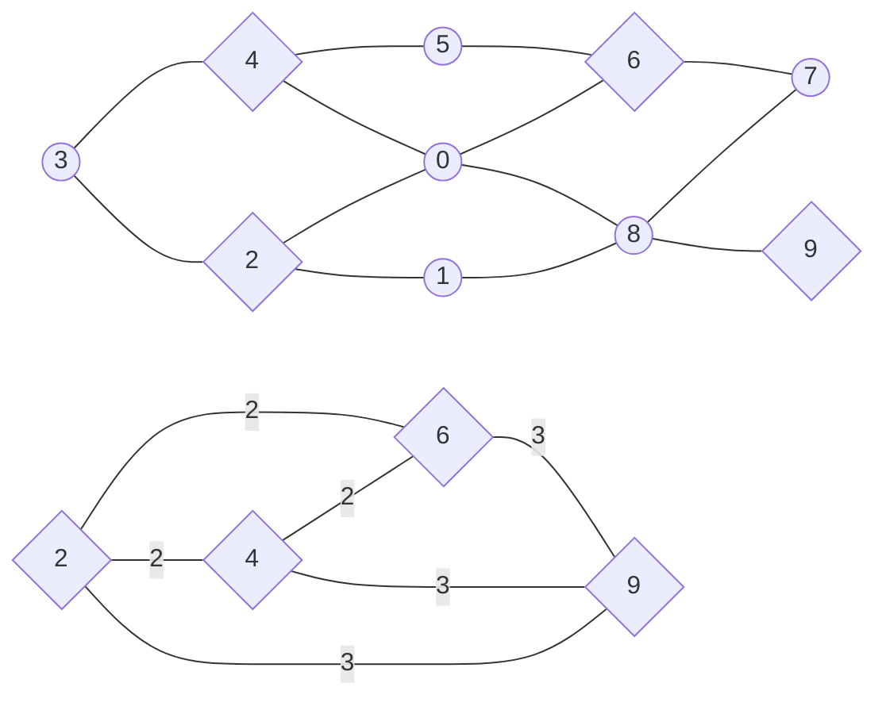

<h1 style="text-align: center;">Aufgabe 1: Müllabfuhr</h1>
<p style="text-align: center;">Teilnahme-ID: 00968</p>
<p style="text-align: center;">Bearbeiter: Finn Rudolph</p>
<p style="text-align: center;">19.03.2022</p>

[TOC]

## Problembeschreibung

Der Stadtplan kann als Graph gesehen werden, wobei Kreuzungen Knoten und Straßen Kanten entsprechen. Der Graph ist ungerichtet und mit den Distanzen zwischen den Kreuzungen gewichtet. Damit ist das Problem ein Kantenroutingproblem und Variation des Briefträgerproblems / Chinese Postman Problem. Es gehört zu den kombinatorischen Optimierungsproblemen, in denen durch mehrere Entscheidungen eine Kostenfunktion maximiert bzw. minimiert werden soll, während Rahmenbedingungen beachtet werden.

Genauer ist es das Min-Max $k$-Chinese Postman Problem, wie es 1978 von Frederickson, Hecht und Kim gestellt wurde. Das originale Paper ist leider nicht kostenfrei im Internet verfügbar, daher beziehe ich mich auf die Problembeschreibung von Ahr (2004). Das Min-Max $k$-Chinese Postman Problem verlangt es, eine gegebene Anzahl von $k$ Rundtouren $F_1, F_2, \dots, F_k$ durch einen gewichteten Graphen $G = (V, E, w)$ zu finden. In der gestellten Aufgabe mit 5 Wochentagen ist $k = 5$, aber es ist eine einfache und nützliche Erweiterung, das allgemein zu halten. Für die Rundtouren gilt folgendes Ziel:

$$
\text{minimiere} \space \max _{i=1} ^k \sum _{e \in E_{F_i}} w(e)
$$

Eine Rundtour $F_i$ ist hier als Folge von Knoten und Kanten $v_0, e_1, v_1, ... e_n, v_n$ definiert. $E_{F_i}$ bezeichnet die Kantenfolge von $F_i$. $w(e)$ sind die Kosten bzw. Länge der Kante $e$. Es müssen folgende Bedingungen erfüllt werden:

$$
\bigcup _{i=1} ^k E_{F_i} = E \\

F_i(v_0) = F_i(v_n) = s \quad \forall \space F_i
$$

$F_i(v_j)$ bezeichnet hier den $j$´ten Knoten von $F$. $s$ ist der Startknoten oder das Stadtzentrum, oft auch Depot genannt. Die erste Einschränkung stellt sicher, dass alle Kanten des Graphen besucht werden. Die zweite besagt, dass jede Tour am Stadtzentrum beginnt und endet; diese nennt man den _Subtour Elimination Constraint_.

_Anmerkung:_ Es ist auch möglich, das Problem als Integer Linear Programming Problem zu formulieren (Ahr, 2004, S. 125 - 134). Da ich aber nicht mit Branch and Bound / Branch and Cut arbeiten werden, habe ich mich für eine weniger abstrakte Formulierung entschieden.

_Anmerkung:_ Der Weg, bis ich das Min-Max $k$-CPP gefunden hatte, war keineswegs schnell und einfach. Angefangen bei Graph Clustering Algorithmen und spektraler Graphentheorie, dann das Traveling Salesman Problem und Vehicle Routing Problem, bin ich erst nach vielen Wochen Recherche erstmals auf das Chinese Postman Problem gestoßen.

## Lösungsidee

Das Min-Max $k$-CPP ist NP-schwer, daher existieren für exakte Lösungen nur Algorithmen mit exponentieller Laufzeit (Frederickson et al., 1978, zitiert nach Ahr, 2004, S. 32). Da das ist für große Probleminstanzen, wie z. B. `muellabfuhr8.txt` mit 1000 Knoten und 3543 Kanten nicht praktikabel ist, wurden bisher vor allem Heuristiken und Metaheuristiken entwickelt.

Obwohl bessere Metaheuristiken existieren, z. B. der Tabu-Suche Algorithmus von Willemse und Joubert (2012), habe ich mich für den Frederickson-Hecht-Kim-Algorithmus (FHK) von Frederickson et al. (1978) entschieden. Denn die Worst-Case Zeitkomplexität kann durch Verwendung eines neuen Algorithmus zum Finden eines _Minimum Weighted Perfect Matching_ (für den FHK-Algorithmus erforderlich) verbessert werden. Mir sind nur Implementierungen des FHK-Algorithmus bekannt, die einen $O(|V|^3)$ Algorithmus dafür verwenden, ich möchte den _Liquidationist_ Algorithmus von Duan et al. (2018) mit $O((m+n \log n) \sqrt n \log (nN))$ verwenden. $N$ ist das größte Kantengewicht. Auch kann der FHK-Algorithmus zur Erstellung der initialen Lösung für eine Metaheuristik gebraucht werden, weswegen eine Verbesserung von ihm durchaus sinnvoll ist. Zum Begriff _Approximationsalgorithmus_: Der Unterschied eines Approximationsalgorithmus zu einer Heuristik ist, dass er eine Lösungsqualität innerhalb eines konstanten Faktors der optimalen Lösung garantiert. Der Approximationsfaktor des FHK-Algorithmus ist $2-\frac 1k$, d. h. die längste Tour ist maximal $2-\frac 1k$-mal länger als die optimale Länge der längsten Tour.

### Der FHK-Algorithmus

Das Prinzip des FHK-Algorithmus ist es, eine Rundtour durch alle Kanten des Graphen in $k$ Pfade zu teilen, und den Anfangs- und Endknoten jedes Pfads mit dem Startknoten zu verbinden (Ahr, 2004, S. 44 - 46). Ein Pfad ist hier eine abwechselnde Abfolge von Knoten und Kanten, die von beidem Dopplungen enthalten kann. Diese Rundtour $C$ ist eine Lösung des Briefträgerproblems, oder Chinese Postman Problems (CPP) auf dem Graphen. Die Kantenzahl in jedem Pfad ist nicht zwingend gleich lang, sondern ist neben der Länge der Postman-Tour, bezeichnet als $w(C)$, auch vom _Shortest Path Tour Lower Bound_ $L$ (Pseudeocode Z. 3) abhängig. Er gibt die Kosten zum Besuchen der vom Startknoten am weitest entfernten Kante an, daher ist er eine untere Grenze für die optimale Lösung des Min-Max $k$-CPP. Die genaue Festlegung der (vorläufig) maximalen Länge $l_i$ der $i$´ten Tour geschieht in Zeile 7 des Pseudocodes. Der Knoten $p_i$, an dem der $i$´te Pfad endet, ist der letzte Knoten in $C$, mit dem die tatsächliche Distanz $w(C(s, p_i))$ noch kleiner als $l_i$ ist. Dieser kann aber auch noch zum nächsten Knoten in $C$ nach $p_i$, bezeichnet als $C(p_i + 1)$ geändert werden. Informell formuliert: Das geschieht, wenn die Distanzen von $p_i$ zu $C(p_i + 1)$ und von $C(p_i + 1)$ zum Startknoten relativ klein sind und wenn dadurch die eigentlich vorgesehene Länge der Tour $l_i$ nicht stark überschritten wird. Exakt wird das in Z. 11 - 12 des Pseudocodes beschrieben. $r_i$ bezeichnet die übrige Länge der $i$`ten Tour zur vorgesehenen Maximallänge. Die $i$´te Tour wird durch den kürzesten Pfad vom vorherigen Teilungsknoten zum Startknoten $SP(p_{i - 1}, s)$ und analog zum aktuellen Teilungsknoten $SP(p_i, s)$ geschlossen.

Der Pseudocode des Algorithmus sieht folgendermaßen aus. `←` bedeutet eine Zuweisung, `=` die Gleichheit zweier Variablen.

```pseudocode
procedure FHK(Graph G)
    C ← ChinesePostman(G);
    L ← max { w(SP(s, a)) + w(e) + w(SP(b, s)) } wobei e = (a, b) ∊ E;
    T ← ∅;

    for i ∊ [1, k]
        lᵢ ← (i / k) ⋅ (L - w(C)) + 0.5 ⋅ L;
        pᵢ ← arg max w(C(s, v)) wobei w(C(s, v)) ≤ lᵢ;

        rᵢ ← lᵢ - w(C(s, pᵢ));
        if w(SP(pᵢ, s) > w(pᵢ, C(pᵢ + 1)) + w(SP(C(pᵢ + 1), s)) - 2 ⋅ rᵢ
            pᵢ ← C(pᵢ + 1);

        Füge (SP(s, pᵢ₋₁) + C(pᵢ₋₁, pᵢ) + SP(pᵢ, s)) zu T hinzu;

    return T;
```

### Das Chinese Postman Problem / Briefträgerproblem

Wie oben beschrieben, ist eine Lösung dieses Problems eine Voraussetzung für den FHK-Algorithmus. Eine optimale Lösung des Briefträgerproblems kann in polynomialer Zeit gefunden werden. Es gehört also, wie für Routingprobleme eher unüblich, der Komplexitätsklasse P an (Edmonds & Johnson, 1973). Ich werde den dort vorgestellten Algorithmus mit einigen Abänderungen verwenden.

Zuerst werden alle Knoten von ungeradem Grad $V_o$ ($o$ für odd) identifiziert und zwischen diesen ein [Minimales Perfektes Matching](#minimale-perfekte-matchings) $M$ berechnet. Als Kantengewichte dienen die kürzesten Pfade in $G$, implizit wird also ein vollständiger Graph als Grundlage für das Matching erstellt. Anschließend wird der Originalgraph mit den Kanten des perfekten Matchings zu einem Multigraphen $G_a$ augmentiert. Wenn ein kürzester Pfad zwischen zwei gematchten Knoten mehrere Kanten enthält, werde alle repliziert. In $G_a$ existiert ein Eulerkreis, weil jeder ungerade Knoten durch seinen Matching-Partner zu einem geraden Knoten gemacht wurde. $d(v)$ bezeichnet den Grad eines Knoten.

Das Matching geht immer genau auf, weil ein Graph immer eine gerade Anzahl $b$ an Knoten mit ungeradem Grad hat. Angenommen, ein Graph hat nur einen Knoten, d. h. $b = 0 \implies b \equiv 0 \space (\bmod 2)$ Das Hinzufügen eines neuen Knoten verändert $b$ nicht. Das Hinzufügen einer Kante erhöht den Grad von zwei Knoten um $1$. Allgemein formuliert:

$$
b \equiv 0 \space (\bmod 2) \and \space b \larr b + 2 \implies b \equiv 0 \space (\bmod 2)
$$

Da man beliebig Knoten und Kanten hinzufügen kann, um jeden Graphen zu konstruieren, gilt es für jeden Graphen.

Der Eulerkreis in dem Multigraphen ist die optimale Lösung des CPPs, wobei parallele Kanten als eine Kante im ursprünglichen Graphen behandelt werden müssen. "Optimal" ist in diesem Abschnitt unter der Voraussetzung zu verstehen, dass das perfekte Matching wirklich minimal ist.

```pseudocode
procedure ChinesePostman(Graph G)
    Vₒ ← ∅;

    for v ∊ V
        if d(v) ≡ 1 (mod 2)
            Vₒ ← Vₒ ∪ v;

    M ← PerfectMatching(Vₒ, SP);

    Gₐ = (V, Eₐ ← E, w);
    for (a, b) ∊ M
        Eₐ ← Eₐ ∪ { e | e ∊ SP(a, b) };

    return EulerianCircuit(Gₐ);
```

### Der Algorithmus von Hierholzer

Um einen Eulerkreis zu finden, wird der Algorithmus von Hierholzer verwendet. Edmonds und Johnson (1973) verwenden diesen in zwei abgewandelten Formen, ich werde ihn in seiner ursprünglichen Form mit einer veränderten Implementierung verwenden.

Grundsätzlich gibt der Algorithmus von Hierholzer einen Kreis $T$ zurück, dessen Reihenfolge umgekehrt dazu ist, wie er vom Algorithmus besucht wurde. Er konstruiert einen Eulerkreis, indem zunächst ein zufälliger Kreis $S$ in $G_a$ durchlaufen wird. Alle dabei verwendeten Kanten werden aus dem Graphen entfernt. Wieder am Startknoten angelangt, wird der Kreis solange rückwärts durchlaufen, bis ein Knoten mit noch freien Kanten auftritt. Alle Knoten und Kanten entlang dieses Wegs werden dem Eulerkreis $T$ hinzugefügt und aus $S$ entfernt. Von diesem Knoten wird der selbe Prozess erneut ausgeführt, bis $S$ leer ist. Dass Knoten und Kanten erst beim rückwärtigen Durchlaufen hinzugefügt werden ist sehr nützlich, weil so die nötigen Knoten zum Erreichen des Startknotens eines anderen Teilkreises erst hinzugefügt werden, nachdem der Teilkreis selbst hinzugefügt wurde. Würde man nach Durchlaufen eines Kreises ihn sofort vollständig einfügen, müsste man spätere Teilkreise innerhalb einfügen, was aufwändig ist.

Der Startknoten wird durch die Bedingung $d(v) = 0$ erfasst, weil er der einzige Knoten ist, der während des vorwärts gerichteten Durchlaufens Grad $0$ haben kann, wenn der Algorithmus gerade bei ihm steht. $v_s$ ist der aktuell besuchte Knoten. Das liegt daran, dass sein Grad durch das anfängliche Verlassen ständig ungerade ist und gerade wird, wenn der Algorithmus bei ihm steht. Bei allen anderen Knoten sind diese Paritätsregeln umgekehrt, daher können sie als aktueller Knoten nie Grad $0$ haben.

$v_l$ ist der letzte, $v_{l - 1}$ der vorletzte Knoten in $S$. $\sim$ bedeutet, dass zwei Knoten durch eine Kante verbunden sind.

```pseudocode
procedure EulerianCircuit(Graph G)
	T ← ∅;
    S ← { s };

    while S ≠ ∅
    	if d(vₗ) = 0
    		Füge eₗ, vₗ zu T hinzu;
    		Entferne eₗ, vₗ aus S;
    	else
    		Füge irgendein v | v ~ vₗ, (v, vₗ) zu S hinzu;
    		Entferne eₗ aus G;

    return T;
```

_Beispiel:_ Der FHK-Algorithmus soll am Beispiel von `muellabfuhr0.txt` verdeutlicht werden. Die Knoten mit ungeradem Grad sind $2, 4, 6$ und $9$ (eckig dargestellt). Aus ihnen wird beispielsweise das minimale perfekte Matching $2, 4$ und $6, 9$ erstellt. Dann werden die Kanten $(0, 2), (0, 4)$ für das erste Paar und $(0, 6), (0, 8), (8, 9)$ für das zweite Paar erneut hinzugefügt. Oben ist der ursprüngliche Graph $G$ dargestellt (alle Kanten haben Gewicht $1$), unten der Graph $G_o$ aus ungeraden Knoten.

_Anmerkung:_ Der Graph ist etwas anders visualisiert, aber gleich zu dem von `muellabfuhr0.txt`.



### Minimales Perfektes Matching

Zum Finden eines minimalen perfekten Matchings in einem nicht-bipartiten Graphen ist Edmonds Blütenalgorithmus und dessen Weiterentwicklungen Standard. Die theoretisch besten Algorithmen konnten bisher die $O(|E| \sqrt {|V|})$-Barriere nicht überwinden (Duan, 2018), womit dieser Teil des FHK-Algorithmus begrenzend für seine Zeitkomplexität ist. Aus diesem Grund möchte ich zum Finden eines minimalen perfekten Matchings eine selbst entwickelte Heuristik verwenden. Bei dem implizit erstellten Graphen aus Knoten mit ungeradem Grad liegt ein vollständiger Graph mit maximal $O(|V|)$ Knoten vor, daher kann die $O(|E| \sqrt {|V|})$-Barriere als $O(|V|^{2.5})$-Barriere umgeschrieben werden. Bei großen Problemgraphen kann meine Heuristik durch ihre Laufzeit von $\Theta(|V|^2)$ eine signifikante Geschwindigkeitszunahme bewirken. Außerdem ist eine gute Implementierung einer der Algorithmen, die auf dem Blütenalgorithmus basieren, sehr schwierig und aufwändig. Beispielsweise hat [Blossom V](https://pub.ist.ac.at/~vnk/software.html) von Vladimir Kolmogorov über 3500 Codezeilen, was einen groben Eindruck über die Komplexität der Implementierung gibt. Eine Implementierung des ursprünglichen Blütenalgorithmus wäre für mich möglich gewesen, allerdings ist dessen Laufzeit sowohl in der Theorie mit $O(|V|^2 \cdot |E|)$ als auch in der Praxis deutlich schlechter, und er unterstützt nur durch eine Modifikation gewichtete Graphen. Ich benutze eine selbst entwickelte Heuristik und vergleiche deren Lösungsqualität und Geschwindigkeit mit Blossom V.

Genauer werden zwei Heuristiken benutzt: Eine, um den Graphen in kleinere Graphen zu clustern, und eine zweite, um in den Teilgraphen ein möglichst minimales perfektes Matching zu finden. Beide sind auf vollständige, metrische Graphen ausgelegt, wie hier vorliegend.

#### Cluster

Die Cluster-Heuristik sortiert alle Kanten des Graphen aufsteigend und teilt Knoten, die durch eine der längsten Kanten verbunden sind, verschiedenen Clustern zu. Die Sortierung der Kanten nach Kosten geschieht durch Radix Sort, den ich bereits in der Bonusaufgabe erkläre, daher wiederhole ich seine Funktionsweise hier nicht. Für eine detaillierte Beschreibung verweise ich auf _zara-zackig.pdf, Abschnitt Radix Sort (MSD)_. Um die Knoten anschließend aufzuteilen, wird die Liste an Kanten $L$ von hinten durchlaufen, und sobald ein Knoten auftritt, der noch keinem Cluster zugewiesen ist, wird er dem Cluster zugewiesen, zu dessen Knoten er die geringsten durchschnittlichen Kosten hat (Zuteilen, Z. 4 - 13). Falls kein ausreichend guter Cluster vorhanden ist, wird mit dem Knoten ein neuer erstellt. Die Schwelle für _ausreichend gut_ wird durch den Parameter $\alpha \in [0, 1]$ bestimmt und ist das Gewicht der Kante bei Index $ t = \lfloor \alpha \cdot |L| \rfloor$ (das $\alpha$-Quantil von $L$). Das heißt, wenn bei einem Knoten $u$ die durchschnittlichen Kosten zu jedem Cluster größer als $w(l_t)$ sind, wird ein neuer Cluster $\{u\}$ erstellt (Z. 15). $l_i$ bezeichnet das $i$´te Element in $L$.

Um perfekte Matchings in den Clustern erstellen zu können, muss die Anzahl an Knoten jedes Clusters gerade sein. Daher sollen gegen Ende des Zuteilens, wenn die Anzahl offener Knoten gleich oder kleiner der Anzahl von Clustern mit ungerader Größe ist, Knoten nur ungeraden Clustern zugeteilt werden (Zuteilen, Z. 5). Auch wird dann ein Knoten immer einem bereits bestehenden Cluster zugeteilt (Zuteilen, Z. 12), sodass am Ende alle Cluster eine gerade Größe haben. Die Matchings der 2-Opt Heuristik für jedes Cluster werden zu einem Matching $M$ zusammengefügt und zurückgegeben.

```pseudocode
procedure Cluster(Vₒ, SP)
	L ← ∅;
	for u ∊ Vₒ
		for v ∊ Vₒ | v ≠ u
			L ← L ∪ (u, v);

	RadixSort(L);
	t = ⌊|L| ⋅ α⌋;
	Cl ← ∅;

	for (u, v) ∊ L, absteigend, bis alle Knoten zugewiesen
		if (u nicht zugeteilt) Zuteilen(u, v);
		if (v nicht zugeteilt) Zuteilen(v, u);

	M ← ∅;
	for cl ∊ Cl
		M ← M ∪ TwoOpt(cl);

	return M;
```

```pseudocode
procedure Zuteilen(u, v)
	min ← ∞;
	c* ← ∅;
	for cl ∊ Cl
		if (|cl| ≡ 1 (mod 2) ∧ |offene Knoten| ≤ |ungerade Cluster|) ∨ v ∊ cl
			Gehe zum folgenden Cluster;
		a ← (sum of x ∊ cl: SP(u, x)) / |cl|
		if a < min
			min ← a;
			c* ← cl;

	if min ≤ w(lₜ) ∨ |offene Knoten| ≤ |ungerade Cluster|
		C* ← c* ∪ u;
	else
		Cl ← Cl ∪ { u };
```

#### 2-Opt

Die Heuristik zum Finden der Matchings in den Subgraphen ist an die 2-Opt Heuristik für das Problem des Handlungsreisenden angelehnt. Aus den schon relativ gut zusammenpassenden Knoten eines Clusters wird ein zufälliges Matching erstellt (Z. 2 - 4), das schrittweise verbessert wird. Dazu werden alle Kombinationen aus zwei verschiedenen Kanten $(u, v), (x, y)$ des Matchings betrachtet (Z. 7 - 8), und falls eine andere Zuordnung der vier Knoten die Summe der Gewichte verringert, wird diese für $M$ übernommen (Z. 9 - 14). Dieser Suchablauf, genannt _2-Opt Suche_, wird solange wiederholt, bis keine Verbesserung mehr gefunden wird.

```pseudocode
procedure TwoOpt(V, SP)
	M ← ∅;
	for i | i ∊ [1, |V|] ∧ i ≡ 1 (mod 2)
		M ← M ∪ (vᵢ, vᵢ₊₁);

	2-Opt Suche:
		for (u, v) ∊ M
			for (x, y) ∊ M ≠ e
				if (w(u, x) + w(v, y) < w(u, v) + w(x, y))
					M ← (M \ { (u, v), (x, y) }) ∪ { (u, x), (v, y) };
					Gehe zu 2-Opt Suche;
				else if (w(u, y) + w(v, x) < w(u, v) + w(x, y))
					M ← (M \ { (u, v), (x, y) }) ∪ { (u, y), (v, x) };
					Gehe zu 2-Opt Suche;

	return M;
```

## Implementierung

Ich schreibe das Programm in C++ für den Compiler clang. Es kann auf einem x86-64 Linux PC ausgeführt werden. Der Code ist grundsätzlich in Funktionen unterteilt, die aus `main.cpp`, oder untereinander aufgerufen werden. In `main.cpp` und `io.cpp` geschieht Ein- und Ausgabe, der übrige Code ist nach Unterproblemen in Module gegliedert. Ich schreibe den Code in Englisch, weil die Schlüsselwörter von C++ ebenfalls englisch sind, damit er einfacher lesbar ist.

Der Graph des Straßennetzwerks wird als Adjazenzmap (Typdefinition `adj_map`) repräsentiert. D. h. ein Vektor mit Länge $|V|$ ordnet jedem Knoten eine Hashmap (C++ `std::unordered_map`) zu, die als Schlüssel alle verbunden Knoten und als Wert die jeweilige Distanz bzw. Kosten zu dem Knoten enthält. Das ermöglicht das Überprüfen der Existenz einer Kante in $O(1)$ bei gleichzeitigem Speicherverbrauch von nur $O(|V| + |E|)$. Die Umwandlung der Textdatei in diese Datenstruktur übernimmt `to_adjacency_map` in `io.cpp`.

Die Zeilenangaben beziehen sich im Weiteren immer auf die zugehörige Funktion im Abschnitt [_Quellcode_](#quellcode)

### Der FHK-Algorithmus

&rarr; zugehörige Funktion: [`fhk`](#fhk)

Meine Implementierung des FHK-Algorithmus beginnt mit Aufrufen von Dijkstra's _Single Source Shortest Path_ Algorithmus für jeden Knoten im Graphen, um eine Distanzmatrix `dis` und Vorgängermatrix `pre` für alle kürzesten Pfade zu erstellen (Z. 2 - 7). Ich habe ihn in meiner Lösungsidee nicht erwähnt, weil er ein Standardalgorithmus bei sehr vielen Problemen ist und ich denke, dass er bekannt ist. Ich habe ihn dem _All Pairs Shortest Path_ Algorithmus von Floyd und Warshall vorgezogen, weil die Problemgraphen durchschnittlich sehr dünn sind, d. h. $|E| \ll |V|^2 / 2$. Bei solchen Graphen arbeitet Dijkstra's Algorithmus unter Verwendung einer Prioritätsschlange (`std::priority_queue`) ähnlich schnell oder schneller.

Nachdem die Lösung des Chinese Postman Problems und der Shortest Path Tour Lower Bound errechnet wurden (später beschrieben), beginnt die eigentliche Logik des FHK-Algorithmus. `pre_split` speichert den vorherigen Teilungsknoten, `tours` die am Ende zurückgegebenen Rundtouren (Z. 14 - 15). Im Gegensatz zum Pseudocode wird hier ein Pfad / eine Rundtour nur als Knotenfolge definiert. `cost` speichert die Kosten zum Erreichen des vorherigen Teilungsknotens (Z. 16), was für die Bestimmung des nächsten Teilungsknotens relevant ist. Die Bestimmung einer Rundtour geschieht `num_tours - 1`-mal. Zunächst wird ihre maximale Länge `max_cost` (Z. 19 - 20) durch die bereits beschriebene Formel errechnet. Indem die Chinese Postman Tour durchlaufen wird, bis `cost > max_cost`, während `cost` ständig mit dem Gewicht der gerade gebrauchten Kante erhöht wird, wird der nächste Teilungsknoten `split` vorläufig festgelegt (Z. 23 - 27). Weil bei Abbruch der `while`-Schleife `split` bereits ein Knoten zu weit gesetzt wurde, implementiere ich das mögliche Verschieben des Teilungsknotens um $1$ etwas anders. Hier in der Implementierung wird die umgekehrte Bedingung überprüft, und gegebenenfalls der vorherige Knoten als Teilungsknoten gewählt.

Alle Touren, bis auf die letzte, werden auf diese Weise bestimmt, durch [`construct_tour()`](#constructtour) explizit konstruiert und dem `tours`-Vektor hinzugefügt. Die letzte Tour besitzt keinen zweiten Teilungsknoten und kann daher sofort festgelegt werden (Z. 45).

#### Shortest Path Tour Lower Bound

&rarr; zugehörige Funktion: [`farthest_edge_cost`](#farthestedgecost)

Es wird über alle Kanten des Graphen iteriert: und die größten Kosten zurückgegeben, die ein kürzester Pfad zum ersten Knoten der Kante, über die Kante und vom zweiten Knoten zurück zum Startknoten hat.

#### Konstruktion einer Tour

&rarr; zugehörige Funktion: [`construct_tour`](#constructtour)

Diese Funktion dient dazu, die eigentliche Logik zum Verbinden einer Tour zum Startknoten, implementiert in `close_tour`, für beide Seiten des Pfads anzuwenden. Damit wird vermieden, das zweimal explizit als Code zu schreiben.

&rarr; zugehörige Funktion [`close_tour`](#closetour)

Der Parameter `append_front` ist `true`, wenn der Anfangsknoten des Pfads zum Startknoten verbunden werden soll und `false`, wenn das mit dem Endknoten des Pfads geschehen soll. Die Knoten, die auf dem kürzesten Pfad des zu verbindenden Knoten zum Startknoten liegen, sind in der Vorgängermatrix im Vektor bei Index `0` enthalten. `curr`, der aktuelle Knoten auf dem kürzesten Pfad, wird solange mit seinem Vorgänger, der bei `pre[0][curr]` liegt, ersetzt, bis dieser `-1` ist, was bedeutet, dass der Startknoten erreicht wurde (Z. 4 - 8). Dass `-1` bedeutet, dass der Zielknoten erreicht ist, habe ich in Dijkstra's Algorithmus so festgelegt. Alle auf diesem Weg besuchten Knoten werden vorne bzw. hinten an die Tour angehängt. Die Funktion verändert direkt die Tour, die ihr als Referenz mitgegeben wurde.

### Der Chinese Postman Algorithmus

&rarr; zugehörige Funktion: [`postman`](#postman)

Zu Beginn werden alle Knoten mit ungeradem Grad identifiziert und `odds` hinzugefügt (Z. 2 - 4). Nachdem das perfekte Matching für diese Knoten gefunden wurde, wird der Multigraph `augmented` erstellt. Er hat die gleiche Struktur wie die ursprüngliche Adjazenzmap, speichert aber die Anzahl paralleler Kanten zwischen zwei Knoten anstatt des Kantengewichts. Kantengewichte sind für den Eulerkreis irrelevant. Zunächst wird für jedes im Ursprungsgraphen verbundene Knotenpaar durch eine verschachtelte `for`-Schleife der Eintrag in `augmented` auf $1$ gesetzt (Z. 12 - 17). Um die Kanten des perfekten Matchings von `odds` hinzuzufügen, müssen alle Kanten entlang des kürzesten Pfads zwischen gematchten Knoten hinzugefügt werden. Das geschieht durch den gleichen Rückverfolgungsalgorithmus wie bei der [Tourenkonstruktion des FHK-Algorithmus](#konstruktion-einer-tour). Der Unterschied ist, dass ständig zwei Knoten `u` und `v` gespeichert und immer einen Schritt weiter bewegt werden. Indem die Anzahl an Kanten zwischen diesen zwei Knoten in `augmented` bei jedem Schritt um $1$ erhöht wird, entsteht der benötigte eulersche Multigraph (Z. 20 - 31). Der Eulerkreis durch den Graphen, der zurückgegeben wird, behandelt parallele Kanten bereits als eine ursprüngliche.

### Hierholzer's Algorithmus

&rarr; zugehörige Funktion: [`eulerian_circuit`](#euleriancircuit)

Die letztendlich zurückgegebene Knotenfolge des Eulerkreises wird in `circuit` gespeichert. Für die aktuelle Teiltour wird ein Stapel verwendet (Z. 2 - 4), weil nur an der letzten Position Elemente hinzugefügt oder entfernt werden müssen. `curr` ist der Knoten, bei dem der Algorithmus aktuell steht. `multigraph[curr].empty()` bedeutet, dass der Grad von `curr` $0$ ist (Z. 9), d. h. die Teiltour wird bis zu einem Knoten mit noch anliegenden Kanten rückverfolgt. Wenn Kanten an `curr` anliegen, wird der erste verbundene Knoten als nächster gewählt (Z. 13) und die zwischenliegende Kante entfernt (Z. 16 - 19). Dazu wird die Anzahl an Kanten zwischen ihnen um $1$ verringert, und falls diese $0$ wird, der Eintrag in `multigraph` ganz entfernt.

### Minimales perfektes Matching

#### Cluster

&rarr; zugehörige Funktion: [`cluster`](#cluster-2)

Da die Gewichte zwischen den Knoten von `odds` die Länge der jeweiligen kürzesten Pfade sind, hat Funktion die Distanzmatrix `dis` als Parameter. Die Kanten werden in einem C-style Array `edges` gespeichert, weil das die Implementierung von Radix Sort einfacher macht als bei einem `std::vector`. Für jede Kante wird nacheinander `u, v, w`, also Vertex 1, Vertex 2, und das Gewicht abgespeichert. Um für jede Kombination aus zwei Knoten eine Kante zu `edges` hinzuzufügen, ist eine zweifach verschachtelte for-Schleife geeignet, die in der zweiten Ebene nur nachfolgende Elemente durchläuft (Z. 5 - 11). `pos` verfolgt ständig, in welche Position die nächste Kante hineingeschrieben werden kann. Nachdem `edges` nach Kantengewicht aufsteigend sortiert wurde, wird `threshold` als das Grenzgewicht festgelegt, das ein Knoten maximal zu einem Cluster haben darf, um hinzugefügt zu werden (Z. 15). Um zu überwachen, ob ein Knoten bereits zugeteilt wird dient `assigned_to` (eine `std::unordered_map`, da Knotennummerierung nicht bei 0 beginnen muss). In `open` und `odd_cl` wird ständig die Anzahl noch offener Knoten und Cluster mit ungerader Größe aktualisiert (Z. 18). Daher ist eine Abbruchbedingung der anschließenden for-Schleife, wenn `open` kleiner oder gleich 0 ist. Während der for-Schleife wird für jeden nicht zugeteilten Knoten `assign_cluster` aufgerufen, entspricht _Zuteilen_ im Pseudocode.

#### Zuteilung zu einem Cluster

&rarr; zugehörige Funktion: [`assign_cluster`](#assigncluster)

Die Umsetzung von `assign_cluster` unterscheidet sich nur in Details vom Pseudocode. Z.B. wird das Überspringen eines Clusters in zwei Bedingungen aufgeteilt: Die erste stellt sicher, dass der andere Knoten der Kante `v` nicht im betrachteten Cluster `clusters[j]` ist (Z. 14). Die zweite stellt sicher, dass am Ende des Algorithmus alle Cluster eine gerade Größe haben (Z. 15). Bei der Zuordnung zu einem Cluster (Z. 26 - 35) ist der Unterschied zum Pseudocode, dass die drei Variablen `open`, `odd_cl` und `assigned_to` aktuell gehalten werden müssen.

#### Radix Sort

&rarr; zugehörige Funktion: [`radix_sort_msd`](#radixsortmsd)

Die Implementierung von Radix Sort ist sehr ähnlich zu der in _Zara Zackigs Zurückkehr_. Es werden zwei Teile von den Enden des Arrays vergrößert: Von vorne der Teil, in dem alle Zahlen einen `h`-ten Bit von 0 haben (Ende markiert durch `u`), und von hinten der Teil, in dem alle Zahlen einen `h`-ten Bit von 1 haben (Anfang markiert durch `v`). Die aktuelle Kante wird abhängig vom `h`-ten Bit ihres Gewichts dem 0-Teil oder 1-Teil zugeordnet (Z. 5 - 12). Es sind immer drei Plätze für eine Kante im Array vorgesehen und das Gewicht steht an dritter Stelle, daher `arr[u * 3 + 2]`. Der `h`-te Bit ist zunächst der höchstwertige Bit, nach der Einteilung nach diesem werden die zwei Teile rekursiv nach dem zweitwichtigsten Bit sortiert.

#### 2-Opt

&rarr; zugehörige Funktion: [`two_opt`](#twoopt)

In den Zeilen 2 - 6 wird das initiale Matching erstellt, bei dem einfach in `vertex_set` aufeinander folgende Knoten gematcht werden. Hier wird eine Kante nicht mehr als C-style Array mit drei Einträgen umgesetzt, sondern als `std::array` mit dem Typalias `edge`. Denn das ermöglicht eine Neuzuweisung und die direkte Initialisierung durch z. B. `{ u, v, w }`. Bei der anschließenden Optimierung wird ähnlich zum Pseudocode nach einer möglichen Verbesserung gesucht, indem jede Kombination aus zwei verschiedenen Matchings probiert wird (Z. 8 - 22). Im Fall einer Verbesserung wird `exchange` aufgerufen, das die Knoten der Matchingkanten bei Index `i` und `j` neu zuordnet. Wenn `swap_partner` `false` ist, wird der erste Knoten der ersten Matchingkante (bei Index `i`) mit dem ersten Knoten der zweiten Matchingkante (bei Index `j`) verbunden. Wenn es `true` ist, wird entsprechend umgekehrt neu zugeordnet. Das Springen zum nächsten Suchschritt wird mit dem C++ Sprungbefehl `goto` umgesetzt, der Bezeichner ist `next`.

&rarr; zugehörige Funktion: [`exchange`](#exchange)

Das Austauschen von Matchingpartnern geschieht, indem die zwei ursprünglichen Kanten zunächst zwischengespeichert werden (Z. 2 - 3). Die entsprechenden Einträge in `mat` werden dann neu zugewiesen, der jeweils gewählte Knoten aus `mat[j]` ist davon abhängig, ob `swap_partner` gesetzt ist (Z. 4 - 5).

## Zeitkomplexität

### FHK-Algorithmus

Der FHK-Algorithmus an sich iteriert über die Chinese Postman Tour, die maximal $O(|V|^2)$ Kanten lang ist. Der Grund dafür ist, dass die CPP Tour die $|E|$ ursprünglichen Kanten plus die maximal $O(|V|^2)$ durch das perfekte Matching auf $V_o$ hinzugefügten. Denn im schlechtesten Fall hat jeder Knoten einen ungeraden Grad und der Pfad zu seinem Matching-Partner ist $|V|$ Kanten lang. Damit ist die Worst-Case Zeitkomplexität $O(|V|^2)$. Die Best-Case Zeitkomplexität tritt dann ein, wenn keine ungeraden Knoten im Graphen sind, also $\Omega (|E|)$. Im Average Case haben die Hälfte aller Knoten einen ungeraden Grad. Wenn man annimmt, dass Matching-Partner im Graphen grundsätzlich nahe (innerhalb einer konstanten Kantenzahl) beieinander liegen und Kantengewichte nur positiv sind, kann für die Average-Case Zeitkomplexität von $\Theta(|E| + |V| / 2)= \Theta(|E|)$ angegeben werden. Letztere Umformung ist möglich, da der Graph verbunden ist, d. h. es gibt einen Pfad von jedem Knoten zu jedem anderen. Die Annahme, dass der Pfad zum Matching-Partner durchschnittlich eine konstante Länge hat ist sinnvoll, da mit aus Annahme $|V_o| \approx |V| / 2$ eine konstante Verteilung, oder Dichte der ungeraden Knoten folgt.

### Dijkstra's Algorithmus

Unter Verwendung einer Prioritätsschlange, in C++ über `std::priority_queue` als Binärheap implementiert, benötigt Dijkstra's Single Source Shortest Path Algorithmus $O(|E| \log |V|)$ Zeit (Saunders, 1999, S. 22 - 23).

### Der Chinese Postman Algorithmus

Zum Erstellen der Liste an ungeraden Knoten wird im Best-, Average- und Worst-Case $\Theta(|V|)$ benötigt, da jeder Knoten einmal auf seinen Grad überprüft wird.

Das Augmentieren des ursprünglichen Graphen benötigt im Best-, Average-Case $\Theta(|E|)$ und im Worst-Case $O(|V|^2)$, die Begründung ist identisch zu der für die Laufzeit des FHK-Algorithmus.

### Hierholzer's Algorithmus

Die Best-, Average- und Worst-Case Zeitkomplexität der Implementierung von Hierholzer's Algorithmus ist $\Theta(|E|)$, da jede Kante des Graphen genau zweimal durchlaufen wird. Das erste Mal ist bei der Konstruktion eines neuen Teilkreises ([`eulerian_circuit`](#euleriancircuit), Z. 12 - 20), das zweite Mal während des Rückverfolgens der Tour bis zum nächsten freien Knoten ([`eulerian_circuit`](#euleriancircuit), Z. 9 - 11).

### Minimum Weighted Perfect Matching

#### Cluster

$|V_o|$ bezeichnet die Anzahl ungerader Knoten in $G$. In `cluster` werden alle Kanten explizit erstellt, wofür im Best-, Worst- und Average-Case $\Theta(|V_o|^2)$ benötigt wird, da der Graph vollständig ist. Radix Sort läuft bei einer konstanten Bitlänge (32 bei `int`) und konstanter Größe der Listenelemente linear bzgl. der Länge der Liste also ebenfalls in $\Theta(|V_o|^2)$. Die anschließende for-Schleife wird im Worst-Case $O(|V_o|^2)$-mal wiederholt. `assign_cluster` wird aber immer genau $|V_o|$-mal aufgerufen, da `open` bei jedem Aufruf um genau 1 verringert wird und die Schleife bei `open == 0` abbricht. Da `assign_threads` selbst im Worst-Case die Distanz zu jedem Knoten überprüft, also $O(|V_o|)$ Zeit benötigt, ist die gesamte Worst-Case Komplexität des Clusterns $O(|V_o|^2)$.

#### 2-Opt

Wahrscheinlichkeit, dass eine neuer Cluster erstellt wird: $1-\alpha$

durchschnittliche Clustergröße: $\alpha |V|$

### Laufzeit des gesamten Algorithmus

Wenn $|E| \ll |V|^2 / 2$, wie bei den vorliegenden Problemgraphen, ist die Laufzeit von Dijkstra's Algorithmus nicht signifikant gegenüber der des Matching-Algorithmus.

## Beispiele

Um mein Programm an anderen großen Graphen außer den vorgegebenen testen zu können, habe ich mir Testinstanzen von sintef (Literaturverzeichnis &rarr; Testinstanzen) herausgesucht. Sie sind zwar eigentlich für das _Capacitated Arc Routing Problem_ (CARP) bzw _Node, Edge and Arc Routing Problem_ (NEARP) gedacht, aber das stört nicht. Mit einem kleinen C++ Programm (`muellabfuhr/beispiele/convert_samples.cpp`) habe ich sie in das bekannte Format umgewandelt, wobei gerichtete Kanten einfach als ungerichtet behandelt wurden. Ich habe die des BHW-Benchmarks und des DI-NEARP-Benchmarks verwendet, Instanzen, bei denen der zugrundeliegende Graph gleich ist, wurden nicht doppelt aufgenommen. Insgesamt sind es 14 Instanzen mit $|V|$ von 11 bis 1120 und $|E|$ von 25 bis 1450.

## Quellcode

### Typdefinitionen

```c++
typedef std::vector<std::unordered_map<int, int>> adj_map;

typedef std::vector<std::vector<int>> matrix_2d;

typedef std::array<int, 3> edge;
```

### fhk

```c++
std::vector<std::vector<int>> fhk(adj_map &graph, int k, float alpha) {
    matrix_2d dis, pre;
    for (int v = 0; v < graph.size(); v++) {
        auto [distances, predecessors] = dijkstra(graph, v);
        dis.push_back(distances);
        pre.push_back(predecessors);
    }

    auto [cpp_tour, cpp_cost] = postman(graph, dis, pre, alpha);

    int lower_bound = farthest_edge_cost(graph, dis);
    int pre_split = 0;
    int cost = 0;
    std::vector<std::vector<int>> tours;

    for (int i = 1; i <= k - 1; i++) {
        int max_cost = ((float) i / (float) k) *
            (float) (cpp_cost - lower_bound) + 0.5 * (float) lower_bound;

        int split = pre_split; // index in cpp_tour
        while (cost <= max_cost) {
            cost += graph[cpp_tour[split]][cpp_tour[split + 1]];
            split += 1;
        }

        int residual = max_cost - cost - graph[cpp_tour[split]][cpp_tour[split + 1]];

        if (
            dis[cpp_tour[split]][0] <= graph[cpp_tour[split]][cpp_tour[split + 1]]
                + dis[cpp_tour[split + 1]][0]
                - 2 * residual
        ) {
            split -= 1;
            cost -= graph[cpp_tour[split]][cpp_tour[split + 1]];
        }

        tours.push_back(construct_tour(cpp_tour, pre, pre_split, split));
        pre_split = split;
    }
    tours.push_back(construct_tour(cpp_tour, pre, pre_split, cpp_tour.size() - 1));
    return tours;
}
```

#### construct_tour

```c++
std::vector<int> construct_tour(std::vector<int> &cpp_tour, matrix_2d &pre, int start, int end) {
    std::vector<int> tour(cpp_tour.begin() + start, cpp_tour.begin() + end + 1);
    close_tour(tour, pre, 1);
    close_tour(tour, pre, 0);

    return tour;
}
```

#### close_tour

```c++
void close_tour(std::vector<int> &tour, matrix_2d &pre, bool append_front) {
    int curr = pre[0][append_front ? *tour.begin() : *(--tour.end())];

    while (curr != -1) {
        if (append_front) tour.insert(tour.begin(), curr);
        else tour.push_back(curr);
        curr = pre[0][curr];
    }
}
```

#### farthest_edge_cost

```c++
int farthest_edge_cost(adj_map &graph, matrix_2d &dis) {
    int farthest = 0;
    for (int u = 0; u < graph.size(); u++) {
        for (const auto &[v, w]: graph[u]) {
            farthest = std::max(dis[0][u] + w + dis[v][0], farthest);
        }
    }
    return farthest;
}
```

#### dijkstra

```c++
std::pair<std::vector<int>, std::vector<int>> dijkstra(adj_map &graph, int start) {
    std::vector<int> dis(graph.size(), INT_MAX), pre(graph.size(), -1);
    std::vector<bool> visited(graph.size(), false);

    auto is_closer = [&dis](int u, int v) -> bool {
        return dis[u] > dis[v];
    };

    std::priority_queue<int, std::vector<int>, decltype(is_closer)> queue(is_closer);
    queue.push(start);
    dis[start] = 0;

    while (!queue.empty()) {
        int curr = queue.top();
        queue.pop();
        visited[curr] = true;

        for (const auto &[next, w]: graph[curr]) {
            if (!visited[next] && dis[next] > dis[curr] + w) {
                dis[next] = dis[curr] + w;
                pre[next] = curr;
                queue.push(next);
            }
        }
    }

    return { dis, pre };
}
```

### postman

```c++
std::pair<std::vector<int>, int> postman(adj_map &graph, matrix_2d &dis, matrix_2d &pre, float alpha) {
    std::vector<int> odds;
    for (int v = 0; v < graph.size(); v++)
        if (graph[v].size() & 1) odds.push_back(v);

    write_complete_graph(dis, odds, "graph.txt");
    std::vector<edge> matching = cluster(dis, odds, alpha);

    adj_map augmented(graph.size());
    int weight_sum = 0;

    for (int u = 0; u < graph.size(); u++) {
        for (const auto &[v, w]: graph[u]) {
            augmented[u][v] = 1;
            weight_sum += w;
        }
    }
    weight_sum /= 2;

    for (auto &[start, target, _]: matching) {
        int u = start;
        int v = pre[target][start];

        while (v != -1) {
            augmented[u][v] += 1;
            augmented[v][u] += 1;
            weight_sum += graph[u][v];
            u = v;
            v = pre[target][v];
        }
    }

    std::vector<int> postman_tour = eulerian_circuit(augmented);
    return { postman_tour, weight_sum };
}
```

### eulerian_circuit

```c++
std::vector<int> eulerian_circuit(adj_map &multigraph) {
    std::vector<int> circuit;
    std::stack<int> subtour;
    subtour.push(0);

    while (!subtour.empty()) {
        int curr = subtour.top();

        if (multigraph[curr].empty()) {
            subtour.pop();
            circuit.push_back(curr);
        } else {
            int next = multigraph[curr].begin()->first;
            multigraph[curr][next] = multigraph[next][curr] -= 1;

            if (multigraph[curr][next] == 0) {
                multigraph[curr].erase(next);
                multigraph[next].erase(curr);
            }
            subtour.push(next);
        }
    }
    return circuit;
}
```

### cluster

```c++
std::vector<edge> cluster(matrix_2d &dis, std::vector<int> odds, float alpha) {
    int n = odds.size(), m = n * (n - 1) / 2;
    int edges[m * 3], pos = 0;

    for (int i = 0; i < odds.size(); i++) {
        for (int j = i + 1; j < odds.size(); j++) {
            int e[3] = { odds[i], odds[j], dis[odds[i]][odds[j]] };
            std::move(e, e + 3, edges + pos);
            pos += 3;
        }
    }

    radix_sort_msd(edges, m, 31);

    int threshold = edges[((int) (alpha * (m - 1)) * 3 + 2)]; // weight of α-Quantile
    std::vector<std::vector<int>> clusters;
    std::unordered_map<int, int> assigned_to;
    int open = n, odd_cl = 0;

    for (int i = m - 1; i >= 0 && open > 0; i--) {
        int u = edges[i * 3], v = edges[i * 3 + 1];

        if (assigned_to.find(u) == assigned_to.end())
            assign_cluster(dis, clusters, u, v, open, odd_cl, threshold, assigned_to);
        if (assigned_to.find(v) == assigned_to.end())
            assign_cluster(dis, clusters, v, u, open, odd_cl, threshold, assigned_to);
    }

    std::vector<edge> mat;
    int sum = 0;
    for (std::vector<int> &cl: clusters) {
        std::vector<edge> part_mat = two_opt(dis, cl);
        for (edge &e: part_mat) {
            mat.push_back(e);
            sum += e[2];
        }
    }

    return mat;
}
```

#### radix_sort_msd

```c++
void radix_sort_msd(int* arr, int length, int h) {
    if (length <= 1 || h == -1) return;
    int u = 0, v = length - 1;

    while (u < v) {
        if ((arr[u * 3 + 2] >> h) & (int) 1) {
            std::swap_ranges(arr + u * 3, arr + u * 3 + 3, arr + v * 3);
            v -= 1;
        } else {
            u += 1;
        }
    }

    if (!((arr[u * 3 + 2] >> h) & (int) 1)) u += 1;
    radix_sort_msd(arr, u, h - 1);
    radix_sort_msd(arr + u * 3, length - u, h - 1);
}
```

#### assign_cluster

```c++
void assign_cluster(
    matrix_2d &dis,
    std::vector<std::vector<int>> &clusters,
    int u,
    int v,
    int &open,
    int &odd_cl,
    int threshold,
    std::unordered_map<int, int> &assigned_to
) {
    int min = INT_MAX, min_j = -1;

    for (int j = 0; j < clusters.size(); j++) {
        if (open <= odd_cl && !(clusters[j].size() & 1)) continue;
        if (open > odd_cl && assigned_to.find(v) != assigned_to.end() && j == assigned_to[v]) continue;

        float avg = 0;
        for (int vtx: clusters[j]) avg += dis[u][vtx];
        avg /= (float) clusters[j].size();
        if (avg < min) {
            min = avg;
            min_j = j;
        }
    }

    if (min <= threshold || open <= odd_cl) {
        clusters[min_j].push_back(u);
        odd_cl += (clusters[min_j].size() & 1) ? 1 : -1;
        assigned_to[u] = min_j;
    } else {
        clusters.push_back({ u });
        odd_cl += 1;
        assigned_to[u] = clusters.size() - 1;
    }
    open -= 1;
}
```

### two_opt

```c++
std::vector<edge> two_opt(matrix_2d &dis, std::vector<int> &vertex_set) {
    std::vector<edge> mat;
    for (int i = 0; i < vertex_set.size(); i += 2) {
        int u = vertex_set[i], v = vertex_set[i + 1], w = dis[u][v];
        mat.push_back({ u, v, w });
    }

    next:
        for (int i = 0; i < mat.size(); i++) {
            for (int j = i + 1; j < mat.size(); j++) {
                int curr_cost = mat[i][2] + mat[j][2];

                if (curr_cost - dis[mat[i][0]][mat[j][0]] - dis[mat[i][1]][mat[j][1]] > 0) {
                    exchange(dis, mat, i, j, 0);
                    goto next;
                }
                if (curr_cost - dis[mat[i][0]][mat[j][1]] - dis[mat[i][1]][mat[j][0]] > 0) {
                    exchange(dis, mat, i, j, 1);
                    goto next;
                }
            }
        }

    return mat;
}
```

#### exchange

```c++
void exchange(matrix_2d &dis, std::vector<edge> &mat, int i, int j, bool swap_partner) {
    edge e1 = mat[i];
    edge e2 = mat[j];
    mat[i] = { e1[0], e2[swap_partner], dis[e1[0]][e2[swap_partner]] };
    mat[j] = { e1[1], e2[!swap_partner], dis[e1[1]][e2[!swap_partner]] };
}
```

## Literaturverzeichnis

1. Ahr, D. (2004). _Contributions to Multiple Postmen Problems_ (Dissertation, Ruprecht-Karls-Universität Heidelberg). http://archiv.ub.uni-heidelberg.de/volltextserver/4963/1/thesis.pdf
2. Broek, R. (2018). _Lecture Notes on Linear Programming_. Universiteit Utrecht. http://www.cs.uu.nl/docs/vakken/mads/LectureNotesILP.pdf
3. Cook, W. & Rohe, A. (1999). _Computing Minimum Weighted Perfect Matchings_. http://www.math.uwaterloo.ca/~bico/papers/match_ijoc.pdf
4. Edmonds, J. & Johnson, E. (1973). _Matching, Euler Tours and the Chinese Postman_. http://web.eecs.umich.edu/~pettie/matching/Edmonds-Johnson-chinese-postman.pdf
5. Laporte, G. (1991). _The Vehicle Routing Problem: An Overview of exact and approximate Algorithms_. https://staff.fmi.uvt.ro/~daniela.zaharie/ma2017/projects/applications/VehicleRouting/VRP_Laporte_review.pdf
6. Limon, Y. & Azizoglu, M. (2018). _New Heuristics for the balanced k-Chinese Postman Problem_. http://www.inderscience.com/storage/f581191312274106.pdf
7. Liu, S. & Louis, S. & Harris, N. & La, H. (2019). _A Genetic Algorithm for the MinMax k-Chinese Postman Problem with Applications to Bride Inspection_. Missouri University of Science and Technology. https://scholarsmine.mst.edu/cgi/viewcontent.cgi?article=1050&context=inspire-meetings
8. Duan, R. & Pettie, S. & Su, H. (2018). _Scaling Algorithms for Weighted Matching in General Graphs_. https://web.eecs.umich.edu/~pettie/papers/MWPM.pdf
9. Sannemo, J. (2018). _Principles of Algorithmic Problem Solving_. KTH Royal Institute of Technology. https://www.csc.kth.se/~jsannemo/slask/main.pdf
9. Saunders, S. (1999). _A Comparison of Data Structures for Dijkstra's Single Source Shortest Path Algorithm_. https://www.csse.canterbury.ac.nz/research/reports/HonsReps/1999/hons_9907.pdf
10. Willemse, E. & Joubert, J. (2012). _Applying min-max k postman problems to the routing of security guards_. https://repository.up.ac.za/bitstream/2263/18380/1/Willemse_Applying%282012%29.pdf

Testinstanzen: https://www.sintef.no/nearp/

Blossom V Source Code: https://pub.ist.ac.at/~vnk/software.html
