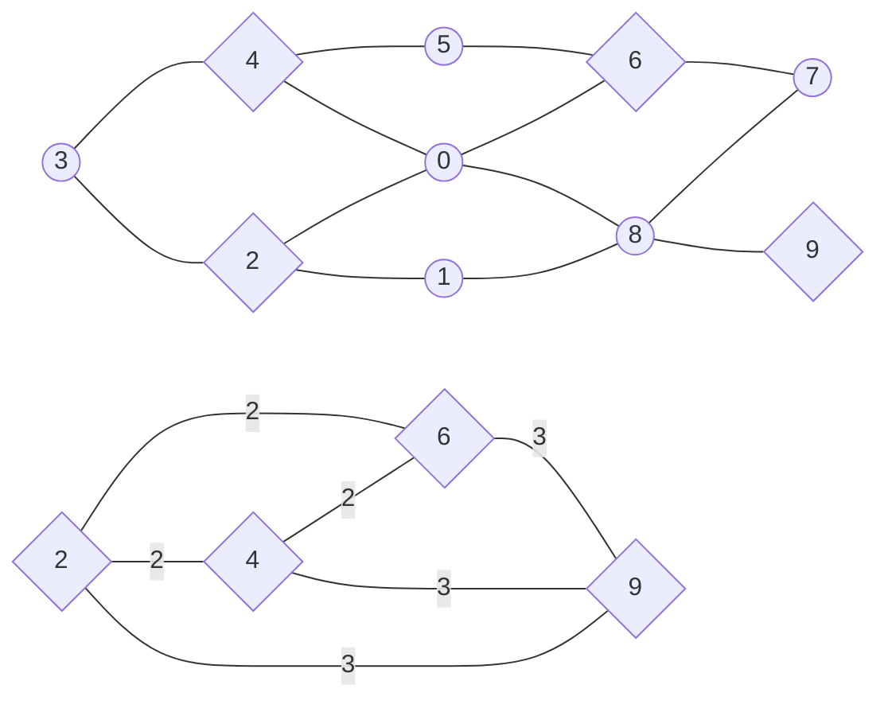

<h1 style="text-align: center;">Aufgabe 1: Müllabfuhr</h1>
<p style="text-align: center;">Teilnahme-ID: 00968</p>
<p style="text-align: center;">Bearbeiter: Finn Rudolph</p>
<p style="text-align: center;">19.03.2022</p>

[TOC]

## Problembeschreibung

Der Stadtplan kann als Graph gesehen werden, wobei Kreuzungen Knoten und Straßen Kanten entsprechen. Der Graph ist ungerichtet und mit den Distanzen zwischen den Kreuzungen gewichtet. Damit ist das Problem ein Kantenroutingproblem und Variation des Briefträgerproblems / Chinese Postman Problem. Es gehört zu den kombinatorischen Optimierungsproblemen, in denen durch mehrere Entscheidungen eine Kostenfunktion maximiert bzw. minimiert werden soll, während Rahmenbedingungen beachtet werden.

Genauer ist es das Min-Max $k$-Chinese Postman Problem, wie es 1978 von Frederickson, Hecht und Kim gestellt wurde. Das originale Paper ist leider nicht kostenfrei im Internet verfügbar, daher beziehe ich mich auf die Problembeschreibung von Ahr (2004). Das Min-Max $k$-Chinese Postman Problem verlangt es, eine gegebene Anzahl von $k$ Rundtouren $F_1, F_2, \dots, F_k$ durch einen gewichteten Graphen $G = (V, E, w)$ zu finden. In der gestellten Aufgabe mit 5 Wochentagen ist $k = 5$, aber es ist eine einfache und nützliche Erweiterung, das allgemein zu halten. Für die Rundtouren gilt folgendes Ziel:

$$
\text{minimiere} \space \max _{i=1} ^k \sum _{e \in E_{F_i}} w(e)
$$

Eine Rundtour $F_i$ ist hier als Folge von Knoten und Kanten $v_0, e_1, v_1, ... e_n, v_n$ definiert. $E_{F_i}$ bezeichnet die Kantenfolge von $F_i$. $w(e)$ sind die Kosten bzw. Länge der Kante $e$. Es müssen folgende Bedingungen erfüllt werden:

$$
\bigcup _{i=1} ^k E_{F_i} = E \\

F_i(v_0) = F_i(v_n) = s \quad \forall \space F_i
$$

$F_i(v_j)$ bezeichnet hier den $j$´ten Knoten von $F$. $s$ ist der Startknoten oder das Stadtzentrum, oft auch Depot genannt. Die erste Einschränkung stellt sicher, dass alle Kanten des Graphen besucht werden. Die zweite besagt, dass jede Tour am Stadtzentrum beginnt und endet; diese nennt man den _Subtour Elimination Constraint_.

_Anmerkung:_ Es ist auch möglich, das Problem als Integer Linear Programming Problem zu formulieren (Ahr, 2004, S. 125 - 134). Da ich aber nicht mit Branch and Bound / Branch and Cut arbeiten werden, habe ich mich für eine weniger abstrakte Formulierung entschieden.

_Anmerkung:_ Der Weg, bis ich das Min-Max $k$-CPP gefunden hatte, war keineswegs schnell und einfach. Angefangen bei Graph Clustering Algorithmen und spektraler Graphentheorie, dann das Traveling Salesman Problem und Vehicle Routing Problem, bin ich erst nach vielen Wochen Recherche erstmals auf das Chinese Postman Problem gestoßen.

## Lösungsidee

Das Min-Max $k$-CPP ist NP-schwer, daher existieren für exakte Lösungen nur Algorithmen mit exponentieller Laufzeit (Frederickson et al., 1978, zitiert nach Ahr, 2004, S. 32). Da das ist für große Probleminstanzen, wie z. B. `muellabfuhr8.txt` mit 1000 Knoten und 3543 Kanten nicht praktikabel ist, wurden bisher vor allem Heuristiken und Metaheuristiken entwickelt.

Obwohl bessere Metaheuristiken existieren, z. B. der Tabu-Suche Algorithmus von Willemse und Joubert (2012), habe ich mich für den Frederickson-Hecht-Kim-Algorithmus (FHK) von Frederickson et al. (1978) entschieden. Denn die Worst-Case Zeitkomplexität kann durch Verwendung eines neuen Algorithmus zum Finden eines _Minimum Weighted Perfect Matching_ (für den FHK-Algorithmus erforderlich) verbessert werden. Mir sind nur Implementierungen des FHK-Algorithmus bekannt, die einen $O(|V|^3)$ Algorithmus dafür verwenden, ich möchte den _Liquidationist_ Algorithmus von Duan et al. (2018) mit $O((m+n \log n) \sqrt n \log (nN))$ verwenden. $N$ ist das größte Kantengewicht. Auch kann der FHK-Algorithmus zur Erstellung der initialen Lösung für eine Metaheuristik gebraucht werden, weswegen eine Verbesserung von ihm durchaus sinnvoll ist. Zum Begriff _Approximationsalgorithmus_: Der Unterschied eines Approximationsalgorithmus zu einer Heuristik ist, dass er eine Lösungsqualität innerhalb eines konstanten Faktors der optimalen Lösung garantiert. Der Approximationsfaktor des FHK-Algorithmus ist $2-\frac 1k$, d. h. die längste Tour ist maximal $2-\frac 1k$-mal länger als die optimale Länge der längsten Tour.

### Der FHK-Algorithmus

Das Prinzip des FHK-Algorithmus ist es, eine Rundtour durch alle Kanten des Graphen in $k$ Pfade zu teilen, und den Anfangs- und Endknoten jedes Pfads mit dem Startknoten zu verbinden (Ahr, 2004, S. 44 - 46). Ein Pfad ist hier eine abwechselnde Abfolge von Knoten und Kanten, die von beidem Dopplungen enthalten kann. Diese Rundtour $C$ ist eine Lösung des Briefträgerproblems, oder Chinese Postman Problems (CPP) auf dem Graphen. Die Kantenzahl in jedem Pfad ist nicht zwingend gleich lang, sondern ist neben der Länge der Postman-Tour, bezeichnet als $w(C)$, auch vom _Shortest Path Tour Lower Bound_ $L$ (Pseudeocode Z. 3) abhängig. Er gibt die Kosten zum Besuchen der vom Startknoten am weitest entfernten Kante an, daher ist er eine untere Grenze für die optimale Lösung des Min-Max $k$-CPP. Die genaue Festlegung der (vorläufig) maximalen Länge $l_i$ der $i$´ten Tour geschieht in Zeile 7 des Pseudocodes. Der Knoten $p_i$, an dem der $i$´te Pfad endet, ist der letzte Knoten in $C$, mit dem die tatsächliche Distanz $w(C(s, p_i))$ noch kleiner als $l_i$ ist. Dieser kann aber auch noch zum nächsten Knoten in $C$ nach $p_i$, bezeichnet als $C(p_i + 1)$ geändert werden. Informell formuliert: Das geschieht, wenn die Distanzen von $p_i$ zu $C(p_i + 1)$ und von $C(p_i + 1)$ zum Startknoten relativ klein sind und wenn dadurch die eigentlich vorgesehene Länge der Tour $l_i$ nicht stark überschritten wird. Exakt wird das in Z. 11 - 12 des Pseudocodes beschrieben. $r_i$ bezeichnet die übrige Länge der $i$`ten Tour zur vorgesehenen Maximallänge. Die $i$´te Tour wird durch den kürzesten Pfad vom vorherigen Teilungsknoten zum Startknoten $SP(p_{i - 1}, s)$ und analog zum aktuellen Teilungsknoten $SP(p_i, s)$ geschlossen.

Der Pseudocode des Algorithmus sieht folgendermaßen aus. `←` bedeutet eine Zuweisung, `=` die Gleichheit zweier Variablen.

```pseudocode
procedure FHK(Graph G)
    C ← ChinesePostman(G);
    L ← max { w(SP(s, a)) + w(e) + w(SP(b, s)) } wobei e = (a, b) ∊ E;
    T ← ∅;

    for i ∊ [1, k]
        lᵢ ← (i / k) ⋅ (L - w(C)) + 0.5 ⋅ L;
        pᵢ ← arg max w(C(s, v)) wobei w(C(s, v)) ≤ lᵢ;

        rᵢ ← lᵢ - w(C(s, pᵢ));
        if w(SP(pᵢ, s) > w(pᵢ, C(pᵢ + 1)) + w(SP(C(pᵢ + 1), s)) - 2 ⋅ rᵢ
            pᵢ ← C(pᵢ + 1);

        Füge (SP(s, pᵢ₋₁) + C(pᵢ₋₁, pᵢ) + SP(pᵢ, s)) zu T hinzu;

    return T;
```

### Das Chinese Postman Problem / Briefträgerproblem

Wie oben beschrieben, ist eine Lösung dieses Problems eine Voraussetzung für den FHK-Algorithmus. Eine optimale Lösung des Briefträgerproblems kann in polynomialer Zeit gefunden werden. Es gehört also, wie für Routingprobleme eher unüblich, der Komplexitätsklasse P an (Edmonds & Johnson, 1973). Ich werde den dort vorgestellten Algorithmus mit einigen Abänderungen verwenden.

Zuerst werden alle Knoten von ungeradem Grad identifiziert, aus denen ein vollständiger Graph $G_o$ ($o$ für _odd_) erstellt wird, der mit mit den kürzesten Pfaden zwischen den Knoten im Originalgraphen gewichtet ist. Nachdem ein [Minimales Perfektes Matching](#minimale-perfekte-matchings) $M$ in $G_o$ gefunden wurde, wird der Originalgraph mit den Kanten des perfekten Matchings zu einem Multigraphen $G_a$ augmentiert. Darin existiert nun ein Eulerkreis, weil jeder ungerade Knoten durch seinen Matching-Partner zu einem geraden Knoten gemacht wurde. $d(v)$ bezeichnet den Grad eines Knoten.

Das Matching geht immer genau auf, weil ein Graph immer eine gerade Anzahl $b$ an Knoten mit ungeradem Grad hat. Angenommen, ein Graph hat nur einen Knoten, d. h. $b = 0 \implies b \equiv 0 \space (\bmod 2)$ Das Hinzufügen eines neuen Knoten verändert $b$ nicht. Das Hinzufügen einer Kante erhöht den Grad von zwei Knoten um $1$. Allgemein formuliert:

$$
b \equiv 0 \space (\bmod 2) \and \space b \larr b + 2 \implies b \equiv 0 \space (\bmod 2)
$$

Da man beliebig Knoten und Kanten hinzufügen kann, um jeden Graphen zu konstruieren, gilt es für jeden Graphen.

Der Eulerkreis in dem Multigraphen ist die optimale Lösung des CPPs, wobei parallele Kanten als eine Kante im ursprünglichen Graphen behandelt werden müssen.

```pseudocode
procedure ChinesePostman(Graph G)
    Gₒ = (Vₒ ← ∅, Eₒ ← ∅, wₒ ← ∅);

    for v ∊ V
        if d(v) ≡ 1 (mod 2)
            Vₒ ← Vₒ ∪ v;
    for a ∊ Vₒ
        for b ∊ Vₒ
            Eₒ ← Eₒ ∪ (a, b);
            wₒ(a, b) ← w(SP(a, b));

    M ← PerfectMatching(Gₒ);

    Gₐ = (V, Eₐ ← E, w);
    for (a, b) ∊ M
        Eₐ ← Eₐ ∪ { e | e ∊ SP(a, b) };

    return EulerianCircuit(Gₐ);
```

#### Der Algorithmus von Hierholzer

Um einen Eulerkreis zu finden, wird der Algorithmus von Hierholzer verwendet. Edmonds und Johnson (1973) verwenden diesen in zwei abgewandelten Formen, ich werde ihn in seiner ursprünglichen Form mit einer veränderten Implementierung verwenden.

Grundsätzlich gibt der Algorithmus von Hierholzer einen Kreis $T$ zurück, dessen Reihenfolge umgekehrt dazu ist, wie er vom Algorithmus besucht wurde. Er konstruiert einen Eulerkreis, indem zunächst ein zufälliger Kreis $S$ in $G_a$ durchlaufen wird. Alle dabei verwendeten Kanten werden aus dem Graphen entfernt. Wieder am Startknoten angelangt, wird der Kreis solange rückwärts durchlaufen, bis ein Knoten mit noch freien Kanten auftritt. Alle Knoten und Kanten entlang dieses Wegs werden dem Eulerkreis $T$ hinzugefügt und aus $S$ entfernt. Von diesem Knoten wird der selbe Prozess erneut ausgeführt, bis $S$ leer ist. Dass Knoten und Kanten erst beim rückwärtigen Durchlaufen hinzugefügt werden ist sehr nützlich, weil so die nötigen Knoten zum Erreichen des Startknotens eines anderen Teilkreises erst hinzugefügt werden, nachdem der Teilkreis selbst hinzugefügt wurde. Würde man nach Durchlaufen eines Kreises ihn sofort vollständig einfügen, müsste man spätere Teilkreise innerhalb einfügen, was aufwändig ist.

Der Startknoten wird durch die Bedingung $d(v) = 0$ erfasst, weil er der einzige Knoten ist, der während des vorwärts gerichteten Durchlaufens Grad $0$ haben kann, wenn der Algorithmus gerade bei ihm steht. $v_s$ ist der aktuell besuchte Knoten. Das liegt daran, dass sein Grad durch das anfängliche Verlassen ständig ungerade ist und gerade wird, wenn der Algorithmus bei ihm steht. Bei allen anderen Knoten sind diese Paritätsregeln umgekehrt, daher können sie als aktueller Knoten nie Grad $0$ haben.

$v_l$ ist der letzte, $v_{l - 1}$ der vorletzte Knoten in $S$. $\sim$ bedeutet, dass zwei Knoten durch eine Kante verbunden sind.

```pseudocode
procedure EulerianCircuit(Graph G)
	T ← ∅;
    S ← { s };

    while S ≠ ∅
    	if d(vₗ) = 0
    		Füge eₗ, vₗ zu T hinzu;
    		Entferne eₗ, vₗ aus S;
    	else
    		Füge irgendein v | v ~ vₗ, (v, vₗ) zu S hinzu;
    		Entferne eₗ aus G;

    return T;
```

_Beispiel:_ Der FHK-Algorithmus soll am Beispiel von `muellabfuhr0.txt` verdeutlicht werden. Die Knoten mit ungeradem Grad sind $2, 4, 6$ und $9$ (eckig dargestellt). Aus ihnen wird beispielsweise das minimale perfekte Matching $2, 4$ und $6, 9$ erstellt. Dann werden die Kanten $(0, 2), (0, 4)$ für das erste Paar und $(0, 6), (0, 8), (8, 9)$ für das zweite Paar erneut hinzugefügt. Oben ist der ursprüngliche Graph $G$ dargestellt (alle Kanten haben Gewicht $1$), unten der Graph $G_o$ aus ungeraden Knoten.

_Anmerkung:_ Der Graph ist etwas anders visualisiert, aber gleich zu dem von `muellabfuhr0.txt`.



### Minimale Perfekte Matchings

## Implementierung

Ich schreibe das Programm in C++ für den Compiler clang. Es kann auf einem x86-64 Linux PC ausgeführt werden. Der Code ist grundsätzlich in Funktionen unterteilt, die aus `main.cpp`, oder untereinander aufgerufen werden. In `main.cpp` und `io.cpp` geschieht Ein- und Ausgabe, der übrige Code ist nach Unterproblemen in Module gegliedert. Ich schreibe den Code in Englisch, weil die Schlüsselwörter von C++ ebenfalls englisch sind, damit er einfacher lesbar ist.

Der Graph des Straßennetzwerks wird als Adjazenzmap repräsentiert. D. h. ein Vektor mit Länge $|V|$ ordnet jedem Knoten eine Hashmap (C++ `std::map`) zu, die als Schlüssel alle verbunden Knoten und als Wert die jeweilige Distanz bzw. Kosten zu dem Knoten. Das ermöglicht das Überprüfen der Existenz einer Kante in $O(1)$ bei gleichzeitigem Speicherverbrauch von nur $O(|V| + |E|)$. Die Umwandlung der Textdatei in diese Datenstruktur übernimmt `to_adjacency_map` in `main.cpp`.

Die Zeilenangaben beziehen sich im Weiteren immer auf die zugehörige Funktion im Abschnitt [_Quellcode_](#quellcode)

### Der FHK-Algorithmus

&rarr; zugehörige Funktion: `fhk`

Meine Implementierung des FHK-Algorithmus beginnt mit Aufrufen von Dijkstra's _Single Source Shortest Path_ Algorithmus für jeden Knoten im Graphen, um eine Distanzmatrix `dis` und Vorgängermatrix `pre` für alle kürzesten Pfade zu erstellen (Z. 2 - 7). Ich habe ihn in meiner Lösungsidee nicht erwähnt, weil er ein Standardalgorithmus bei sehr vielen Problemen ist und ich denke, dass er bekannt ist. Ich habe ihn dem _All Pairs Shortest Path_ Algorithmus von Floyd und Warshall vorgezogen, weil die Problemgraphen durchschnittlich sehr dünn sind, d. h. $|E| \ll |V|^2$. Bei solchen Graphen arbeitet Dijkstra's Algorithmus unter Verwendung einer Prioritätsschlange (`std::priority_queue`) ähnlich schnell oder schneller.

Nachdem die Lösung des Chinese Postman Problems und der Shortest Path Tour Lower Bound errechnet wurden (später beschrieben), beginnt die eigentliche Logik des FHK-Algorithmus. `pre_split` speichert den vorherigen Teilungsknoten, `tours` die am Ende zurückgegebenen Rundtouren (Z. 14 - 15). Im Gegensatz zum Pseudocode wird hier ein Pfad / eine Rundtour nur als Knotenfolge definiert. `cost` speichert die Kosten zum Erreichen des vorherigen Teilungsknotens (Z. 16), was für die Bestimmung des nächsten Teilungsknotens relevant ist. Die Bestimmung einer Rundtour geschieht `num_tours - 1`-mal. Zunächst wird ihre maximale Länge `max_cost` (Z. 19 - 20) durch die bereits beschriebene Formel errechnet. Indem die Chinese Postman Tour durchlaufen wird, bis `cost > max_cost`, während `cost` ständig mit dem Gewicht der gerade gebrauchten Kante erhöht wird, wird der nächste Teilungsknoten `split` vorläufig festgelegt (Z. 23 - 27). Weil bei Abbruch der `while`-Schleife `split` bereits ein Knoten zu weit gesetzt wurde, implementiere ich das mögliche Verschieben des Teilungsknotens um $1$ etwas anders. Hier in der Implementierung wird die umgekehrte Bedingung überprüft, und gegebenenfalls der vorherige Knoten als Teilungsknoten gewählt.

Alle Touren, bis auf die letzte, werden auf diese Weise bestimmt, durch [`construct_tour()`]() explizit konstruiert und dem `tours`-Vektor hinzugefügt. Die letzte Tour besitzt keinen zweiten Teilungsknoten und kann daher sofort festgelegt werden (Z. 45).

#### Shortest Path Tour Lower Bound

&rarr; zugehörige Funktion: `farthest_edge_cost`

Es wird über alle Kanten des Graphen iteriert: und die größten Kosten zurückgegeben, die ein kürzester Pfad zum ersten Knoten der Kante, über die Kante und vom zweiten Knoten zurück zum Startknoten hat.

#### Konstruktion einer Tour

&rarr; zugehörige Funktion: `vector<int> construct_tour(vector<int> &cpp_tour, matrix_2d &pre, int start, int end)`

Diese Funktion dient dazu, die eigentliche Logik zum Verbinden einer Tour zum Startknoten, implementiert in `close_tour()`, für beide Seiten des Pfads anzuwenden. Damit wird vermieden, das zweimal explizit als Code zu schreiben.

&rarr; zugehörige Funktion `void close_tour(vector<int> &tour, matrix_2d &pre, bool append_front)`

Der Parameter `append_front` ist `true`, wenn der Anfangsknoten des Pfads zum Startknoten verbunden werden soll und `false`, wenn das mit dem Endknoten des Pfads geschehen soll. Die Knoten, die auf dem kürzesten Pfad des zu verbindenden Knoten zum Startknoten liegen, sind in der Vorgängermatrix im Vektor bei Index `0` enthalten. `curr`, der aktuelle Knoten auf dem kürzesten Pfad, wird solange mit seinem Vorgänger, der bei `pre[0][curr]` liegt, ersetzt, bis dieser `-1` ist, was bedeutet, dass der Startknoten erreicht wurde (Z. 4 - 8). Dass `-1` bedeutet, dass der Zielknoten erreicht ist, habe ich in Dijkstra's Algorithmus so festgelegt. Alle auf diesem Weg besuchten Knoten werden vorne bzw. hinten an die Tour angehängt. Die Funktion verändert direkt die Tour, die ihr als Referenz mitgegeben wurde.

### Der Chinese Postman Algorithmus

&rarr; zugehörige Funktion: `pair<vector<int>, int> postman(adj_map &graph, matrix_2d &dis, matrix_2d &pre)`

Zu Beginn wird der vollständige Graph aus Knoten mit ungeradem Grad erstellt. Dazu wird einem Set `odds` jeder Knoten hinzugefügt, dessen Anzahl an Einträgen in seiner Hashmap Rest $1 \space (\bmod 2)$ hat (Z. 2 - 7). Der Graph selbst wird erstellt, indem in `odds_graph` für jede Kombination zweier Knoten aus `odds` die Distanz ihres kürzesten Pfads eingetragen wird (Z. 13 - 24).

Nachdem das perfekte Matching für `odds_graph` gefunden wurde, wird der augmentierte Multigraph `augmented` erstellt. Er wird als zweidimensionale Map implementiert und hat die gleiche Struktur wie die ursprüngliche Adjazenzmap, speichert aber die Anzahl paralleler Kanten zwischen zwei Knoten anstatt des Kantengewichts. Weil Kantengewichte für den Eulerkreis irrelevant sind, werden sie in diesem Teil des Algorithmus vernachlässigt. Die zweidimensionale Map statt einer Adjazenzmap ist deshalb sinnvoll, weil während der Konstruktion des Eulerkreises neben Kanten auch Knoten aus dem Graphen entfernt werden, was bedeuten würde, dass ein Eintrag im Vektor entfernt wird. Damit würden sich die Indizes der Hashmaps verschieben, was den Graphen verfälscht. Zunächst wird für jedes im Ursprungsgraphen verbundene Knotenpaar, durch eine verschachtelte `for`-Schleife, der Eintrag in `augmented` auf $1$ gesetzt (Z. 31 - 36). Um die Kanten des perfekten Matchings von `odds` hinzuzufügen, müssen alle Kanten entlang des kürzesten Pfads hinzugefügt werden. Das geschieht durch den gleichen Rückverfolgungsalgorithmus wie bei der [Tourenkonstruktion des FHK-Algorithmus](#konstruktion-einer-tour). Der Unterschied ist, dass ständig zwei Knoten `a` und `b` gespeichert und immer einen Schritt weiter bewegt werden. Indem die Anzahl an Kanten zwischen diesen zwei Knoten in `augmented` bei jedem Schritt um $1$ erhöht wird, entsteht der gewünschte eulersche Multigraph (Z. 39 - 50).

Der Eulerkreis durch den Graphen, der zurückgegeben wird, behandelt parallele Kanten bereits als eine ursprüngliche, was durch die implizite Umsetzung des Multigraphen als `map_2d` möglich ist.

#### Hierholzer's Algorithmus

&rarr; zugehörige Funktion: `vector<int> eulerian_circuit(map_2d &graph)`

Die letztendlich zurückgegebene Knotenfolge des Eulerkreises wird in `circuit` gespeichert. Für die aktuelle Subtour wird ein Stapel verwendet (Z. 2 - 4), weil nur an der letzten Position Elemente hinzugefügt oder entfernt werden müssen. `curr` ist der Knoten, bei dem der Algorithmus aktuell steht. `graph[curr].empty()` bedeutet, dass der Grad von `curr` $0$ ist (Z. 9), d. h. die Subtour wird bis zu einem Knoten mit noch anliegenden Kanten rückverfolgt. Wenn Kanten an `curr` anliegen, wird der erste verbundene Knoten als nächster gewählt (Z. 13) und die zwischenliegende Kante entfernt (Z. 16 - 19). Dazu wird die Anzahl an Kanten zwischen ihnen um $1$ verringert, und falls diese $0$ wird, der Eintrag in der `map` ganz entfernt.

## Zeitkomplexität

## Beispiele

Um mein Programm an anderen großen Graphen außer den vorgegebenen testen zu können, habe ich mir Testinstanzen von sintef (Literaturverzeichnis &rarr; Testinstanzen) herausgesucht. Sie sind zwar eigentlich für das _Capacitated Arc Routing Problem_ (CARP) bzw _Node, Edge and Arc Routing Problem_ (NEARP) gedacht, aber das stört nicht. Mit einem kleinen C++ Programm (`muellabfuhr/beispiele/convert_samples.cpp`) habe ich sie in das bekannte Format umgewandelt, wobei gerichtete Kanten einfach als ungerichtet behandelt wurden. Ich habe die des BHW-Benchmarks und des DI-NEARP-Benchmarks verwendet, Instanzen, bei denen der zugrundeliegende Graph gleich ist, wurden nicht doppelt aufgenommen. Insgesamt sind es 14 Instanzen mit $|V|$ von 11 bis 1120 und $|E|$ von 25 bis 1450.

## Quellcode

### Typdefinitionen

```c++
typedef vector<map<int, int>> adj_map;

typedef map<int, map<int, int>> map_2d;

typedef vector<vector<int>> matrix_2d;
```

_Anmerkung:_ `matrix_2d` wird nur für `vector<vector<int>>` eingesetzt, wenn die Datenstruktur wirklich als Matrix gedacht ist.

### Der FHK-Algorithmus

Die folgenden Funktionen befinden sich in `fhk_algorithm.cpp`.

```c++
vector<vector<int>> fhk(adj_map &graph) {
    matrix_2d dis, pre;
    for (int v = 0; v < graph.size(); v++) {
        auto [distances, predecessors] = dijkstra(graph, v);
        dis.push_back(distances);
        pre.push_back(predecessors);
    }

    auto [cpp_tour, cpp_cost] = postman(graph, dis, pre);

    int lower_bound = farthest_edge_cost(graph, dis);
    int pre_split = 0;
    int cost = 0;
    vector<vector<int>> tours;

    for (int i = 1; i <= num_tours - 1; i++) {
        int max_cost = ((float) i / (float) num_tours) *
            (float) (cpp_cost - lower_bound) + 0.5 * (float) lower_bound;

        int split = pre_split; // index in cpp_tour, not actual vertex
        while (cost <= max_cost) {
            cost += graph[cpp_tour[split]][cpp_tour[split + 1]];
            split += 1;
        }

        int residual = max_cost - cost - graph[cpp_tour[split]][cpp_tour[split + 1]];

        if (
            dis[cpp_tour[split]][0] <=
                graph[cpp_tour[split]][cpp_tour[split + 1]]
                + dis[cpp_tour[split + 1]][0]
                - 2 * residual
        ) {
            split -= 1;
            cost -= graph[cpp_tour[split]][cpp_tour[split + 1]];
        }

        tours.push_back(construct_tour(cpp_tour, pre, pre_split, split));
        pre_split = split;
    }
    tours.push_back(construct_tour(cpp_tour, pre, pre_split, cpp_tour.size() - 1));
    return tours;
}
```

```c++
vector<int> construct_tour(vector<int> &cpp_tour, matrix_2d &pre, int start, int end) {
    vector<int> tour(cpp_tour.begin() + start, cpp_tour.begin() + end + 1);
    close_tour(tour, pre, true);
    close_tour(tour, pre, false);

    return tour;
}
```

```c++
void close_tour(vector<int> &tour, matrix_2d &pre, bool append_front) {
    int curr = pre[0][append_front ? *tour.begin() : *(--tour.end())];

    while (curr != -1) {
        if (append_front) tour.insert(tour.begin(), curr);
        else tour.push_back(curr);
        curr = pre[0][curr];
    }
}
```

```c++
int farthest_edge_cost(adj_map &graph, matrix_2d &dis) {
    int farthest = 0;
    for (int a = 0; a < graph.size(); a++) {
        for (const auto &[b, w]: graph[a]) {
            farthest = max(dis[0][a] + w + dis[b][0], farthest);
        }
    }

    return farthest;
}
```

#### Dijkstra's Algorithmus

```c++
pair<vector<int>, vector<int>> dijkstra(adj_map &graph, int start) {
    vector<int> dis(graph.size(), INT_MAX), pre(graph.size(), -1);
    vector<bool> visited(graph.size(), false);

    auto is_closer = [&dis](int a, int b) -> bool {
        return dis[a] > dis[b];
    };

    priority_queue<int, vector<int>, decltype(is_closer)> queue(is_closer);
    queue.push(start);
    dis[start] = 0;

    while (!queue.empty()) {
        int curr = queue.top();
        queue.pop();
        visited[curr] = true;

        for (const auto &[next, w]: graph[curr]) {
            if (!visited[next] && dis[next] > dis[curr] + w) {
                dis[next] = dis[curr] + w;
                pre[next] = curr;
                queue.push(next);
            }
        }
    }

    return { dis, pre };
}
```

### Der Chinese Postman Algorithmus

```c++
pair<vector<int>, int> postman(adj_map &graph, matrix_2d &dis, matrix_2d &pre) {
    set<int> odds;
    for (int v = 0; v < graph.size(); v++) {
        if (graph[v].size() % 2 == 1) {
            odds.insert(v);
        }
    }

    map_2d odds_graph;
    int max_cost = 0;
    pair<int, int> largest_edge;

    for (const auto &a: odds) {
        for (const auto &b: odds) {
            if (a != b) {
                odds_graph[a][b] = odds_graph[b][a] = dis[a][b];

                if (dis[a][b] > max_cost) {
                    largest_edge = { a, b };
                    max_cost = dis[a][b];
                }
            }
        }
    }

    set<pair<int, int>> matching = perfect_matching(odds_graph, largest_edge);

    map_2d augmented;
    int weight_sum = 0;

    for (int a = 0; a < graph.size(); a++) {
        for (const auto &[b, w]: graph[a]) {
            augmented[a][b] = 1;
            weight_sum += w;
        }
    }
    weight_sum /= 2;

    for (auto [start, target]: matching) {
        int b = pre[target][start];
        int a = start;

        while (b != -1) {
            augmented[a][b] += 1;
            augmented[b][a] += 1;
            weight_sum += graph[a][b];
            a = b;
            b = pre[target][b];
        }
    }

    vector<int> postman_tour = eulerian_circuit(augmented);
    return { postman_tour, weight_sum };
}
```

#### Hierholzer's Algorithmus

```c++
vector<int> eulerian_circuit(map_2d &graph) {
    vector<int> circuit;
    stack<int> subtour;
    subtour.push(0);

    while (!subtour.empty()) {
        int curr = subtour.top();

        if (graph[curr].empty()) {
            subtour.pop();
            circuit.push_back(curr);
        } else {
            int next = graph[curr].begin()->first;
            subtour.push(next);

            graph[curr][next] = graph[next][curr] -= 1;
            if (graph[curr][next] == 0) {
                graph[curr].erase(next);
                graph[next].erase(curr);
            }
        }
    }
    return circuit;
}
```

## Literaturverzeichnis

1. Ahr, D. (2004). _Contributions to Multiple Postmen Problems_ (Dissertation, Ruprecht-Karls-Universität Heidelberg). http://archiv.ub.uni-heidelberg.de/volltextserver/4963/1/thesis.pdf
2. Broek, R. (2018). _Lecture Notes on Linear Programming_. Universiteit Utrecht. http://www.cs.uu.nl/docs/vakken/mads/LectureNotesILP.pdf
3. Cook, W. & Rohe, A. (1999). _Computing Minimum Weighted Perfect Matchings_. http://www.math.uwaterloo.ca/~bico/papers/match_ijoc.pdf
4. Edmonds, J. & Johnson, E. (1973). _Matching, Euler Tours and the Chinese Postman_. http://web.eecs.umich.edu/~pettie/matching/Edmonds-Johnson-chinese-postman.pdf
5. Laporte, G. (1991). _The Vehicle Routing Problem: An Overview of exact and approximate Algorithms_. https://staff.fmi.uvt.ro/~daniela.zaharie/ma2017/projects/applications/VehicleRouting/VRP_Laporte_review.pdf
6. Limon, Y. & Azizoglu, M. (2018). _New Heuristics for the balanced k-Chinese Postman Problem_. http://www.inderscience.com/storage/f581191312274106.pdf
7. Liu, S. & Louis, S. & Harris, N. & La, H. (2019). _A Genetic Algorithm for the MinMax k-Chinese Postman Problem with Applications to Bride Inspection_. Missouri University of Science and Technology. https://scholarsmine.mst.edu/cgi/viewcontent.cgi?article=1050&context=inspire-meetings
8. Duan, R. & Pettie, S. & Su, H. (2018). _Scaling Algorithms for Weighted Matching in General Graphs_. https://web.eecs.umich.edu/~pettie/papers/MWPM.pdf
9. Sannemo, J. (2018). _Principles of Algorithmic Problem Solving_. KTH Royal Institute of Technology. https://www.csc.kth.se/~jsannemo/slask/main.pdf
10. Willemse, E. & Joubert, J. (2012). _Applying min-max k postman problems to the routing of security guards_. https://repository.up.ac.za/bitstream/2263/18380/1/Willemse_Applying%282012%29.pdf

**Testinstanzen:** https://www.sintef.no/nearp/
