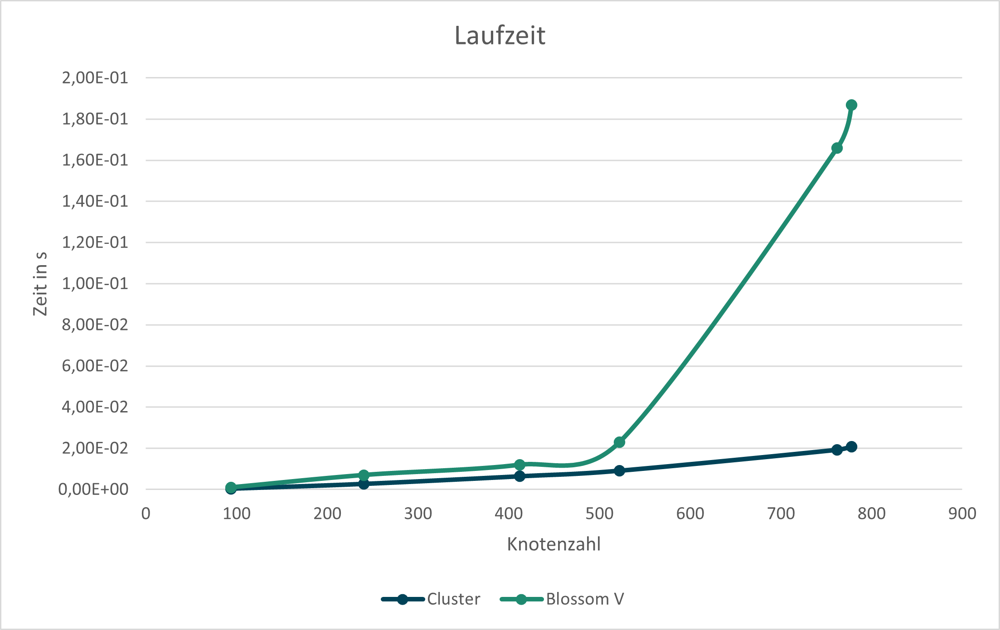

<h1 style="text-align: center;">Aufgabe 1: Müllabfuhr</h1>
<p style="text-align: center;">Teilnahme-ID: 00968</p>
<p style="text-align: center;">Bearbeiter: Finn Rudolph</p>
<p style="text-align: center;">19.03.2022</p>

[TOC]

## Problembeschreibung

Der Stadtplan kann als Graph gesehen werden, wobei Kreuzungen Knoten und Straßen Kanten entsprechen. Der Graph ist ungerichtet und mit den Distanzen zwischen den Kreuzungen gewichtet. Damit ist das Problem ein Kantenroutingproblem und Variation des Briefträgerproblems / Chinese Postman Problem. Es gehört zu den kombinatorischen Optimierungsproblemen, in denen durch mehrere Entscheidungen eine Kostenfunktion maximiert bzw. minimiert werden soll, während Rahmenbedingungen beachtet werden.

Genauer ist es das Min-Max $k$-Chinese Postman Problem, wie es 1978 von Frederickson, Hecht und Kim gestellt wurde. Das originale Paper ist leider nicht kostenfrei im Internet verfügbar, daher beziehe ich mich auf die Problembeschreibung von Ahr (2004). Das Min-Max $k$-Chinese Postman Problem verlangt es, eine gegebene Anzahl von $k$ Rundtouren $F_1, F_2, \dots, F_k$ durch einen gewichteten Graphen $G = (V, E, w)$ zu finden. In der gestellten Aufgabe mit 5 Wochentagen ist $k = 5$, aber es ist eine einfache und nützliche Erweiterung, das allgemein zu halten. Für die Rundtouren gilt folgendes Ziel:

$$
\text{minimiere} \space \max _{i=1} ^k \sum _{e \in E_{F_i}} w(e)
$$

Eine Rundtour $F_i$ ist hier als Folge von Knoten und Kanten $v_0, e_1, v_1, ... e_n, v_n$ definiert. $E_{F_i}$ bezeichnet die Kantenfolge von $F_i$. $w(e)$ sind die Kosten bzw. Länge der Kante $e$. Es müssen folgende Bedingungen erfüllt werden:

$$
\bigcup _{i=1} ^k E_{F_i} = E \\

F_i(v_0) = F_i(v_n) = s \quad \forall \space F_i
$$

$F_i(v_j)$ bezeichnet hier den $j$´ten Knoten von $F$. $s$ ist der Startknoten oder das Stadtzentrum, in Bezug auf Routingprobleme oft auch Depot genannt. Die erste Einschränkung stellt sicher, dass alle Kanten des Graphen besucht werden. Die zweite besagt, dass jede Tour am Stadtzentrum beginnt und endet; diese nennt man den _Subtour Elimination Constraint_.

_Anmerkung:_ Es ist auch möglich, das Problem als Integer Linear Programming Problem zu formulieren (Ahr, 2004, S. 125 - 134). Da ich aber nicht mit Branch and Bound / Branch and Cut arbeiten werden, habe ich mich für eine weniger abstrakte Formulierung entschieden.

_Anmerkung:_ Der Weg, bis ich das Min-Max $k$-CPP gefunden hatte, war keineswegs schnell und einfach. Angefangen bei Graph Clustering Algorithmen und spektraler Graphentheorie, dann das Traveling Salesman Problem und Vehicle Routing Problem, bin ich erst nach vielen Wochen Recherche erstmals auf das Chinese Postman Problem gestoßen.

## Lösungsidee

Das Min-Max $k$-CPP ist NP-schwer, daher existieren für exakte Lösungen nur Algorithmen mit exponentieller Laufzeit (Frederickson et al., 1978, zitiert nach Ahr, 2004, S. 32). Da das ist für große Probleminstanzen, wie z. B. `muellabfuhr8.txt` mit 1000 Knoten und 3543 Kanten nicht praktikabel ist, wurden bisher vor allem Heuristiken und Metaheuristiken entwickelt.

Ich habe mich für den Frederickson-Hecht-Kim-Algorithmus (FHK) von Frederickson et al. (1978) entschieden, obwohl bessere Metaheuristiken existieren, z. B. der Tabu-Suche Algorithmus von Willemse und Joubert (2012). Denn die Worst-Case Zeitkomplexität kann durch Verwendung eines eigens entwickelten Algorithmus zum Finden eines _Minimum Weighted Perfect Matching_ verbessert werden. Denn dieses für den FHK-Algorithmus erforderliche Teilproblem ist bisher das begrenzende Element der Zeitkomplexität. Auch kann der FHK-Algorithmus zur Erstellung der initialen Lösung für eine Metaheuristik gebraucht werden, weswegen eine Verbesserung von ihm durchaus sinnvoll ist. Zum Begriff _Approximationsalgorithmus_: Der Unterschied eines Approximationsalgorithmus zu einer Heuristik ist, dass er eine Lösungsqualität innerhalb eines konstanten Faktors der optimalen Lösung garantiert. Der Approximationsfaktor des FHK-Algorithmus ist $2-\frac 1k$, d. h. die längste Tour ist maximal $2-\frac 1k$-mal länger als die optimale Länge der längsten Tour. Da der neue Matchingalgorithmus allerdings eine Heuristik ist und nicht optimal, kann dieser Approximationsfaktor auf meine Implementierung nicht angewandt werden.

### Der FHK-Algorithmus

Das Prinzip des FHK-Algorithmus ist es, eine Rundtour durch alle Kanten des Graphen in $k$ Pfade zu teilen, und den Anfangs- und Endknoten jedes Pfads mit dem Startknoten zu verbinden (Ahr, 2004, S. 44 - 46). Ein Pfad ist hier eine abwechselnde Abfolge von Knoten und Kanten, die von beidem Dopplungen enthalten kann. Diese Rundtour $C$ ist eine Lösung des Briefträgerproblems, oder Chinese Postman Problems (CPP) auf dem Graphen. Die Kantenzahl in jedem Pfad ist nicht zwingend gleich lang, sondern ist neben der Länge der Postman-Tour, bezeichnet als $w(C)$, auch vom _Shortest Path Tour Lower Bound_ $L$ (Pseudeocode Z. 3) abhängig. Er gibt die Kosten zum Besuchen der vom Startknoten am weitest entfernten Kante an, daher ist er eine untere Grenze für die optimale Lösung des Min-Max $k$-CPP. Die genaue Festlegung der (vorläufig) maximalen Länge $l_i$ der $i$´ten Tour geschieht in Zeile 7 des Pseudocodes. Der Knoten $p_i$, an dem der $i$´te Pfad endet, ist der letzte Knoten in $C$, mit dem die tatsächliche Distanz $w(C(s, p_i))$ noch kleiner als $l_i$ ist. Dieser kann aber auch noch zum nächsten Knoten in $C$ nach $p_i$, bezeichnet als $C(p_i + 1)$ geändert werden. Informell formuliert: Das geschieht, wenn die Distanzen von $p_i$ zu $C(p_i + 1)$ und von $C(p_i + 1)$ zum Startknoten relativ klein sind und wenn dadurch die eigentlich vorgesehene Länge der Tour $l_i$ nicht stark überschritten wird. Exakt wird das in Z. 11 - 12 des Pseudocodes beschrieben. $r_i$ bezeichnet die übrige Länge der $i$´ten Tour zur vorgesehenen Maximallänge. Die $i$´te Tour wird durch den kürzesten Pfad vom vorherigen Teilungsknoten zum Startknoten $SP(p_{i - 1}, s)$ und analog zum aktuellen Teilungsknoten $SP(p_i, s)$ geschlossen. Der Pseudocode des Algorithmus sieht folgendermaßen aus. `←` bedeutet eine Zuweisung, `=` die Gleichheit zweier Variablen.

```pseudocode
procedure FHK(G)
    C ← ChinesePostman(G);
    L ← max { w(SP(s, u)) + w(u, v) + w(SP(v, s)) } wobei (u, v) ∊ E;
    T ← ∅;

    for i ∊ [1, k]
        lᵢ ← (i / k) ⋅ (L - w(C)) + 0.5 ⋅ L;
        pᵢ ← arg max w(C(s, v)) wobei w(C(s, v)) ≤ lᵢ;

        rᵢ ← lᵢ - w(C(s, pᵢ));
        if w(SP(pᵢ, s) > w(pᵢ, C(pᵢ + 1)) + w(SP(C(pᵢ + 1), s)) - 2 ⋅ rᵢ
            pᵢ ← C(pᵢ + 1);

        Erweitere T um die neue Tour (SP(s, pᵢ₋₁) + C(pᵢ₋₁, pᵢ) + SP(pᵢ, s));

    return T;
```

### Das Chinese Postman Problem / Briefträgerproblem

Wie oben beschrieben, ist eine Lösung dieses Problems eine Voraussetzung für den FHK-Algorithmus. Eine optimale Lösung des Briefträgerproblems kann in polynomialer Zeit gefunden werden. Es gehört also, wie für Routingprobleme eher unüblich, der Komplexitätsklasse P an (Edmonds & Johnson, 1973).

Zuerst werden alle Knoten von ungeradem Grad $V_o$ ($o$ für odd) identifiziert und zwischen diesen ein [Minimales Perfektes Matching](#minimale-perfekte-matchings) $M$ berechnet. Als Kantengewichte dienen die kürzesten Pfade in $G$, implizit wird also ein vollständiger Graph als Grundlage für das Matching erstellt. Anschließend wird der Originalgraph mit den Kanten des perfekten Matchings zu einem Multigraphen $G_a$ augmentiert. Wenn ein kürzester Pfad zwischen zwei gematchten Knoten mehrere Kanten enthält, werde alle repliziert. In $G_a$ existiert ein Eulerkreis, weil jeder ungerade Knoten durch seinen Matching-Partner zu einem geraden Knoten gemacht wurde. $d(v)$ bezeichnet den Grad eines Knoten.

Das Matching geht immer genau auf, weil ein Graph immer eine gerade Anzahl $b$ an Knoten mit ungeradem Grad hat. Angenommen, ein Graph hat nur einen Knoten, d. h. $b = 0 \implies b \equiv 0 \space (\bmod 2)$ Das Hinzufügen eines neuen Knoten verändert $b$ nicht. Das Hinzufügen einer Kante erhöht den Grad von zwei Knoten um $1$. Allgemein formuliert:

$$
b \equiv 0 \space (\bmod 2) \and \space b \larr b + 2 \implies b \equiv 0 \space (\bmod 2)
$$

Da man beliebig Knoten und Kanten hinzufügen kann, um jeden Graphen zu konstruieren, gilt es für jeden Graphen.

Der Eulerkreis in $G_a$ ist die optimale Lösung des CPPs, wobei parallele Kanten als eine Kante im ursprünglichen Graphen behandelt werden müssen. "Optimal" ist in diesem Abschnitt unter der Voraussetzung zu verstehen, dass das perfekte Matching wirklich minimal ist.

```pseudocode
procedure ChinesePostman(G)
    Vₒ ← ∅;

    for v ∊ V
        if d(v) ≡ 1 (mod 2)
            Vₒ ← Vₒ ∪ v;

    M ← PerfectMatching(Vₒ);

    Gₐ = (V, Eₐ ← E, w);
    for (u, v) ∊ M
        Eₐ ← Eₐ ∪ { e | e ∊ SP(u, v) };

    return Cluster(Gₐ);
```

### Hierholzer's Algorithmus

Um einen Eulerkreis zu finden, wird der Algorithmus von Hierholzer verwendet. Edmonds und Johnson (1973) verwenden diesen in zwei abgewandelten Formen, ich werde ihn in seiner ursprünglichen Form verwenden.

Grundsätzlich gibt der Algorithmus von Hierholzer einen Kreis $K$ zurück, dessen Reihenfolge umgekehrt dazu ist, wie er vom Algorithmus besucht wurde. Er konstruiert einen Eulerkreis, indem zunächst ein zufälliger Kreis $S$ in $G_a$ durchlaufen wird. Alle dabei verwendeten Kanten werden aus dem Graphen entfernt. Wieder am Startknoten angelangt, wird $S$ solange rückwärts durchlaufen, bis ein Knoten mit noch freien Kanten auftritt. Alle Knoten und Kanten entlang dieses Wegs werden dem Eulerkreis $K$ hinzugefügt und aus $S$ entfernt. Von diesem Knoten wird der selbe Prozess erneut ausgeführt, bis $S$ leer ist. Dass Knoten und Kanten erst beim rückwärtigen Durchlaufen hinzugefügt werden ist sehr nützlich, weil so die nötigen Knoten zum Erreichen des Startknotens eines anderen Teilkreises erst hinzugefügt werden, nachdem der Teilkreis selbst hinzugefügt wurde. Würde man nach Durchlaufen eines Kreises ihn sofort vollständig einfügen, müsste man spätere Teilkreise innerhalb einfügen, was aufwändig ist.

Der Startknoten wird durch die Bedingung $d(v_l) = 0$ erfasst, weil er der einzige Knoten ist, der während des vorwärts gerichteten Durchlaufens Grad $0$ haben kann, wenn der Algorithmus gerade bei ihm steht. $v_l$ ist der aktuell besuchte Knoten. Das liegt daran, dass sein Grad durch das anfängliche Verlassen ständig ungerade ist und gerade wird, wenn der Algorithmus bei ihm steht. Bei allen anderen Knoten ist diese Paritätsregel umgekehrt, daher können sie als aktueller Knoten nie Grad $0$ haben.

$v_l$ ist der letzte, $v_{l - 1}$ der vorletzte Knoten in $S$. $\sim$ bedeutet, dass zwei Knoten durch eine Kante verbunden sind.

```pseudocode
procedure EulerianCircuit(G)
	K ← ∅;
    S ← { s };

    while S ≠ ∅
    	if d(vₗ) = 0
    		Erweitere K um eₗ, vₗ;
    		Entferne eₗ, vₗ aus S;
    	else
    		Erweitere K um ein beliebiges v ∊ G | v ~ vₗ, (v, vₗ);
    		Entferne eₗ aus G;

    return K;
```

### Minimales Perfektes Matching

Zum Finden eines minimalen perfekten Matchings in einem nicht-bipartiten Graphen ist Edmonds Blütenalgorithmus und dessen Weiterentwicklungen Standard. Die theoretisch besten Algorithmen konnten bisher die $O(|E| \sqrt {|V|})$-Barriere nicht überwinden (Duan, 2018), womit dieser Teil des FHK-Algorithmus begrenzend für seine Zeitkomplexität ist. Aus diesem Grund möchte ich zum Finden eines minimalen perfekten Matchings eine selbst entwickelte Heuristik verwenden. Bei dem implizit erstellten Graphen aus Knoten mit ungeradem Grad liegt ein vollständiger Graph mit maximal $O(|V|)$ Knoten vor, daher kann die $O(|E| \sqrt {|V|})$-Barriere als $O(|V|^{2.5})$-Barriere umgeschrieben werden. Bei großen Problemgraphen kann meine Heuristik durch ihre Laufzeit von $\Theta(|V|^2)$ eine signifikante Geschwindigkeitszunahme bewirken. Außerdem ist eine gute Implementierung einer der Algorithmen, die auf dem Blütenalgorithmus basieren, sehr schwierig und aufwändig. Beispielsweise hat [Blossom V](https://pub.ist.ac.at/~vnk/software.html) von Vladimir Kolmogorov über 3500 Codezeilen, was einen groben Eindruck über die Komplexität der Implementierung gibt. Eine Implementierung des ursprünglichen Blütenalgorithmus wäre für mich möglich gewesen, allerdings ist dessen Laufzeit sowohl in der Theorie mit $O(|V|^2 \cdot |E|)$ als auch in der Praxis deutlich schlechter, und er unterstützt nur durch eine Modifikation gewichtete Graphen. Ich benutze eine selbst entwickelte Heuristik und vergleiche deren Lösungsqualität und Geschwindigkeit mit Blossom V.

Genauer werden zwei Heuristiken benutzt: Eine, um den Graphen in kleinere Graphen zu clustern, und eine zweite, um in den Teilgraphen ein möglichst minimales perfektes Matching zu finden. Beide sind auf vollständige, metrische Graphen ausgelegt, wie hier vorliegend.

#### Cluster

Die Cluster-Heuristik sortiert alle Kanten des Graphen aufsteigend und teilt Knoten, die durch eine der längsten Kanten verbunden sind, verschiedenen Clustern zu. Die Sortierung der Kanten nach Kosten geschieht durch Radix Sort, den ich bereits in der Bonusaufgabe erkläre, daher wiederhole ich seine Funktionsweise hier nicht. Für eine detaillierte Beschreibung verweise ich auf _zara-zackig.pdf, Abschnitt Radix Sort (MSD)_. Um die Knoten anschließend aufzuteilen, wird die Liste an Kanten $L$ von hinten durchlaufen, und sobald ein Knoten auftritt, der noch keinem Cluster zugewiesen ist, wird er dem Cluster $C*$ zugewiesen, zu dessen Knoten er die geringsten durchschnittlichen Kosten hat (Pseudocode _Zuteilen_, Z. 4 - 13). Ein Cluster ist als Teilmenge von $V_o$ definiert. Falls kein ausreichend guter Cluster vorhanden ist, wird mit dem Knoten ein neuer erstellt. Die Schwelle für _ausreichend gut_ wird durch den Parameter $\alpha \in ]0, 1[$ bestimmt und ist das Gewicht der Kante bei Index $ t = \lfloor \alpha \cdot |L| \rfloor$ (das $\alpha$-Quantil von $L$). Das heißt, wenn bei einem Knoten $u$ die durchschnittlichen Kosten zu jedem Cluster größer als $w(l_t)$ sind, wird ein neuer Cluster $\{u\}$ erstellt (_Zuteilen_, Z. 15). $l_i$ bezeichnet das $i$´te Element in $L$, $Cl$ die Menge aller Cluster.

Um perfekte Matchings in den Clustern erstellen zu können, muss die Anzahl an Knoten jedes Clusters gerade sein. Daher sollen gegen Ende des Zuteilens, wenn die Anzahl offener Knoten gleich oder kleiner der Anzahl von Clustern mit ungerader Größe ist, Knoten nur ungeraden Clustern zugeteilt werden (_Zuteilen_, Z. 5). Auch wird dann ein Knoten immer einem bereits bestehenden Cluster zugeteilt (_Zuteilen_, Z. 12), sodass am Ende alle Cluster eine gerade Größe haben. Die danach errechneten Matchings der 2-Opt Heuristik für jedes Cluster werden zu einem Matching $M$ zusammengefügt und zurückgegeben.

```pseudocode
procedure Cluster(Vₒ)
	L ← ∅;
	for u ∊ Vₒ
		for v ∊ Vₒ | v ≠ u
			L ← L ∪ (u, v);

	RadixSort(L);
	t = ⌊|L| ⋅ α⌋;
	Cl ← ∅;

	for (u, v) ∊ L, absteigend, bis alle Knoten zugewiesen
		if (u nicht zugeteilt) Zuteilen(u, v);
		if (v nicht zugeteilt) Zuteilen(v, u);

	M ← ∅;
	for C ∊ Cl
		M ← M ∪ TwoOpt(C);

	return M;
```

```pseudocode
procedure Zuteilen(u, v)
	min ← ∞;
	C* ← ∅;
	for C ∊ Cl
		if (|C| ≡ 1 (mod 2) ∧ |offene Knoten| ≤ |ungerade Cluster|) ∨ v ∊ C
			Gehe zum folgenden Cluster;
		a ← (Summe der w(SP(u, x)) aller x ∊ C) / |C|
		if a < min
			min ← a;
			C* = C;

	if min ≤ w(lₜ) ∨ |offene Knoten| ≤ |ungerade Cluster|
		C* ← C* ∪ u;
	else
		Cl ← Cl ∪ { u };
```

#### 2-Opt

Die Heuristik zum Finden der Matchings in den Subgraphen ist an die 2-Opt Heuristik für das Problem des Handlungsreisenden angelehnt. Aus den bereits relativ gut zusammenpassenden Knoten eines Clusters wird ein zufälliges Matching erstellt (Z. 2 - 4), das schrittweise verbessert wird. $c_i$ bezeichnet den $i$´ten Knoten von $C$. Es werden alle Kombinationen aus zwei verschiedenen Kanten $(u, v), (x, y)$ des Matchings betrachtet (Z. 7 - 8), und falls eine andere Zuordnung der vier Knoten die Summe der Gewichte verringert, wird diese für $M$ übernommen (Z. 9 - 14). $M$ bezeichnet hier nur das Matching der mitgegebenen Knotenme Dieser Suchablauf, genannt _2-Opt Suche_, wird solange wiederholt, bis keine Verbesserung mehr gefunden wird.

```pseudocode
procedure TwoOpt(C)
	M ← ∅;
	for i ∊ [1, |C|] | i ≡ 1 (mod 2)
		M ← M ∪ (cᵢ, cᵢ₊₁);

	2-Opt Suche:
		for (u, v) ∊ M
			for (x, y) ∊ M ≠ e
				if w(SP(u, x)) + w(SP(v, y)) < w(SP(u, v)) + w(SP(x, y))
					M ← (M \ { (u, v), (x, y) }) ∪ { (u, x), (v, y) };
					Gehe zu 2-Opt Suche;
				else if w(SP(u, y)) + w(SP(v, x)) < w(SP(u, v)) + w(SP(x, y))
					M ← (M \ { (u, v), (x, y) }) ∪ { (u, y), (v, x) };
					Gehe zu 2-Opt Suche;

	return M;
```

_Beispiel:_ Der FHK-Algorithmus soll am Beispiel von `muellabfuhr0.txt` verdeutlicht werden. Die Knoten mit ungeradem Grad sind $2, 4, 6$ und $9$ (eckig dargestellt). Aus ihnen wird beispielsweise das minimale perfekte Matching $2, 4$ und $6, 9$ erstellt. Dann werden die Kanten $(0, 2), (0, 4)$ für das erste Paar und $(0, 6), (0, 8), (8, 9)$ für das zweite Paar erneut hinzugefügt. Oben ist der ursprüngliche Graph $G$ dargestellt (alle Kanten haben Gewicht $1$), unten $V_o$ und die Gewichte der kürzesten Pfade dazwischen, ebenfalls als Graph visualisiert.

_Anmerkung:_ Der Graph ist etwas anders dargestellt, aber gleich zu dem von `muellabfuhr0.txt`.


## Implementierung

Ich schreibe das Programm in C++ für den Compiler clang. Es kann auf einem x86-64 Linux PC ausgeführt werden. Dazu muss im Order `muellabfuhr` folgender Befehl eingegeben werden:

```
./main < [Eingabedatei] [k] [α]
```

$k$ und $\alpha$ sind optional, standardmäßig wird $k = 5$ und $\alpha = 0,6$ verwendet.

Der Code ist grundsätzlich in Funktionen unterteilt, die aus `main.cpp`, oder untereinander aufgerufen werden. In `main.cpp` und `io.cpp` geschieht Ein- und Ausgabe, der übrige Code ist nach Unterproblemen in Module gegliedert. Ich schreibe den Code in Englisch, weil die Schlüsselwörter von C++ ebenfalls englisch sind, damit er einfacher lesbar ist.

Der Graph des Straßennetzwerks wird als Adjazenzmap (Typdefinition [`adj_map`](#typdefinitionen)) repräsentiert. D. h. ein Vektor mit Länge $|V|$ ordnet jedem Knoten eine Hashmap (C++ `std::unordered_map`) zu, die als Schlüssel alle verbunden Knoten und als Wert die jeweilige Distanz bzw. Kosten zu dem Knoten enthält. Das ermöglicht das Überprüfen der Existenz einer Kante in $O(1)$ bei gleichzeitigem Speicherverbrauch von nur $O(|V| + |E|)$. Die Umwandlung der Textdatei in diese Datenstruktur übernimmt `to_adjacency_map` in `io.cpp`.

Die Zeilenangaben beziehen sich im Weiteren immer auf die zugehörige Funktion im Abschnitt [_Quellcode_](#quellcode)

### Der FHK-Algorithmus

&rarr; zugehörige Funktion: [`fhk`](#fhk)

Meine Implementierung des FHK-Algorithmus beginnt mit Aufrufen von Dijkstra's _Single Source Shortest Path_ Algorithmus für jeden Knoten im Graphen, um eine Distanzmatrix `dis` und Vorgängermatrix `pre` für alle kürzesten Pfade zu erstellen (Z. 2 - 7). Ich habe ihn in meiner Lösungsidee nicht erwähnt, weil er ein Standardalgorithmus bei sehr vielen Problemen ist und ich denke, dass er bekannt ist. Ich habe ihn dem _All Pairs Shortest Path_ Algorithmus von Floyd und Warshall vorgezogen, weil die Problemgraphen durchschnittlich sehr dünn sind, d. h. $|E| \ll |V|^2 / 2$. Bei solchen Graphen arbeitet Dijkstra's Algorithmus unter Verwendung einer Prioritätsschlange (`std::priority_queue`) ähnlich schnell oder schneller.

Nachdem die Lösung des Chinese Postman Problems und der Shortest Path Tour Lower Bound errechnet wurden (später beschrieben), beginnt die eigentliche Logik des FHK-Algorithmus. `pre_split` speichert den vorherigen Teilungsknoten, `tours` die am Ende zurückgegebenen Rundtouren (Z. 12 - 14). Im Gegensatz zum Pseudocode wird hier ein Pfad / eine Rundtour nur als Knotenfolge definiert. `cost` speichert die Kosten zum Erreichen des vorherigen Teilungsknotens, was für die Bestimmung des nächsten Teilungsknotens relevant ist. Die Bestimmung einer Rundtour geschieht `num_tours - 1`-mal. Zunächst wird ihre maximale Länge `max_cost` (Z. 17 - 18) durch die bereits beschriebene Formel errechnet. Indem die Chinese Postman Tour durchlaufen wird, bis `cost > max_cost`, während `cost` ständig mit dem Gewicht der gerade gebrauchten Kante erhöht wird, wird der nächste Teilungsknoten `split` vorläufig festgelegt (Z. 20 - 24). Weil bei Abbruch der `while`-Schleife `split` bereits ein Knoten zu weit gesetzt wurde, implementiere ich das mögliche Verschieben des Teilungsknotens um $1$ etwas anders. Hier in der Implementierung wird die umgekehrte Bedingung überprüft, und gegebenenfalls der vorherige Knoten als Teilungsknoten gewählt (Z. 26 - 35).

Alle Touren, bis auf die letzte, werden auf diese Weise bestimmt, durch [`construct_tour()`](#constructtour) explizit konstruiert und dem `tours`-Vektor hinzugefügt. Die letzte Tour besitzt keinen zweiten Teilungsknoten und kann daher sofort festgelegt werden (Z. 40).

#### Shortest Path Tour Lower Bound

&rarr; zugehörige Funktion: [`farthest_edge_cost`](#farthestedgecost)

Es wird über alle Kanten des Graphen iteriert: und die größten Kosten zurückgegeben, die ein kürzester Pfad zum ersten Knoten der Kante, über die Kante und vom zweiten Knoten zurück zum Startknoten hat.

#### Konstruktion einer Tour

&rarr; zugehörige Funktion: [`construct_tour`](#constructtour)

Diese Funktion dient dazu, die eigentliche Logik zum Verbinden einer Tour zum Startknoten, implementiert in `close_tour`, für beide Seiten des Pfads anzuwenden. Damit wird vermieden, das zweimal explizit als Code zu schreiben.

&rarr; zugehörige Funktion [`close_tour`](#closetour)

Der Parameter `append_front` ist `true`, wenn der Anfangsknoten des Pfads zum Startknoten verbunden werden soll und `false`, wenn das mit dem Endknoten des Pfads geschehen soll. Die Knoten, die auf dem kürzesten Pfad des zu verbindenden Knoten zum Startknoten liegen, sind in der Vorgängermatrix im Vektor bei Index `0` enthalten. `curr`, der aktuelle Knoten auf dem kürzesten Pfad, wird solange mit seinem Vorgänger, der bei `pre[0][curr]` liegt, ersetzt, bis dieser `-1` ist, was bedeutet, dass der Startknoten erreicht wurde (Z. 4 - 8). Dass `-1` bedeutet, dass der Zielknoten erreicht ist, wurde in Dijkstra's Algorithmus so festgelegt. Alle auf diesem Weg besuchten Knoten werden vorne bzw. hinten an die Tour angehängt. Die Funktion verändert direkt die Tour, die ihr als Referenz mitgegeben wurde.

### Der Chinese Postman Algorithmus

&rarr; zugehörige Funktion: [`postman`](#postman)

Zu Beginn werden alle Knoten mit ungeradem Grad identifiziert und `odds` hinzugefügt (Z. 2 - 4). Nachdem das perfekte Matching für diese Knoten gefunden wurde, wird der Multigraph `augmented` erstellt. Er hat die gleiche Struktur wie die ursprüngliche Adjazenzmap, speichert aber die Anzahl paralleler Kanten zwischen zwei Knoten anstatt des Kantengewichts. Kantengewichte sind für den Eulerkreis irrelevant. Zunächst wird für jedes im Ursprungsgraphen verbundene Knotenpaar durch eine verschachtelte `for`-Schleife der Eintrag in `augmented` auf $1$ gesetzt (Z. 12 - 17). Um die Kanten des perfekten Matchings von `odds` hinzuzufügen, müssen alle Kanten entlang des kürzesten Pfads zwischen gematchten Knoten hinzugefügt werden. Das geschieht durch den gleichen Rückverfolgungsalgorithmus wie bei der [Tourenkonstruktion des FHK-Algorithmus](#konstruktion-einer-tour). Der Unterschied ist, dass ständig zwei Knoten `u` und `v` gespeichert und immer einen Schritt weiter bewegt werden. Indem die Anzahl an Kanten zwischen diesen zwei Knoten in `augmented` bei jedem Schritt um $1$ erhöht wird, entsteht der benötigte eulersche Multigraph (Z. 20 - 31). Der Eulerkreis durch den Graphen, der zurückgegeben wird, behandelt parallele Kanten bereits als eine ursprüngliche.

### Hierholzer's Algorithmus

&rarr; zugehörige Funktion: [`eulerian_circuit`](#euleriancircuit)

Die letztendlich zurückgegebene Knotenfolge des Eulerkreises wird in `circuit` gespeichert. Für die aktuelle Teiltour wird ein Stapel verwendet (Z. 2 - 4), weil nur an der letzten Position Elemente hinzugefügt oder entfernt werden müssen. `curr` ist der Knoten, bei dem der Algorithmus aktuell steht. `multigraph[curr].empty()` bedeutet, dass der Grad von `curr` $0$ ist (Z. 9), d. h. die Teiltour wird bis zu einem Knoten mit noch anliegenden Kanten rückverfolgt. Wenn Kanten an `curr` anliegen, wird der erste verbundene Knoten als nächster gewählt (Z. 13) und die zwischenliegende Kante entfernt (Z. 16 - 19). Dazu wird die Anzahl an Kanten zwischen ihnen um $1$ verringert, und falls diese $0$ wird, der Eintrag in `multigraph` ganz entfernt.

### Minimales perfektes Matching

#### Cluster

&rarr; zugehörige Funktion: [`cluster`](#cluster-4)

Da die Gewichte zwischen den Knoten von `odds` die Länge der jeweiligen kürzesten Pfade sind, hat Funktion die Distanzmatrix `dis` als Parameter. Die Kanten werden in einem C-style Array `edges` gespeichert, weil das die Implementierung von Radix Sort einfacher macht als bei einem `std::vector`. Für jede Kante werden drei Arrayplätze besetzt, in denen `u, v, w` aufeinander folgen. Um für jede Kombination aus zwei Knoten eine Kante zu `edges` hinzuzufügen, ist eine zweifach verschachtelte for-Schleife geeignet, die in der zweiten Ebene nur nachfolgende Elemente durchläuft (Z. 5 - 11). `pos` verfolgt ständig, in welche Position die nächste Kante hineingeschrieben werden kann. Nachdem `edges` nach Kantengewicht aufsteigend sortiert wurde, wird `threshold` als das Grenzgewicht festgelegt, das ein Knoten maximal zu einem Cluster haben darf, um hinzugefügt zu werden (Z. 15). Um zu überwachen, ob ein Knoten bereits zugeteilt wird dient `assigned_to` (eine `std::unordered_map`, da Knotennummerierung nicht bei 0 beginnen muss). In `open` und `odd_cl` wird ständig die Anzahl noch offener Knoten und Cluster mit ungerader Größe aktualisiert (Z. 18). Daher ist eine Abbruchbedingung der anschließenden for-Schleife, wenn `open` kleiner oder gleich 0 ist. Während der for-Schleife wird für jeden nicht zugeteilten Knoten `assign_cluster` aufgerufen, entspricht _Zuteilen_ im Pseudocode.

#### Zuteilung zu einem Cluster

&rarr; zugehörige Funktion: [`assign_cluster`](#assigncluster)

Die Umsetzung von `assign_cluster` unterscheidet sich nur in Details vom Pseudocode. Z. B. wird das Überspringen eines Clusters in zwei Bedingungen aufgeteilt: Die erste stellt sicher, dass der andere Knoten der Kante `v` nicht im betrachteten Cluster `clusters[j]` ist (Z. 14). Die zweite stellt sicher, dass am Ende des Algorithmus alle Cluster eine gerade Größe haben (Z. 15). Auch wird nicht der ganze aktuell beste Cluster gespeichert, sondern mit `min_j` nur dessen Index in `clusters`. Bei der Zuordnung zu einem Cluster (Z. 26 - 35) ist der Unterschied zum Pseudocode, dass die drei Variablen `open`, `odd_cl` und `assigned_to` aktuell gehalten werden müssen.

#### Radix Sort

&rarr; zugehörige Funktion: [`radix_sort_msd`](#radixsortmsd)

Die Implementierung von Radix Sort ist sehr ähnlich zu der in _Zara Zackigs Zurückkehr_. Es werden zwei Teile von den Enden des Arrays vergrößert: Von vorne der Teil, in dem alle Zahlen einen `h`-ten Bit von 0 haben (Ende markiert durch `u`), und von hinten der Teil, in dem alle Zahlen einen `h`-ten Bit von 1 haben (Anfang markiert durch `v`). Die aktuelle Kante wird abhängig vom `h`-ten Bit ihres Gewichts dem 0-Teil oder 1-Teil zugeordnet (Z. 5 - 12). Es sind immer drei Plätze für eine Kante im Array vorgesehen und das Gewicht steht an dritter Stelle, daher wird immer `arr[u * 3 + 2]` betrachtet. Der `h`-te Bit ist zunächst der höchstwertige Bit, nach der Einteilung nach diesem werden die zwei Teile rekursiv nach dem zweitwichtigsten Bit sortiert.

#### 2-Opt

&rarr; zugehörige Funktion: [`two_opt`](#twoopt)

In den Zeilen 2 - 6 wird das initiale Matching erstellt, bei dem einfach in `vertex_set` aufeinander folgende Knoten gematcht werden. Hier wird eine Kante nicht mehr als C-style Array mit drei Einträgen umgesetzt, sondern als `std::array` mit dem Typalias `edge`. Denn das ermöglicht eine Neuzuweisung und die direkte Initialisierung als Funktionsargument, z. B. `{ u, v, w }`. Bei der anschließenden Optimierung wird ähnlich zum Pseudocode nach einer möglichen Verbesserung gesucht, indem jede Kombination aus zwei verschiedenen Matchings probiert wird (Z. 8 - 22). Im Fall einer Verbesserung wird `exchange` aufgerufen, das die Knoten der Matchingkanten bei Index `i` und `j` neu zuordnet. Wenn `swap_partner` `false` ist, wird der erste Knoten der ersten Matchingkante (bei Index `i`) mit dem ersten Knoten der zweiten Matchingkante (bei Index `j`) verbunden. Wenn es `true` ist, wird entsprechend umgekehrt neu zugeordnet. Das Springen zum nächsten Suchschritt wird mit dem C++ Sprungbefehl `goto` umgesetzt, der Bezeichner ist `next`.

&rarr; zugehörige Funktion: [`exchange`](#exchange)

Das Austauschen von Matchingpartnern geschieht, indem die zwei ursprünglichen Kanten zunächst zwischengespeichert werden (Z. 2 - 3). Die entsprechenden Einträge in `mat` werden dann neu zugewiesen, der jeweils gewählte Knoten aus `mat[j]` ist davon abhängig, ob `swap_partner` gesetzt ist (Z. 4 - 5).

## Zeitkomplexität

### FHK-Algorithmus

Der FHK-Algorithmus an sich iteriert über die Chinese Postman Tour, die maximal $O(|V|^2)$ Kanten lang ist. Der Grund dafür ist, dass die CPP Tour die $|E|$ ursprünglichen Kanten plus die maximal $O(|V|^2)$ durch das perfekte Matching auf $V_o$ hinzugefügten. Denn im schlechtesten Fall hat jeder Knoten einen ungeraden Grad und der Pfad zu seinem Matching-Partner ist $|V|$ Kanten lang. Damit ist die Worst-Case Zeitkomplexität $O(|V|^2)$. Die Best-Case Zeitkomplexität tritt dann ein, wenn keine ungeraden Knoten im Graphen sind, also $\Omega (|E|)$. Im Average Case haben die Hälfte aller Knoten einen ungeraden Grad. Wenn man annimmt, dass Matching-Partner im Graphen grundsätzlich nahe (innerhalb einer konstanten Kantenzahl) beieinander liegen und Kantengewichte nur positiv sind, kann für die Average-Case Zeitkomplexität von $\Theta(|E| + |V| / 2)= \Theta(|E|)$ angegeben werden. Letztere Umformung ist möglich, da der Graph verbunden ist, d. h. es gibt einen Pfad von jedem Knoten zu jedem anderen. Die Annahme, dass der Pfad zum Matching-Partner durchschnittlich eine konstante Länge hat ist sinnvoll, da mit aus Annahme $|V_o| \approx |V| / 2$ eine konstante Verteilung, oder Dichte der ungeraden Knoten folgt.

### Dijkstra's Algorithmus

Unter Verwendung einer Prioritätsschlange, in C++ über `std::priority_queue` als Binärheap implementiert, benötigt Dijkstra's Single Source Shortest Path Algorithmus $O(|E| \log |V|)$ Zeit (Saunders, 1999, S. 22 - 23).

### Der Chinese Postman Algorithmus

Zum Erstellen der Liste an ungeraden Knoten wird im Best-, Average- und Worst-Case $\Theta(|V|)$ benötigt, da jeder Knoten einmal auf seinen Grad überprüft wird.

Das Augmentieren des ursprünglichen Graphen benötigt im Best-, Average-Case $\Theta(|E|)$ und im Worst-Case $O(|V|^2)$, die Begründung ist identisch zu der für die Laufzeit des FHK-Algorithmus.

### Hierholzer's Algorithmus

Die Best-, Average- und Worst-Case Zeitkomplexität der Implementierung von Hierholzer's Algorithmus ist $\Theta(|E|)$, da jede Kante des Graphen genau zweimal durchlaufen wird. Das erste Mal ist bei der Konstruktion eines neuen Teilkreises ([`eulerian_circuit`](#euleriancircuit), Z. 12 - 20), das zweite Mal während des Rückverfolgens der Tour bis zum nächsten freien Knoten ([`eulerian_circuit`](#euleriancircuit), Z. 9 - 11).

### Minimales Perfektes Matching

#### Cluster

$|V_o|$ bezeichnet die Anzahl ungerader Knoten in $G$. In `cluster` werden alle Kanten explizit erstellt, wofür im Best-, Worst- und Average-Case $\Theta(|V_o|^2)$ benötigt wird, da der Graph vollständig ist. Radix Sort läuft bei einer konstanten Bitlänge (32 bei `int`) und konstanter Größe der Listenelemente linear bzgl. der Länge der Liste also ebenfalls in $\Theta(|V_o|^2)$. Die anschließende for-Schleife wird im Worst-Case $O(|V_o|^2)$-mal wiederholt. `assign_cluster` wird aber immer genau $|V_o|$-mal aufgerufen, da `open` bei jedem Aufruf um genau 1 verringert wird und die Schleife bei `open == 0` abbricht. Da `assign_threads` selbst im Worst-Case die Distanz zu jedem Knoten überprüft, also $O(|V_o|)$ Zeit benötigt, ist die gesamte Worst-Case Komplexität des Clusterns $O(|V_o|^2)$.

#### 2-Opt

Zuerst soll bewiesen werden, dass die 2-Opt Heuristik nicht in einem endlosen Zyklus von Kantenvertauschungen gefangen sein kann, sondern immer terminiert. Das lässt sich durch die gesamten Matchingkosten $w(M)$ als fallende Monovariante zeigen. $M$ bezieht sich in diesem Abschnitt auf das Matching des eingegebenen Clusters. Denn eine Vertauschung wird nur ausgeführt, wenn die gesamten Matchingkosten danach kleiner als zuvor sind, d. h. $w(M') < w(M)$. Da das bei jedem Sprung zu `next` (auch _Suchschritt_ genannt) gilt, $w(M)$ eine Untergrenze hat, und $w(M)$ ganzzahlig ist, ist nach einer endlichen Anzahl von `next`-Sprüngen ein Minimum erreicht. Die genaue Anzahl davon ist schwierig einzuschätzen. Beim 2-Opt Algorithmus für das metrische TSP ist bewiesen, dass diese Oberschranke polynomiell ist (Leeuwen & Schoone, 1980), mir war es leider nicht möglich, den Beweis dafür auf dieses Problem zu übertragen. Um keine falschen Angaben zu machen, wird die Worst-Case Anzahl an Suchschritten also mit $O(2^n)$ angegeben, wobei $n$ die Knotenzahl des eingegebenen Graphen ist. Für den Average-Case kann man annehmen, dass durch die Vorarbeit von `cluster` jeder Knoten bereits nahe seinem (lokal) optimalen Matching-Partner ist, also nur ein oder zwei Vertauschungen benötigt. Daraus folgt eine Average-Case Komplexität von $\Theta(n)$. Der Best-Case ist, wenn im ersten Suchschritt keine Verbesserung gefunden wird, also $\Omega(1)$.

Jede Suche nach einer möglichen Verbesserung (jeder Sprung zu `next`) benötigt $O((\frac n2)^2) = O(n^2)$ im schlechtesten Fall, da jede Kombination aus zwei Matchingkanten geprüft wird ($|M| = \frac n2$). Der Average Case hängt stark von der Matchingqualität zu Beginn des Suchschritts ab und kann daher auch nicht besser als $\Theta(n^2)$ gesetzt werden. Im Best-Case wird bei der ersten Kombination eine Verbesserung gefunden, er ist also $\Omega(1)$.

$n$ ist Größe des eingegebenen Clusters und damit von $\alpha$ abhängig. Die folgende Argumentation gilt für den Grenzfall von $\lim _{|V_o| \rarr \infin}$, da in der ersten Iteration der for-Schleife zum Zuweisen in `cluster` immer sicher zwei Cluster erstellt werden. In `assign_cluster` wird bei einer Knotenzuweisung mit einer Wahrscheinlichkeit von $1 - \alpha$ ein neuer Cluster erstellt, wenn man eine Gleichverteilung der Kantengewichte voraussetzt. Da $|V_o|$ solcher Zuweisungen geschehen, gibt es zum Ende des Algorithmus $(1- \alpha) |V_o|$ Cluster. Diese Annäherung wird aber für große $|V_o|$ immer besser. Die durchschnittliche Größe eines Clusters ist folglich $n = \frac {|V_o|}{(1 - \alpha) |V_o|} = \frac 1{1-\alpha}$.

Die Komplexität des gesamten 2-Opt Algorithmus ist im Worst-Case $O(n^22^n)$, im Average-Case $\Theta(n^3)$ und im Best-Case $O(1)$. Um die mehrfache Ausführung für jeden Cluster zu berücksichtigen, muss jeweils ein Faktor von $(1 - \alpha)|V_o|$ hinzugefügt werden.

### Laufzeit des gesamten Algorithmus

Durch Addieren der Komplexitäten der Teilalgorithmen, bzw. Multiplizieren bei mehrfacher Ausführung, erhält man folgende Worst-, und Average-Case Komplexität, unter der Annahme, dass $|V_o| = O(|V|); |V_o| = \Theta(|V| / 2) = \Theta(|V|)$:

$$
O \Bigg(|V|^2 + |E| \log |V| + (1 - \alpha) \cdot |V| \cdot \bigg(\frac 1{1 -\alpha} \bigg)^2 \cdot 2^{1 / (1 -\alpha)} \Bigg) = \\ =
O \Bigg(|V|^2 + |E| \log |V| + \frac {|V|}{1 -\alpha} \cdot 2^{1 / (1 -\alpha)} \Bigg) \\ \\

\Theta \Bigg( |E| \log |V| + |V|^2 + (1 - \alpha) |V| \bigg (\frac 1{1 - \alpha} \bigg)^3 \Bigg) = \\ =
\Theta \Bigg( |E| \log |V| + |V|^2 + \frac {|V|}{(1 - \alpha)^2} \Bigg)
$$

## Beispiele

Alle Tests werden mit der `-O3` Compilerflag auf einem PC mit Manjaro i3 als Betriebssystem und dem Prozessor Ryzen 5 6-Core (12 Threads) sowie 16 GB RAM (14,5 GB verfügbar) durchgeführt.

### Beispiele der Bwinf-Website

Hier gilt bei allen Beispielen $\alpha = 0,6$ und $k = 5$.

#### muellabfuhr0.txt

Ausgabe:

```
Tag 1: 0 6 7 8 9 8 0 | Gesamtlänge: 6
Tag 2: 0 8 9 8 7 6 0 | Gesamtlänge: 6
Tag 3: 0 6 5 4 3 4 0 | Gesamtlänge: 6
Tag 4: 0 4 3 2 3 4 0 | Gesamtlänge: 6
Tag 5: 0 4 0 8 1 2 0 | Gesamtlänge: 6

Länge der längsten Tagestour: 6
```

Zeit: 1,84E-04 s

An muellabfuhr0.txt sieht man deutlich den Schwachpunkt der Heuristik: Bei sehr einfachen Fällen werden nicht optimale Lösungen errechnet (Faktor 1.5 schlechter), obwohl eine optimale Lösung leicht ersichtlich ist.

#### muellabfuhr1.txt

Ausgabe:

```
Tag 1: 0 6 7 5 4 7 6 0 | Gesamtlänge: 19
Tag 2: 0 6 3 2 3 6 0 | Gesamtlänge: 18
Tag 3: 0 6 3 2 3 5 7 6 0 | Gesamtlänge: 23
Tag 4: 0 6 7 5 0 6 1 6 0 | Gesamtlänge: 14
Tag 5: 0 6 1 3 4 0 | Gesamtlänge: 24

Länge der längsten Tagestour: 24
```

Zeit: 2,35E-04 s

#### muellabfuhr2.txt

Ausgabe:

```
Tag 1: 0 6 9 12 9 10 14 13 4 6 0 | Gesamtlänge: 10
Tag 2: 0 6 14 13 9 7 11 5 14 6 0 | Gesamtlänge: 10
Tag 3: 0 6 14 8 12 1 13 3 11 5 0 | Gesamtlänge: 10
Tag 4: 0 5 11 3 4 10 2 11 8 7 9 0 | Gesamtlänge: 11
Tag 5: 0 9 7 8 2 14 7 1 6 0 9 5 0 | Gesamtlänge: 12

Länge der längsten Tagestour: 12
```

Zeit: 3,06E-04 s

#### muellabfuhr3.txt

Ausgabe:

```
Tag 1: 0 11 10 9 11 8 10 7 9 8 7 11 6 10 5 9 6 8 5 7 6 5 0 | Gesamtlänge: 22
Tag 2: 0 5 11 4 10 3 9 4 8 3 7 4 6 3 5 4 3 11 2 10 13 9 2 0 | Gesamtlänge: 23
Tag 3: 0 2 8 13 7 2 6 13 5 2 4 13 3 2 13 11 1 10 0 9 14 10 0 | Gesamtlänge: 22
Tag 4: 0 10 12 9 1 8 0 7 14 8 12 7 1 6 0 5 14 6 12 5 1 4 0 | Gesamtlänge: 22
Tag 5: 0 3 14 4 12 3 1 2 0 12 2 14 0 1 13 14 1 12 14 11 12 13 0 | Gesamtlänge: 22

Länge der längsten Tagestour: 23
```

Zeit: 3,29E-04 s

#### muellabfuhr4.txt

Ausgabe:

```
Tag 1: 0 9 8 7 6 5 6 7 8 9 0 | Gesamtlänge: 10
Tag 2: 0 9 8 7 6 5 6 7 8 9 0 | Gesamtlänge: 10
Tag 3: 0 9 8 7 6 5 6 7 8 9 0 | Gesamtlänge: 10
Tag 4: 0 9 8 7 6 5 6 7 8 9 0 | Gesamtlänge: 10
Tag 5: 0 9 8 7 6 5 4 3 2 1 0 | Gesamtlänge: 10

Länge der längsten Tagestour: 10
```

Zeit: 1,31E-04 s

Dieser Graph ist der Kreisgraph $C_{10}$, daher ist die ausgegebene Lösung optimal.

#### muellabfuhr5.txt

Ausgabe:

```
Tag 1: 0 18 2 0 32 1 2 29 30 33 1 3 0 34 1 4 30 49 1 5 0 35 29 6 0 36 30 7 0 48 1 31 32 2 3 31 5 2 33 3 34 30 45 0 44 30 46 0 43 30 17 1 7 31 49 2 4 32 7 2 17 0 16 1 36 31 45 1 44 2 16 13 30 41 0 11 30 10 0 39 1 41 31 43 2 42 1 10 2 49 3 4 34 33 32 10 31 13 1 8 31 39 2 36 29 37 31 12 2 6 33 35 32 48 3 5 32 49 33 5 4 6 4 35 34 32 47 3 36 5 49 4 48 33 8 2 13 0 9 1 38 0 40 32 44 33 47 4 8 32 37 0 15 3 7 10 36 34 49 48 5 47 34 6 31 9 30 14 32 43 1 46 4 44 3 14 4 15 32 13 3 17 32 42 3 43 33 42 4 14 13 0 | Gesamtlänge: 1464
Tag 2: 0 13 14 5 6 10 4 43 5 35 49 6 7 48 6 47 37 2 45 34 13 5 17 6 36 35 10 3 18 32 9 3 39 34 42 5 39 4 9 6 15 16 31 38 2 41 49 47 9 2 19 32 12 3 40 34 8 3 38 4 12 5 45 36 48 35 7 12 6 44 36 8 5 38 34 37 5 10 49 46 9 34 10 48 29 5 40 4 37 49 8 6 46 7 49 43 7 42 36 49 38 7 45 35 46 48 43 48 8 7 13 49 12 36 13 48 47 8 14 1 11 4 16 18 5 41 12 33 37 3 19 1 20 0 23 1 21 2 20 32 22 3 20 4 22 2 25 1 24 0 49 45 37 7 11 36 15 29 1 27 2 23 4 19 5 7 44 29 49 42 48 45 6 13 9 48 14 35 17 14 46 47 16 6 38 48 44 35 43 14 49 40 47 43 46 29 34 7 15 49 11 14 47 45 44 46 42 9 14 45 10 47 17 0 | Gesamtlänge: 1467
Tag 3: 0 17 34 41 12 48 15 35 13 15 46 16 49 39 10 12 35 38 14 15 42 38 9 10 46 13 43 45 8 10 43 44 42 47 39 44 41 9 43 42 37 10 38 43 39 46 45 8 46 17 29 7 36 18 49 19 36 16 17 7 16 29 10 13 39 42 8 9 37 13 42 45 17 48 11 13 47 18 7 9 11 42 12 43 41 14 10 38 30 42 41 29 43 6 37 38 45 41 13 12 14 16 41 47 11 38 8 30 1 28 2 24 3 21 36 9 12 8 40 16 10 44 18 31 2 26 3 25 4 27 3 28 4 25 0 8 35 37 12 47 15 43 37 46 11 29 8 41 39 16 43 37 41 46 18 15 9 44 17 18 48 19 7 20 5 22 7 23 5 25 7 21 49 21 47 19 35 1 12 46 19 30 42 14 6 41 15 9 33 4 24 49 20 30 12 45 40 17 9 16 21 48 20 35 3 23 48 40 29 45 19 6 23 35 41 17 0 | Gesamtlänge: 1462
Tag 4: 0 17 13 14 37 17 12 38 29 47 20 13 18 42 40 18 41 19 43 18 12 15 21 45 11 15 40 19 12 39 19 14 18 8 16 38 44 21 30 47 25 49 22 36 4 26 49 27 49 28 15 22 46 25 36 26 6 24 48 26 46 20 14 40 39 17 38 39 20 9 19 31 47 23 30 6 27 36 47 24 13 19 38 20 41 40 20 31 46 23 32 46 27 48 28 0 19 37 44 11 20 8 44 22 45 23 44 25 45 26 5 24 30 15 20 37 16 20 43 21 9 39 18 10 11 22 12 40 22 41 23 43 22 31 15 19 10 17 20 10 21 14 22 16 19 42 22 39 11 23 32 45 27 44 26 7 40 23 42 25 13 22 10 23 39 21 8 23 9 22 38 18 29 14 26 42 27 13 21 17 19 29 42 21 18 20 29 23 38 33 13 23 31 14 23 12 21 37 22 18 19 25 5 43 0 | Gesamtlänge: 1474
Tag 5: 0 43 5 25 19 20 34 44 24 34 46 28 36 14 24 43 24 31 11 26 41 25 10 24 32 11 24 9 25 34 11 27 41 24 39 26 40 27 9 26 12 24 8 25 30 40 25 38 26 34 15 23 37 15 24 37 11 25 32 6 25 37 27 30 37 26 32 41 21 19 22 17 23 16 24 29 0 27 7 28 30 0 26 16 25 17 26 31 40 33 41 11 33 45 28 17 24 35 6 28 18 26 43 28 29 27 39 15 27 34 16 27 31 30 18 24 20 23 19 33 18 25 20 33 17 27 12 28 21 25 19 26 20 22 33 21 22 25 35 21 26 35 18 27 10 28 19 27 35 40 21 27 32 29 22 26 8 28 31 30 22 23 24 33 29 31 35 22 27 23 25 33 31 34 28 23 26 24 27 5 28 24 25 26 27 25 28 32 30 26 28 27 38 40 28 39 33 0 | Gesamtlänge: 1478

Länge der längsten Tagestour: 1478
```

Zeit: 3,42E-03 s

#### muellabfuhr6.txt

Ausgabe:

```
Tag 1: 0 93 98 35 88 90 41 86 41 90 32 88 81 76 80 64 51 64 63 80 65 81 88 73 52 55 97 69 78 37 78 75 69 38 75 23 38 97 23 78 55 52 20 34 8 20 73 88 35 46 35 98 4 0 | Gesamtlänge: 551244
Tag 2: 0 4 98 58 98 45 10 98 32 81 51 65 76 63 80 53 95 53 80 16 92 79 57 92 74 16 89 99 96 89 40 99 43 66 40 99 27 94 15 12 50 91 49 21 50 91 68 14 36 34 20 73 88 35 98 58 0 | Gesamtlänge: 539507
Tag 3: 0 58 98 35 88 73 20 34 36 14 68 91 68 3 49 68 14 36 11 37 68 14 3 11 1 3 1 49 21 12 50 7 12 85 15 7 15 50 85 87 27 43 27 87 8 34 36 55 75 69 23 18 77 86 5 77 84 19 39 60 44 0 | Gesamtlänge: 576394
Tag 4: 0 44 60 39 19 48 25 83 39 83 33 30 33 60 61 60 59 44 60 39 25 30 83 28 70 82 31 70 28 31 24 61 24 59 62 54 17 56 47 26 57 53 29 57 29 26 9 47 22 54 62 6 62 59 44 0 | Gesamtlänge: 524363
Tag 5: 0 44 59 62 6 26 56 9 54 22 17 9 22 24 82 28 30 39 19 2 19 48 10 4 93 58 0 71 46 32 35 93 45 42 86 72 13 72 2 84 13 77 67 42 5 42 41 67 5 13 2 5 41 45 58 0 44 4 0 | Gesamtlänge: 577455

Länge der längsten Tagestour: 577455
```

Zeit: 2,22E-03 s

#### muellabfuhr7.txt

Ausgabe:

```
Tag 1: 0 409 464 167 464 467 484 467 409 317 358 495 72 401 495 358 401 194 409 249 495 409 484 167 354 484 464 163 354 163 127 354 464 66 409 169 194 249 72 409 352 167 5 317 12 354 66 352 484 66 167 52 127 0 30 436 402 209 493 489 403 431 436 410 420 308 395 420 347 410 347 172 395 321 54 493 321 172 395 224 140 420 436 30 402 403 247 431 394 489 136 209 172 436 80 410 244 395 140 244 308 140 103 321 103 308 54 395 41 308 41 54 103 224 420 244 80 402 431 209 247 136 394 209 30 244 41 103 172 136 403 30 209 80 431 172 80 136 247 30 0 401 169 317 52 163 5 52 12 127 5 66 467 72 249 358 194 0 12 194 72 358 169 72 169 495 0 1 427 304 250 316 250 50 225 304 215 427 260 36 260 151 477 348 374 134 348 375 151 375 477 63 374 280 407 35 374 193 348 63 477 134 193 477 134 375 170 260 375 63 193 151 348 280 189 177 50 177 316 407 189 35 134 189 477 280 35 316 225 427 4 17 33 34 270 345 292 444 483 349 424 444 426 444 380 426 292 349 230 473 114 473 404 182 404 270 490 39 430 490 253 422 93 490 186 253 422 221 424 291 222 349 444 181 292 182 181 426 291 230 222 483 291 114 221 222 230 114 221 483 114 93 186 422 473 490 44 473 93 270 44 345 380 182 349 181 291 93 404 39 270 430 34 380 181 133 380 182 345 133 182 44 93 253 39 186 39 93 221 473 39 44 34 39 345 34 33 451 376 325 370 389 139 376 446 223 399 82 451 303 121 451 361 370 361 303 376 268 384 326 322 384 357 389 357 376 82 326 325 357 268 357 139 322 399 268 322 325 231 322 399 384 231 139 325 82 231 399 49 322 82 268 139 384 82 357 370 376 121 451 71 376 33 49 303 446 223 303 71 303 33 370 121 33 71 446 33 82 33 17 299 369 385 408 396 437 408 398 396 437 398 307 385 196 434 369 143 298 55 298 408 160 437 26 385 295 307 137 295 434 38 26 299 385 78 437 158 408 26 38 369 24 299 78 437 137 398 158 160 307 158 295 196 143 434 17 369 119 434 24 26 78 160 396 137 158 55 196 119 143 119 55 385 24 38 17 4 7 9 205 319 144 329 456 22 319 287 382 344 416 382 21 205 94 246 175 246 482 310 191 246 310 232 228 175 228 382 130 228 411 344 40 228 130 416 411 287 456 21 319 329 144 456 21 287 22 205 329 95 482 95 144 94 95 246 120 232 344 310 130 232 175 191 120 482 135 329 94 310 175 94 482 9 287 416 40 130 411 40 21 22 144 9 21 329 135 9 22 329 9 94 191 95 9 7 235 294 242 108 474 284 353 498 353 301 498 147 353 315 498 309 378 234 210 234 323 363 309 363 97 323 309 147 378 147 363 289 315 301 289 353 213 315 284 301 213 284 289 309 97 234 294 474 213 284 188 294 210 242 235 108 294 471 242 210 42 294 7 242 42 235 471 108 289 498 97 147 289 474 42 235 474 213 188 474 7 188 42 108 7 4 260 215 1 25 419 342 25 1 0 | Gesamtlänge: 794792
Tag 2: 0 1 25 342 313 200 283 435 327 419 219 419 28 327 200 419 245 435 366 283 366 200 313 405 350 397 164 340 154 435 141 283 327 245 283 28 200 25 342 89 200 245 327 342 219 293 219 327 89 245 25 327 67 219 25 89 28 342 67 313 132 405 397 142 164 57 397 132 350 154 164 350 141 154 142 350 340 142 141 154 57 350 132 142 57 397 311 313 29 405 311 340 57 132 311 313 25 1 10 447 343 58 447 227 377 449 290 468 390 343 331 447 112 449 195 343 195 447 269 449 282 423 254 282 138 290 360 112 343 269 112 269 195 331 449 277 282 10 468 449 100 377 10 449 62 423 468 138 468 254 449 58 331 269 360 377 62 360 227 331 112 227 269 58 195 10 360 100 290 254 277 423 138 10 277 290 62 227 62 10 1 2 421 372 174 372 297 386 372 324 386 86 297 261 386 96 429 96 297 330 334 330 261 334 386 372 243 256 218 256 386 421 217 256 211 421 243 386 64 334 324 330 96 324 64 330 86 96 261 324 14 324 174 243 218 68 421 126 372 2 19 27 90 433 198 207 240 204 207 184 198 433 465 346 460 149 198 318 460 465 346 433 359 279 497 359 237 497 90 335 346 359 90 237 279 79 240 113 207 237 79 279 335 465 87 433 165 335 165 198 318 438 460 87 165 346 438 87 198 118 207 184 445 104 438 65 87 445 149 184 318 149 104 149 65 318 104 65 184 118 79 207 43 204 79 90 279 27 204 118 113 43 118 240 27 19 2 1 0 | Gesamtlänge: 534637
Tag 3: 0 1 2 19 27 19 485 491 379 485 124 105 491 383 413 383 491 481 220 481 272 485 379 481 252 485 122 383 481 19 383 272 19 124 379 252 272 220 252 124 272 413 105 252 122 124 220 19 2 218 386 126 217 211 126 174 297 64 86 64 261 86 14 256 68 211 243 68 211 2 217 68 126 2 1 3 356 371 183 371 214 356 116 450 183 255 466 255 312 459 197 305 16 312 258 336 368 450 356 173 450 173 214 459 46 305 459 20 46 312 466 128 173 255 258 459 16 258 197 466 47 336 20 46 312 197 255 116 371 255 450 368 47 450 128 116 214 183 258 20 255 356 3 6 251 412 406 131 470 285 131 285 159 338 418 388 418 341 463 338 8 341 274 388 341 176 37 176 75 285 406 187 257 448 251 271 162 257 203 271 203 171 111 257 239 271 487 171 257 487 171 271 187 203 448 187 251 6 3 1 0 | Gesamtlänge: 569595
Tag 4: 0 1 3 6 18 442 469 454 442 73 458 441 458 439 442 441 109 458 391 73 439 442 452 469 440 180 469 180 452 206 442 192 480 392 454 480 180 442 107 454 302 480 332 454 273 392 302 332 107 469 192 452 107 480 273 202 454 109 391 439 441 391 276 337 439 387 276 337 391 18 276 387 18 439 206 337 180 206 276 180 192 107 273 332 302 202 332 392 440 107 202 392 74 107 180 73 387 441 18 73 337 18 6 11 488 475 262 156 475 76 110 288 83 400 328 83 278 328 216 476 425 216 288 69 476 69 267 51 216 32 288 156 475 457 488 373 208 328 51 425 267 425 32 69 425 156 61 267 23 61 32 69 216 23 288 51 110 92 475 60 488 455 101 455 208 400 59 91 208 457 11 13 11 6 3 1 0 | Gesamtlänge: 794208
Tag 5: 0 1 3 6 11 13 45 355 479 155 479 351 478 362 351 367 300 351 428 478 248 362 428 236 300 355 155 300 241 248 157 241 362 428 185 478 367 478 241 479 88 241 351 238 179 238 236 351 306 238 229 351 98 238 45 77 88 300 45 77 241 428 248 155 157 428 185 229 236 179 229 98 306 179 367 98 236 306 185 98 179 45 13 226 264 461 453 281 496 281 264 146 461 178 492 152 472 364 339 492 320 145 320 461 286 496 275 461 259 264 145 461 199 286 190 281 275 226 146 281 286 264 199 259 492 417 472 85 417 152 339 364 417 472 99 462 365 499 125 365 148 499 129 462 102 365 15 462 499 15 365 123 129 226 496 190 275 453 226 462 125 129 417 148 201 339 472 123 148 85 123 102 226 281 146 453 190 226 99 226 286 320 199 178 320 152 178 145 152 201 364 123 462 13 123 148 15 129 364 85 499 102 190 146 286 264 13 129 99 123 15 85 125 13 99 102 13 11 457 92 262 76 457 60 156 83 278 59 208 76 373 101 373 60 92 76 455 11 101 60 76 31 59 208 31 91 11 76 60 11 6 187 412 37 285 37 338 115 341 333 274 8 53 443 381 486 414 393 414 168 494 432 56 432 263 161 296 70 296 266 314 266 393 381 414 150 314 212 296 117 150 266 381 106 212 70 150 393 166 494 314 296 106 494 117 212 486 443 265 415 443 168 233 265 168 153 263 53 233 415 153 265 153 233 166 168 486 432 161 56 153 166 443 153 486 106 117 212 494 70 117 314 70 106 168 381 494 56 53 153 53 8 115 463 8 463 84 171 162 239 487 84 388 111 487 162 448 6 412 81 406 6 131 81 406 159 37 406 6 159 333 75 333 8 418 48 388 84 162 111 84 115 341 48 8 75 37 81 6 3 255 47 3 128 183 3 1 304 170 304 36 215 4 225 1 250 35 50 189 63 151 170 36 4 1 4 225 260 1 0 317 0 | Gesamtlänge: 1052083

Länge der längsten Tagestour: 1052083
```

Zeit: 2,49E-02 s

#### muellabfuhr8.txt

Ausgabe:

```
Tag 1: 0 922 952 824 788 952 200 853 974 976 694 853 725 574 767 820 707 767 572 518 814 609 621 883 586 354 888 949 163 912 601 943 377 568 368 601 497 543 601 476 912 538 949 83 476 306 961 315 543 786 312 315 910 715 925 876 791 631 737 561 514 885 651 514 737 791 715 876 478 715 606 982 402 901 478 177 982 459 931 782 799 997 979 931 901 99 578 982 865 863 350 973 475 775 966 560 775 973 393 775 733 926 966 736 733 990 347 863 594 266 863 297 475 347 973 560 926 321 736 322 412 726 759 208 435 790 35 435 759 700 726 367 759 627 790 274 608 919 672 11 915 484 277 766 841 617 766 201 821 277 588 308 915 267 299 353 672 308 275 672 267 919 615 608 735 274 275 615 308 246 919 264 615 672 264 275 919 11 308 264 299 246 264 608 102 627 208 700 189 367 208 790 488 35 627 410 759 41 412 137 759 189 567 646 971 955 646 956 648 969 693 184 763 936 86 970 763 941 984 287 871 456 769 480 963 325 769 867 789 287 920 984 81 738 501 375 738 108 950 138 927 989 874 741 989 616 727 801 948 950 46 801 681 458 801 652 948 798 950 391 585 753 946 849 858 989 849 585 946 341 753 50 946 669 741 927 616 849 138 989 121 616 741 858 927 849 391 108 585 316 391 375 108 893 972 612 693 893 940 524 893 869 384 524 184 893 564 940 86 524 564 753 936 970 941 796 819 579 933 938 356 567 735 435 102 274 242 735 330 938 291 933 468 970 126 933 128 763 512 753 940 512 564 341 669 340 807 92 840 836 900 930 825 924 699 688 336 924 587 654 924 900 654 559 993 409 878 724 68 993 569 498 384 569 724 993 685 806 534 993 378 559 685 549 758 843 999 247 843 678 547 758 276 678 247 549 547 883 292 845 318 586 621 250 845 188 949 757 888 756 810 633 960 916 146 810 628 934 703 628 916 359 810 960 528 934 602 598 490 958 768 991 314 992 784 958 602 788 922 281 952 420 310 0 952 205 824 974 554 694 974 634 460 889 776 37 708 776 122 889 959 451 460 1 420 708 294 310 303 593 614 503 593 555 584 493 552 280 503 552 584 593 479 584 503 493 555 428 593 281 428 479 281 788 934 323 528 703 960 348 916 633 756 190 655 87 756 354 190 318 354 292 621 518 794 744 491 794 396 570 832 563 582 451 976 570 582 463 794 345 820 129 574 820 181 655 707 129 655 211 292 87 318 888 163 538 757 439 497 712 476 439 601 398 712 421 637 875 60 538 637 221 961 619 221 875 619 173 931 177 459 715 705 793 910 600 793 690 910 317 690 70 961 165 619 782 890 979 542 799 245 890 383 997 773 887 932 802 671 932 400 671 379 261 671 339 400 802 887 195 773 648 695 972 957 271 972 831 648 972 881 957 897 944 890 434 607 408 417 90 481 123 878 157 498 724 157 569 142 654 159 559 900 719 836 924 719 583 192 825 688 387 837 682 387 702 886 975 702 464 975 951 395 886 697 550 907 397 988 907 629 978 852 599 882 830 728 755 573 830 762 882 698 762 329 855 52 762 592 882 447 599 147 780 779 511 324 625 511 443 625 779 443 427 511 780 279 592 360 780 244 511 279 363 161 638 56 772 563 582 451 460 1 294 0 | Gesamtlänge: 2796493
Tag 2: 0 294 1 460 451 582 563 772 56 638 161 363 279 511 279 698 363 106 755 743 787 860 743 483 755 571 573 728 374 571 860 9 744 396 832 745 563 772 691 440 772 632 787 604 743 571 483 573 374 830 131 425 320 599 131 882 239 780 620 360 363 620 698 329 830 361 483 389 572 112 389 860 604 638 437 604 489 787 676 658 489 676 691 745 772 713 563 710 794 112 609 518 767 345 574 707 684 820 21 574 684 725 179 181 916 31 628 647 146 960 426 783 602 490 160 166 419 490 649 958 856 598 768 856 991 370 492 768 992 856 664 784 492 991 362 370 558 662 251 914 182 526 610 980 526 722 610 662 525 526 111 722 662 111 610 914 526 251 894 343 827 718 268 994 718 611 994 827 44 894 404 611 827 305 273 493 185 552 269 305 994 7 611 343 404 251 229 525 251 182 662 241 558 967 846 530 686 749 510 686 644 423 686 660 967 174 314 558 182 525 241 229 980 525 914 980 722 914 111 980 251 343 525 722 229 182 241 174 991 160 492 349 859 530 660 749 731 859 660 423 530 14 660 644 749 213 530 644 213 686 731 25 686 162 644 510 848 462 815 742 816 838 495 816 964 803 145 964 896 803 597 740 964 557 597 838 300 835 987 981 218 557 740 838 964 597 816 517 630 764 808 630 704 517 507 704 470 630 964 202 981 896 747 186 986 868 729 862 986 371 862 12 868 862 751 868 125 781 258 811 730 862 18 986 217 751 12 781 811 520 566 670 811 729 751 18 729 371 868 154 419 362 349 419 859 423 749 430 213 846 162 423 14 749 846 644 14 162 430 14 213 423 731 149 186 507 470 808 262 704 764 470 597 300 557 838 145 747 148 673 921 705 876 606 901 529 402 578 865 529 982 99 459 876 631 705 791 925 288 977 206 663 899 75 935 918 541 935 270 663 877 899 918 642 717 541 124 537 752 342 877 618 935 136 663 937 737 450 561 791 376 390 477 977 406 561 921 33 673 880 562 118 566 811 371 751 154 349 166 6 154 12 811 125 154 166 362 160 419 6 868 18 186 217 711 149 507 296 109 747 217 149 109 470 517 262 510 25 262 764 711 704 61 630 742 740 575 495 740 816 61 517 711 109 186 296 61 109 217 18 371 125 85 649 40 490 120 602 426 647 810 556 826 467 943 568 467 556 628 348 528 205 788 420 294 303 708 238 776 220 303 584 280 555 243 894 884 209 273 428 768 664 614 692 273 884 185 305 718 243 884 555 692 209 768 784 856 160 649 380 392 120 783 380 120 826 568 98 392 85 380 826 377 467 40 826 222 392 40 783 222 85 120 222 380 40 85 6 125 258 520 670 34 716 785 399 945 39 987 469 737 411 921 469 514 631 885 335 514 937 450 885 561 469 651 737 406 651 335 561 651 216 921 600 401 562 278 880 909 371 730 520 32 566 34 258 32 278 405 730 566 424 786 135 543 398 497 312 135 118 278 401 58 562 32 118 424 405 909 34 405 520 34 424 32 405 566 258 98 377 368 467 647 556 426 628 359 703 348 810 31 359 647 31 146 633 348 31 426 934 205 323 554 725 694 179 974 200 420 0 303 281 0 824 310 200 1 889 442 460 122 708 294 0 | Gesamtlänge: 2686821
Tag 3: 0 294 708 122 442 959 449 634 976 79 442 451 449 79 570 463 710 522 563 440 522 745 442 238 889 37 238 460 37 122 708 1 122 220 479 280 493 268 269 7 243 692 44 404 827 7 44 251 111 182 314 370 174 362 492 598 784 922 664 428 209 614 273 503 718 269 185 718 7 185 273 555 209 243 268 280 593 0 205 853 554 684 181 190 292 586 188 318 292 188 888 83 163 188 354 87 586 211 883 101 678 999 417 607 944 383 245 782 144 890 151 383 799 979 383 577 434 481 388 607 90 408 144 417 180 388 434 944 577 706 972 184 564 519 869 259 807 509 519 940 341 524 512 936 128 941 723 984 63 871 532 456 441 867 287 532 984 796 920 723 796 344 441 789 260 739 687 513 739 295 687 789 344 734 813 998 657 734 998 696 734 590 813 714 996 864 15 851 996 674 175 413 996 500 714 851 709 800 864 233 812 334 590 709 714 864 851 500 636 15 996 553 674 413 500 553 636 416 938 113 580 416 468 579 233 709 15 714 590 800 233 590 657 813 334 696 813 38 657 334 734 812 295 334 199 696 78 687 265 78 334 998 64 265 797 739 199 295 797 687 441 63 920 81 375 585 50 564 86 512 50 375 272 316 108 849 121 138 108 501 81 316 738 272 984 344 723 819 295 513 812 199 797 78 295 734 199 687 260 441 532 81 272 532 63 789 963 661 769 48 871 232 287 456 661 48 963 17 769 232 325 480 232 456 63 867 456 48 480 17 325 661 17 232 867 871 965 948 46 727 282 681 381 801 798 965 652 458 337 681 665 844 237 337 665 237 223 844 319 837 364 771 947 929 23 947 879 929 494 947 748 640 947 486 94 947 82 494 771 879 906 886 464 906 19 975 119 905 485 425 147 852 629 624 397 629 988 550 624 750 988 436 521 544 505 382 487 639 544 429 436 487 429 328 750 373 629 683 395 620 279 360 698 239 620 329 592 239 360 329 106 638 52 329 239 279 363 161 638 56 604 24 437 489 713 457 745 440 457 658 691 414 676 56 772 414 658 440 713 414 440 582 502 570 21 181 725 21 554 179 21 129 190 87 211 845 547 101 758 247 547 276 549 101 999 123 417 388 123 180 90 388 144 577 151 997 245 897 271 881 95 271 706 957 95 972 105 184 86 50 341 384 259 498 51 157 409 73 559 587 836 825 719 656 688 332 699 656 464 192 656 825 900 587 685 653 806 159 587 142 993 73 724 51 409 378 569 68 378 534 685 73 378 142 559 227 900 336 699 719 336 836 930 719 387 656 336 825 515 545 583 699 930 924 332 719 515 699 192 387 212 682 319 473 193 455 97 444 748 169 444 968 748 207 327 433 639 382 429 907 505 23 486 968 640 444 94 640 169 97 748 82 444 207 486 494 94 169 968 82 327 544 328 988 373 487 328 373 429 624 683 697 8 951 19 886 119 545 902 985 818 833 895 680 765 746 985 26 818 746 833 680 746 895 861 746 445 680 861 765 448 861 833 432 902 302 833 224 448 438 454 26 448 913 985 872 454 224 765 3 572 445 814 744 389 744 396 570 976 974 200 420 0 | Gesamtlänge: 2658326
Tag 4: 0 420 200 974 976 570 396 744 389 3 483 9 112 814 3 361 374 855 106 161 499 638 24 106 52 161 24 499 52 24 56 437 743 632 491 502 396 522 463 396 491 710 744 112 3 445 518 250 883 276 101 123 51 68 73 534 653 818 902 107 818 432 515 332 583 20 905 372 978 8 750 187 852 8 683 550 397 697 395 550 629 8 372 485 119 951 20 485 66 454 302 438 913 302 872 448 66 913 432 985 54 432 107 159 653 107 54 26 432 302 26 913 224 861 302 224 438 66 131 320 905 66 320 447 147 372 187 147 373 436 244 625 42 817 110 443 324 244 779 427 45 817 804 548 80 817 461 324 309 804 183 521 382 183 309 487 324 427 110 324 80 461 804 110 461 45 110 548 309 427 42 324 45 548 183 639 521 80 309 42 80 183 433 23 771 929 82 640 97 968 94 97 82 486 364 494 23 82 879 212 319 170 682 844 204 874 701 727 422 701 143 204 701 282 665 193 237 74 143 282 381 455 837 212 455 473 223 665 422 204 223 193 170 212 473 844 84 223 319 74 874 152 509 259 249 840 67 509 249 67 152 340 92 249 340 67 92 152 74 701 84 422 143 84 204 74 84 282 337 381 458 948 49 798 46 965 49 458 46 49 22 64 78 199 513 260 344 819 128 970 105 693 506 969 252 971 13 822 955 366 646 330 822 956 55 366 236 488 102 735 35 274 567 366 172 208 488 435 627 617 394 412 870 903 263 770 839 903 623 770 928 595 645 928 357 645 484 104 928 307 484 357 277 385 307 595 623 333 903 369 870 117 903 115 369 333 870 210 736 4 333 322 369 623 115 333 117 369 257 390 977 376 631 450 651 411 885 216 987 127 945 777 351 983 732 777 939 942 539 284 942 904 939 983 301 589 351 904 823 643 834 857 761 923 666 857 256 666 834 923 403 834 761 603 891 240 675 891 635 603 675 178 603 857 403 178 891 953 453 546 675 225 453 365 605 523 214 605 471 995 850 537 918 124 75 918 720 537 717 828 431 995 533 717 720 541 57 720 850 828 829 908 591 622 908 153 622 482 842 164 805 842 613 805 474 642 537 57 539 643 666 36 823 942 198 983 136 899 270 877 565 75 877 752 474 191 805 100 474 342 565 191 342 477 350 594 347 266 560 733 966 298 540 393 326 594 257 347 350 475 266 477 257 475 326 973 266 350 326 540 516 805 150 393 516 613 482 908 304 622 873 168 898 596 954 892 596 770 954 156 892 898 253 892 228 954 263 596 156 898 535 760 527 596 228 263 156 228 253 415 465 355 535 168 527 873 304 197 482 805 196 482 516 196 613 164 873 197 591 290 415 496 911 466 214 446 466 235 290 355 496 30 290 466 496 535 69 898 158 535 72 228 69 527 72 168 69 355 911 30 355 415 30 466 523 471 829 304 828 908 100 304 153 829 591 153 197 100 752 75 618 270 206 618 16 663 406 937 335 450 406 335 469 411 987 203 673 216 411 203 216 33 880 148 33 401 793 58 910 70 600 58 690 961 2 606 177 901 459 478 173 383 542 799 782 619 165 306 398 601 368 467 556 426 934 205 0 | Gesamtlänge: 2703471
Tag 5: 0 205 934 426 556 467 368 601 398 306 165 619 782 799 542 887 286 979 293 529 338 578 962 99 865 962 338 339 802 261 339 932 59 990 926 379 189 261 59 339 88 700 137 926 103 736 298 560 103 733 321 103 298 775 540 613 150 191 785 198 77 134 399 127 835 981 47 964 300 740 202 597 145 300 202 838 219 575 742 495 815 248 462 575 76 848 130 575 346 495 557 803 202 557 47 176 346 219 176 218 202 127 218 47 300 981 39 47 127 39 218 399 777 785 77 399 732 939 589 62 134 198 589 136 777 983 62 777 198 732 942 301 904 284 643 231 533 431 850 407 995 255 643 256 761 452 995 472 533 452 471 431 452 352 605 53 523 626 132 523 352 407 255 36 923 256 834 36 256 403 675 43 603 240 546 178 240 635 953 546 43 635 178 453 626 953 365 446 626 225 403 43 240 953 214 365 626 214 132 225 178 43 100 482 164 196 150 164 540 966 321 4 103 210 322 117 210 4 412 841 410 726 617 201 277 307 71 385 595 104 307 645 104 357 915 71 201 385 141 766 167 201 588 71 277 104 385 167 617 141 201 484 71 141 394 841 41 726 137 189 400 261 88 367 172 627 488 172 955 956 971 847 291 506 648 612 969 105 612 506 695 95 773 956 252 847 356 822 971 55 822 252 612 695 105 506 252 468 126 291 468 128 579 126 938 13 567 242 366 13 330 113 416 674 96 774 917 866 754 917 667 866 114 641 866 171 641 234 508 285 774 133 754 774 667 289 917 133 667 754 809 866 679 809 311 672 194 246 311 194 299 11 264 267 11 246 353 194 171 311 679 386 93 641 283 508 650 93 508 331 418 721 677 140 721 551 140 659 89 413 96 331 89 721 175 418 413 553 15 413 285 234 386 171 679 114 283 234 93 283 386 114 234 650 418 65 93 551 677 155 358 792 215 358 689 215 91 689 38 998 795 581 116 854 778 139 576 254 358 778 504 254 792 10 854 536 576 5 778 116 659 677 139 504 576 668 504 10 254 668 792 226 254 536 226 668 28 226 29 792 536 668 29 689 531 313 29 28 358 10 226 504 5 140 155 536 10 28 215 531 38 581 313 854 689 22 29 10 215 581 22 313 116 155 659 139 551 659 5 139 171 114 285 175 96 234 175 331 65 650 175 65 96 285 289 866 133 289 580 133 113 356 13 646 55 955 195 932 286 542 245 151 706 95 831 195 286 338 99 529 177 402 962 982 338 59 400 379 137 88 379 367 41 700 410 435 236 242 35 102 410 41 137 4 322 870 115 117 623 839 115 770 156 69 465 158 496 290 158 253 30 235 365 53 352 132 53 995 231 452 407 472 231 431 717 850 231 255 666 284 36 539 301 939 62 785 230 76 346 815 848 248 130 462 76 176 130 219 230 716 77 62 198 301 823 57 231 407 533 850 472 57 124 642 75 270 16 206 390 297 266 257 297 288 631 925 478 2 619 637 60 421 538 27 421 757 83 601 757 27 912 83 368 439 398 476 27 712 306 398 27 60 221 165 306 315 317 793 70 317 58 70 315 690 2 173 459 2 83 439 943 135 98 786 34 32 909 730 12 371 781 6 1 294 0 | Gesamtlänge: 2799192

Länge der längsten Tagestour: 2799192
```

Zeit: 1,41E-01 s

### Andere Beispiele

Um mein Programm an anderen großen Graphen außer den vorgegebenen testen zu können, habe ich mir Testinstanzen von sintef ([Literaturverzeichnis](#literaturverzeichnis) &rarr; Testinstanzen) herausgesucht. Sie sind zwar eigentlich für das _Capacitated Arc Routing Problem_ (CARP) bzw _Node, Edge and Arc Routing Problem_ (NEARP) gedacht, aber das stört nicht. Mit einem kleinen C++ Programm (`muellabfuhr/beispiele/convert_samples.cpp`) habe ich sie in das bekannte Format umgewandelt, wobei gerichtete Kanten als ungerichtet behandelt wurden. Ich habe die des BHW-Benchmarks und des DI-NEARP-Benchmarks verwendet. Insgesamt sind es 14 Instanzen mit $|V|$ von 11 bis 1120 und $|E|$ von 25 bis 1450. Nicht alle wurden für die folgenden Tests verwendet, es wurde aber mit jeder die Lauffähigkeit und bei den kleinen auch die Korrektheit überprüft. Große Instanzen eignen sich besser, da hier Faktoren, die nichts mit dem eigentlichen Algorithmus zu tun haben, nicht so stark ins Gewicht fallen. 

Es wurden Tests zur Laufzeit und Lösungsqualität des gesamten Algorithmus durchgeführt. Die Laufzeit und Lösungsqualität des Matchingalgorithmus wurden außerdem separat betrachtetet, da dieser vollständig selbst entwickelt ist. Bei den Tests ist vor allem interessant, wie die Wahl von $\alpha$ das Ergebnis beeinflusst. Daher wird jeder Test mit $\alpha$ von $0.1$ bis $0.9$ in Schritten von $0.1$ durchgeführt. $k$ ist immer $5$. Wegen der großen Länge der Programmausgaben ist hier jeweils nur die Länge der längsten Tour abgedruckt, da das die entscheidende Größe ist. Für die Kosten von _muellabfuhr7_ gilt jeweil die rechte vertikale Achse, da die Kantengewichte bei dieser Instanz um einige Größenordnungen größer sind.

_Laufzeit des gesamten Algorithmus (in s):_

| Instanz \ $\alpha$ | 0.1      | 0.2      | 0.3      | 0.4      | 0.5      | 0.6      | 0.7      | 0.8      | 0.9      |
| ------------------ | -------- | -------- | -------- | -------- | -------- | -------- | -------- | -------- | -------- |
| n240               | 3,98E-02 | 4,01E-02 | 4,20E-02 | 4,23E-02 | 4,26E-02 | 4,36E-02 | 4,31E-02 | 4,75E-02 | 4,76E-02 |
| n422               | 5,62E-02 | 5,71E-02 | 5,70E-02 | 5,71E-02 | 5,81E-02 | 5,79E-02 | 5,83E-02 | 5,84E-02 | 6,03E-02 |
| n699               | 1,14E-01 | 1,14E-01 | 1,15E-01 | 1,13E-01 | 1,17E-01 | 1,17E-01 | 1,17E-01 | 1,20E-01 | 1,22E-01 |
| n833               | 1,43E-01 | 1,44E-01 | 1,43E-01 | 1,44E-01 | 1,45E-01 | 1,45E-01 | 1,50E-01 | 1,53E-01 | 1,55E-01 |
| muellabfuhr7       | 2,45E-02 | 2,45E-02 | 2,45E-02 | 2,48E-02 | 2,50E-02 | 2,52E-02 | 2,54E-02 | 2,55E-02 | 2,57E-02 |


_Kosten der längsten Tour:_

| Instanz \ $\alpha$ | 0.1     | 0.2     | 0.3     | 0.4     | 0.5     | 0.6     | 0.7     | 0.8     | 0.9     |
| ------------------ | ------- | ------- | ------- | ------- | ------- | ------- | ------- | ------- | ------- |
| n240               | 10080   | 8704    | 8716    | 8866    | 8667    | 8878    | 8878    | 8619    | 8619    |
| n422               | 9773    | 8156    | 8087    | 7393    | 7491    | 7491    | 7409    | 7870    | 7654    |
| n699               | 10668   | 9031    | 8562    | 8756    | 8046    | 7971    | 7971    | 7945    | 7945    |
| n833               | 13637   | 11901   | 11993   | 11743   | 12151   | 12151   | 12204   | 11434   | 11434   |
| muellabfuhr7       | 1051311 | 1034589 | 1002318 | 1002318 | 1002318 | 1052083 | 1041400 | 1039267 | 1039267 |


_Laufzeit des Matchingalgorithmus (in s):_

| Instanz \ $\alpha$ | 0.1      | 0.2      | 0.3      | 0.4      | 0.5      | 0.6      | 0.7      | 0.8      | 0.9      |
| ------------------ | -------- | -------- | -------- | -------- | -------- | -------- | -------- | -------- | -------- |
| n240               | 4,88E-03 | 4,92E-03 | 5,01E-03 | 5,20E-03 | 5,31E-03 | 6,53E-03 | 6,44E-03 | 1,03E-02 | 1,03E-02 |
| n422               | 8,01E-03 | 8,10E-03 | 8,22E-03 | 9,09E-03 | 9,37E-03 | 9,30E-03 | 9,60E-03 | 9,69E-03 | 1,16E-02 |
| n699               | 1,73E-02 | 1,76E-02 | 1,81E-02 | 1,81E-02 | 2,12E-02 | 2,15E-02 | 2,14E-02 | 2,54E-02 | 2,55E-02 |
| n833               | 1,71E-02 | 1,71E-02 | 1,75E-02 | 1,81E-02 | 1,97E-02 | 1,95E-02 | 2,53E-02 | 2,84E-02 | 2,88E-02 |
| muellabfuhr7       | 2,61E-03 | 2,61E-03 | 2,64E-03 | 2,63E-03 | 2,66E-03 | 2,73E-03 | 2,85E-03 | 2,89E-03 | 2,84E-03 |


_Matchingkosten:_

| Instanz \ $\alpha$ | 0.1     | 0.2     | 0.3     | 0.4     | 0.5     | 0.6     | 0.7     | 0.8     | 0.9     |
| ------------------ | ------- | ------- | ------- | ------- | ------- | ------- | ------- | ------- | ------- |
| n240               | 15349   | 8932    | 8797    | 8799    | 7642    | 7326    | 7326    | 7202    | 7202    |
| n422               | 18467   | 9749    | 9181    | 6233    | 5992    | 5992    | 5755    | 6385    | 5311    |
| n699               | 22777   | 15170   | 14548   | 14818   | 13639   | 12695   | 12695   | 12630   | 12630   |
| n833               | 23605   | 16832   | 14385   | 14445   | 14045   | 14045   | 13854   | 12878   | 12878   |
| muellabfuhr7       | 1759653 | 1510987 | 1261885 | 1261885 | 1261918 | 1013091 | 1012994 | 1012949 | 1012949 |


Es ist deutlich zu erkennen, dass ein größeres $\alpha$ tendenziell mit geringeren Matchinkosten und dadurch mit geringeren Gesamtkosten einhergeht. Allerdings erhöht sich mit steigendem $\alpha$ auch die Laufzeit des Matchingalgorithmus, was sich mit der theoretischen Einschätzung der [Average-Case Zeitkomplexität](#laufzeit-des-gesamten-algorithmus) deckt. Denn ein Summand davon, zugehörig zum Matchingalgorithmus, ist $\frac {|V|}{(1 - \alpha)^2}$, der mit steigendem $\alpha$ ebenfalls größer wird. Ein guter Mittelwert ist $\alpha = 0,6$, weil hier die Laufzeit meist noch nicht stark ansteigt, aber dennoch Matchings mit annähernd der Qualität von größeren $\alpha$ ausgegeben werden. Daher wurde dieser Wert in `main.cpp` als Standard für $\alpha$ gesetzt, wenn der Benutzer kein $\alpha$ angibt. Eine kleine Ausnahme ist _muellabfuhr7_, dort ist $\alpha$ mit 0,3, 0,4 oder 0,5 am besten. Die Abweichung sieht in der Grafik sehr groß aus, da _muellabfuhr7_ eine separate Achse hat, die nicht bei 0 beginnt.

### Vergleich zu Blossom V

Zuletzt soll der Matchingalgorithmus mit der Implementierung des Blütenalgorithmus Blossom V ([Literaturverzeichnis](#literaturverzeichnis) &rarr; Blossom V) verglichen werden. Dazu wird Blossom V dür den Graphen ungerader Knoten ausgeführt, der von der Funktion `write_complete_graph` in `io.cpp` in eine Textdatei geschrieben wird. $\alpha$ ist standardmäßig $0,6$, denn $\alpha$ variabel zu lassen würde den Vergleich unfair machen.

_Laufzeit (in s):_

| Instanz      | Knotenzahl | Cluster  | Blossom V |
| ------------ | ---------- | -------- | --------- |
| bhw12        | 94         | 3,77E-04 | 1,00E-03  |
| muellabfuhr7 | 240        | 2,70E-03 | 7,00E-03  |
| n240         | 412        | 6,40E-03 | 1,20E-02  |
| n422         | 522        | 9,13E-03 | 2,30E-02  |
| n883         | 762        | 1,93E-02 | 1,66E-01  |
| n699         | 778        | 2,09E-02 | 1,87E-01  |



_Matchingkosten:_

| Instanz      | Knotenzahl | Cluster | Blossom V |
| ------------ | ---------- | ------- | --------- |
| bhw12        | 94         | 1139    | 1027      |
| muellabfuhr7 | 240        | 1013091 | 1012528   |
| n240         | 412        | 7326    | 6142      |
| n422         | 522        | 5992    | 5265      |
| n883         | 762        | 14045   | 11992     |
| n699         | 778        | 12695   | 12429     |


Man sieht, dass der Cluster-Algorithmus in jedem Fall schneller läuft, und die Laufzeit mit steigener Knotenzahl weniger stark ansteigt. Dafür ist das gefundene Matching nicht optimal, sondern bei diesen Instanzen bis zu einem Faktor von 1,2 schlechter. Der absolute Laufzeitgewinn ist bei dieser Instanzgröße immer noch sehr klein, kann aber bei sehr großen Instanzen einen großen Unterschied machen, da die Laufzeit von Blossom V deutlich stärker ansteigt.

## Quellcode

### Typdefinitionen

```c++
typedef std::vector<std::unordered_map<int, int>> adj_map;

typedef std::vector<std::vector<int>> matrix_2d;

typedef std::array<int, 3> edge;
```

### fhk

```c++
std::vector<std::vector<int>> fhk(adj_map &graph, int k, float alpha) {
    matrix_2d dis, pre;
    for (int v = 0; v < graph.size(); v++) {
        auto [distances, predecessors] = dijkstra(graph, v);
        dis.push_back(distances);
        pre.push_back(predecessors);
    }

    auto [cpp_tour, cpp_cost] = postman(graph, dis, pre, alpha);

    int lower_bound = farthest_edge_cost(graph, dis);
    int pre_split = 0;
    int cost = 0;
    std::vector<std::vector<int>> tours;

    for (int i = 1; i <= k - 1; i++) {
        int max_cost = ((float) i / (float) k) *
            (float) (cpp_cost - lower_bound) + 0.5 * (float) lower_bound;

        int split = pre_split; // index in cpp_tour
        while (cost <= max_cost) {
            cost += graph[cpp_tour[split]][cpp_tour[split + 1]];
            split += 1;
        }

        int residual = max_cost - cost - graph[cpp_tour[split]][cpp_tour[split + 1]];

        if (
            dis[cpp_tour[split]][0] <= graph[cpp_tour[split]][cpp_tour[split + 1]]
                + dis[cpp_tour[split + 1]][0]
                - 2 * residual
        ) {
            split -= 1;
            cost -= graph[cpp_tour[split]][cpp_tour[split + 1]];
        }

        tours.push_back(construct_tour(cpp_tour, pre, pre_split, split));
        pre_split = split;
    }
    tours.push_back(construct_tour(cpp_tour, pre, pre_split, cpp_tour.size() - 1));
    return tours;
}
```

#### farthest_edge_cost

```c++
int farthest_edge_cost(adj_map &graph, matrix_2d &dis) {
    int farthest = 0;
    for (int u = 0; u < graph.size(); u++) {
        for (const auto &[v, w]: graph[u]) {
            farthest = std::max(dis[0][u] + w + dis[v][0], farthest);
        }
    }
    return farthest;
}
```

#### construct_tour

```c++
std::vector<int> construct_tour(std::vector<int> &cpp_tour, matrix_2d &pre, int start, int end) {
    std::vector<int> tour(cpp_tour.begin() + start, cpp_tour.begin() + end + 1);
    close_tour(tour, pre, 1);
    close_tour(tour, pre, 0);

    return tour;
}
```

#### close_tour

```c++
void close_tour(std::vector<int> &tour, matrix_2d &pre, bool append_front) {
    int curr = pre[0][append_front ? *tour.begin() : *(--tour.end())];

    while (curr != -1) {
        if (append_front) tour.insert(tour.begin(), curr);
        else tour.push_back(curr);
        curr = pre[0][curr];
    }
}
```

#### dijkstra

```c++
std::pair<std::vector<int>, std::vector<int>> dijkstra(adj_map &graph, int start) {
    std::vector<int> dis(graph.size(), INT_MAX), pre(graph.size(), -1);
    std::vector<bool> visited(graph.size(), false);

    auto is_closer = [&dis](int u, int v) -> bool {
        return dis[u] > dis[v];
    };

    std::priority_queue<int, std::vector<int>, decltype(is_closer)> queue(is_closer);
    queue.push(start);
    dis[start] = 0;

    while (!queue.empty()) {
        int curr = queue.top();
        queue.pop();
        visited[curr] = true;

        for (const auto &[next, w]: graph[curr]) {
            if (!visited[next] && dis[next] > dis[curr] + w) {
                dis[next] = dis[curr] + w;
                pre[next] = curr;
                queue.push(next);
            }
        }
    }

    return { dis, pre };
}
```

### postman

```c++
std::pair<std::vector<int>, int> postman(adj_map &graph, matrix_2d &dis, matrix_2d &pre, float alpha) {
    std::vector<int> odds;
    for (int v = 0; v < graph.size(); v++)
        if (graph[v].size() & 1) odds.push_back(v);

    write_complete_graph(dis, odds, "graph.txt");
    std::vector<edge> matching = cluster(dis, odds, alpha);

    adj_map augmented(graph.size());
    int weight_sum = 0;

    for (int u = 0; u < graph.size(); u++) {
        for (const auto &[v, w]: graph[u]) {
            augmented[u][v] = 1;
            weight_sum += w;
        }
    }
    weight_sum /= 2;

    for (auto &[start, target, _]: matching) {
        int u = start;
        int v = pre[target][start];

        while (v != -1) {
            augmented[u][v] += 1;
            augmented[v][u] += 1;
            weight_sum += graph[u][v];
            u = v;
            v = pre[target][v];
        }
    }

    std::vector<int> postman_tour = eulerian_circuit(augmented);
    return { postman_tour, weight_sum };
}
```

### eulerian_circuit

```c++
std::vector<int> eulerian_circuit(adj_map &multigraph) {
    std::vector<int> circuit;
    std::stack<int> subtour;
    subtour.push(0);

    while (!subtour.empty()) {
        int curr = subtour.top();

        if (multigraph[curr].empty()) {
            subtour.pop();
            circuit.push_back(curr);
        } else {
            int next = multigraph[curr].begin()->first;
            multigraph[curr][next] = multigraph[next][curr] -= 1;

            if (multigraph[curr][next] == 0) {
                multigraph[curr].erase(next);
                multigraph[next].erase(curr);
            }
            subtour.push(next);
        }
    }
    return circuit;
}
```

### cluster

```c++
std::vector<edge> cluster(matrix_2d &dis, std::vector<int> odds, float alpha) {
    int n = odds.size(), m = n * (n - 1) / 2;
    int edges[m * 3], pos = 0;

    for (int i = 0; i < odds.size(); i++) {
        for (int j = i + 1; j < odds.size(); j++) {
            int e[3] = { odds[i], odds[j], dis[odds[i]][odds[j]] };
            std::move(e, e + 3, edges + pos);
            pos += 3;
        }
    }

    radix_sort_msd(edges, m, 31);

    int threshold = edges[((int) (alpha * (m - 1)) * 3 + 2)]; // weight of α-Quantile
    std::vector<std::vector<int>> clusters;
    std::unordered_map<int, int> assigned_to;
    int open = n, odd_cl = 0;

    for (int i = m - 1; i >= 0 && open > 0; i--) {
        int u = edges[i * 3], v = edges[i * 3 + 1];

        if (assigned_to.find(u) == assigned_to.end())
            assign_cluster(dis, clusters, u, v, open, odd_cl, threshold, assigned_to);
        if (assigned_to.find(v) == assigned_to.end())
            assign_cluster(dis, clusters, v, u, open, odd_cl, threshold, assigned_to);
    }

    std::vector<edge> mat;
    for (std::vector<int> &cl: clusters) {
        std::vector<edge> part_mat = two_opt(dis, cl);
        for (edge &e: part_mat) {
            mat.push_back(e);
        }
    }

    return mat;
}
```

#### radix_sort_msd

```c++
void radix_sort_msd(int* arr, int length, int h) {
    if (length <= 1 || h == -1) return;
    int u = 0, v = length - 1;

    while (u < v) {
        if ((arr[u * 3 + 2] >> h) & (int) 1) {
            std::swap_ranges(arr + u * 3, arr + u * 3 + 3, arr + v * 3);
            v -= 1;
        } else {
            u += 1;
        }
    }

    if (!((arr[u * 3 + 2] >> h) & (int) 1)) u += 1;
    radix_sort_msd(arr, u, h - 1);
    radix_sort_msd(arr + u * 3, length - u, h - 1);
}
```

#### assign_cluster

```c++
void assign_cluster(
    matrix_2d &dis,
    std::vector<std::vector<int>> &clusters,
    int u,
    int v,
    int &open,
    int &odd_cl,
    int threshold,
    std::unordered_map<int, int> &assigned_to
) {
    int min = INT_MAX, min_j = -1;

    for (int j = 0; j < clusters.size(); j++) {
        if (open <= odd_cl && !(clusters[j].size() & 1)) continue;
        if (open > odd_cl && assigned_to.find(v) != assigned_to.end() && j == assigned_to[v]) continue;

        float avg = 0;
        for (int vtx: clusters[j]) avg += dis[u][vtx];
        avg /= (float) clusters[j].size();
        if (avg < min) {
            min = avg;
            min_j = j;
        }
    }

    if (min <= threshold || open <= odd_cl) {
        clusters[min_j].push_back(u);
        odd_cl += (clusters[min_j].size() & 1) ? 1 : -1;
        assigned_to[u] = min_j;
    } else {
        clusters.push_back({ u });
        odd_cl += 1;
        assigned_to[u] = clusters.size() - 1;
    }
    open -= 1;
}
```

### two_opt

```c++
std::vector<edge> two_opt(matrix_2d &dis, std::vector<int> &vertex_set) {
    std::vector<edge> mat;
    for (int i = 0; i < vertex_set.size(); i += 2) {
        int u = vertex_set[i], v = vertex_set[i + 1], w = dis[u][v];
        mat.push_back({ u, v, w });
    }

    next:
        for (int i = 0; i < mat.size(); i++) {
            for (int j = i + 1; j < mat.size(); j++) {
                int curr_cost = mat[i][2] + mat[j][2];

                if (curr_cost - dis[mat[i][0]][mat[j][0]] - dis[mat[i][1]][mat[j][1]] > 0) {
                    exchange(dis, mat, i, j, 0);
                    goto next;
                }
                if (curr_cost - dis[mat[i][0]][mat[j][1]] - dis[mat[i][1]][mat[j][0]] > 0) {
                    exchange(dis, mat, i, j, 1);
                    goto next;
                }
            }
        }

    return mat;
}
```

#### exchange

```c++
void exchange(matrix_2d &dis, std::vector<edge> &mat, int i, int j, bool swap_partner) {
    edge e1 = mat[i];
    edge e2 = mat[j];
    mat[i] = { e1[0], e2[swap_partner], dis[e1[0]][e2[swap_partner]] };
    mat[j] = { e1[1], e2[!swap_partner], dis[e1[1]][e2[!swap_partner]] };
}
```

## Literaturverzeichnis

1. Ahr, D. (2004). _Contributions to Multiple Postmen Problems_ (Dissertation, Ruprecht-Karls-Universität Heidelberg). http://archiv.ub.uni-heidelberg.de/volltextserver/4963/1/thesis.pdf
2. Broek, R. (2018). _Lecture Notes on Linear Programming_. Universiteit Utrecht. http://www.cs.uu.nl/docs/vakken/mads/LectureNotesILP.pdf
3. Cook, W. & Rohe, A. (1999). _Computing Minimum Weighted Perfect Matchings_. http://www.math.uwaterloo.ca/~bico/papers/match_ijoc.pdf
4. Edmonds, J. & Johnson, E. (1973). _Matching, Euler Tours and the Chinese Postman_. http://web.eecs.umich.edu/~pettie/matching/Edmonds-Johnson-chinese-postman.pdf
5. Laporte, G. (1991). _The Vehicle Routing Problem: An Overview of exact and approximate Algorithms_. https://staff.fmi.uvt.ro/~daniela.zaharie/ma2017/projects/applications/VehicleRouting/VRP_Laporte_review.pdf
6. Leeuwen, J & Schoone, A. (1980). _Untangling a Traveling Salesman Tour on the Plane_. http://www.cs.uu.nl/research/techreps/repo/CS-1980/1980-11.pdf
7. Limon, Y. & Azizoglu, M. (2018). _New Heuristics for the balanced k-Chinese Postman Problem_. http://www.inderscience.com/storage/f581191312274106.pdf
8. Liu, S. & Louis, S. & Harris, N. & La, H. (2019). _A Genetic Algorithm for the MinMax k-Chinese Postman Problem with Applications to Bride Inspection_. Missouri University of Science and Technology. https://scholarsmine.mst.edu/cgi/viewcontent.cgi?article=1050&context=inspire-meetings
9. Duan, R. & Pettie, S. & Su, H. (2018). _Scaling Algorithms for Weighted Matching in General Graphs_. https://web.eecs.umich.edu/~pettie/papers/MWPM.pdf
10. Sannemo, J. (2018). _Principles of Algorithmic Problem Solving_. KTH Royal Institute of Technology. https://www.csc.kth.se/~jsannemo/slask/main.pdf
11. Saunders, S. (1999). _A Comparison of Data Structures for Dijkstra's Single Source Shortest Path Algorithm_. https://www.csse.canterbury.ac.nz/research/reports/HonsReps/1999/hons_9907.pdf
12. Willemse, E. & Joubert, J. (2012). _Applying min-max k postman problems to the routing of security guards_. https://repository.up.ac.za/bitstream/2263/18380/1/Willemse_Applying%282012%29.pdf

Testinstanzen: https://www.sintef.no/nearp/

Blossom V Source Code: https://pub.ist.ac.at/~vnk/software.html
