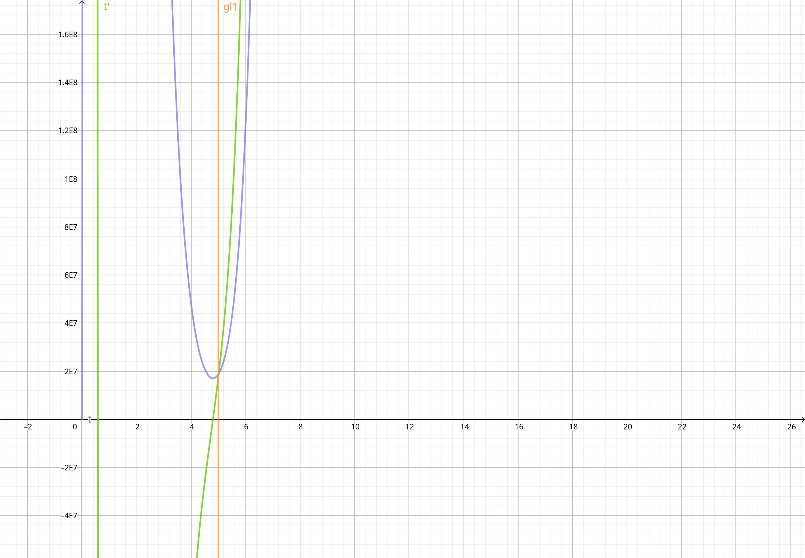

<h1 style="text-align: center;">Bonusaufgabe: Zara Zackigs Zurückkehr</h1>
<p style="text-align: center;">Teilnahme-ID: 00968</p>
<p style="text-align: center;">Bearbeiter: Finn Rudolph</p>
<p style="text-align: center;">19.03.2022</p>

[TOC]

## Problembeschreibung

Zunächst einige wichtige Eigenschaften des $\text{xor}$ Operators. Das exklusive Oder zweier gleicher Zahlen ist immer 0, weil sich bei diesen Zahlen kein Bit unterscheidet. Auch ist $\text{xor}$ kommutativ sowie assoziativ, d. h. die Anwendungsreihenfolge auf mehrere Operanden und Anordnung der Operanden sind irrelevant für das Ergebnis (Lewin, 2012). Die Aufgabenstellung verlangt es, aus einer Menge $S$, bestehend aus Binärzahlen, $k$ verschiedene Zahlen zu finden, deren $\text{xor}$ gleich irgendeiner anderen Zahl $\in S$ ist. Mit den oben genannten Eigenschaften kann das Problem umformuliert werden: Finde $k + 1$ Zahlen aus $S$, deren $\text{xor}$ gleich $0$ ist. Von hier an bezeichnet $k$ die Anzahl an Karten plus Schlüsselkarte, oder die Anzahl Zahlen, deren $\text{xor}$ gleich 0 sein soll, da das formale Beschreibungen deutlich vereinfacht.

Das Problem ist Variation des Teilsummenproblems, das ein Spezialfall des Rucksackproblems ist. Das Teilsummenproblem verlangt es, von einer Menge an ganzen Zahlen $S$ eine Teilmenge $T$ zu bestimmen, deren Summe gleich 0 ist. In diesem Fall wird statt des $+$ Operators der $\text{xor}$ Operator verwendet. Diese Eigenschaft allein würde das Problem, im Gegensatz zum Teilsummenproblem, in polynomialer Zeit lösbar machen (Jafargholi & Viola, 2018, S. 2). Aber da die Größe von $T$ mit $k$ ebenfalls vorgegeben ist, ist es NP-schwer, kann also nur in exponentieller Zeit optimal gelöst werden (S. 2).

Formal ausgedrückt, soll eine Menge $T$ bestimmt werden, die folgende Eigenschaften erfüllt. $t_i$ bezeichnet die $i$´te Zahl in $T$.

$$
t_1 \text{ xor } t_2 \text{ xor } \dots \text{ xor } t_k = 0 \\
|T| = k \\
T \subseteq S \\
t_i \neq t_j \space \forall \space 1 \leq i < j \leq k
$$

## Lösungsidee

### Teilaufgabe a)

Im Gegensatz zum Müllabfuhr-Problem ist eine Heuristik hier unangebracht, denn fast richtige Schlüsselkarten helfen Zara nicht weiter. Das Ziel ist es also, die exponentielle Laufzeit, die ein optimaler Algorithmus haben wird, mit einigen Tricks im Rahmen zu halten. Dafür verwende ich den Brute-Force Ansatz _Meet in the Middle_ (Sannemo, 2018, S. 138), es wird also ein Teil aller möglichen Kombinationen im Voraus berechnet.

#### Das 3-XOR Problem

Für den Fall $k = 3$ (3-XOR Problem) existiert ein einfacher Algorithmus mit quadratischer Laufzeit (Bouillaguet & Delaplace, 2021, S. 5). Mit einem naiven Ausprobieren aller Kombinationen würde er $O(n^3)$ benötigen, da man $\binom{n}{3} = \frac 16 n^3 - \frac 12 n^2 + \frac 13 n$ Möglichkeiten hat, die Zahlen zu kombinieren. $n = |S|$, wie in der Aufgabenstellung. Durch Speichern aller Zahlen von $S$ in einem Hashset kann der Grad des Polynoms um $1$ reduziert werden, da nicht für jedes $\text{xor}$-verknüpfte Paar von Zahlen die ganze Liste durchlaufen werden muss. Es wird für jede $\text{xor}$-Verknüpfung aus zwei verschiedenen Zahlen geprüft, ob diese im Hashset existiert, denn das $\text{xor}$ von zwei gleichen Zahlen ist $0$. Natürlich ist eine Lösung nur gültig, wenn der gefundene Eintrag im Hashset nicht zu einer der zwei Zahlen gehört.

Das hier vorliegende Problem kann also, analog zum 3-XOR Problem, als $k$-XOR Problem bezeichnet werden. Der Begriff existiert allerdings bereits und wird für ein ähnliches Problem verwendet, nämlich aus $k$ Listen je ein Element zu wählen, sodass das $\text{xor}$ all dieser Elemente 0 ist. Für dieses Problem existiert ein Algorithmus mit subexponentieller Laufzeit (Wagner, 2002), der allerdings eine bestimmte Größe der Listen voraussetzt, weswegen eine Übertragung auf dieses Problem nicht sinnvoll ist.

_Anmerkung:_ Der Algorithmus für das 3-XOR Problem läuft in polynomialer Zeit, weil das Problem für variable $k$ eine Zeitkomplexität mit $k$ im Exponenten hat.

#### Verallgemeinerung des 3-XOR Problems

Ich möchte diese Idee des Vorberechnens für größere $k$ generalisieren. Allerdings verwende ich wegen des großen Speicherbedarfs kein Hashset, sondern eine sortierte Liste, in der ein bestimmtes Element mithilfe von Binärsuche in $O(\log_2n)$ gefunden werden kann. Obwohl das zunächst langsamer ist als $O(1)$ bei einem Hashset, lohnt es sich insgesamt für den Zeitaufwand, da der Speicherplatz für die Zeitkomplexität limitierend ist, wie ich später erklären werde.

Um das Problem beispielsweise für $k = 4$ zu lösen, wird eine Liste $L$ mit allen $\text{xor}$-Verknüpfungen von zwei ungleichen Zahlen aus $S$ gefüllt:

$$
L = \{s_1 \text{ xor } s_2 \space
\forall \space (s_1, s_2 \in S \space | \space s_1 \neq s_2) \}
$$

Damit ist das Problem für $k = 4$ in $O(n^2 \log_2 n)$ lösbar, weil die Erstellung von $L$ in $O(n^2)$, und das Überprüfen der Existenz jedes $\text{xor}$-verknüpften Paares in $L$ in $O(n^2 )$ ausgeführt werden kann.

Für allgemeine $k$ sei $d$ die Anzahl an Zahlen, die für einen Eintrag in $L$ mit $\text{xor}$ verknüpft werden (im obigen Fall $d = 2$). Um die Karten im Auge zu behalten, die für einen vorberechneten $\text{xor}$-Wert benutzt wurden, wird eine zweite Liste $Q$ angelegt, in der jeweils die Indizes in $S$ der verwendeten Karten gespeichert werden. $L$ und $Q$ können durch folgende Rekursion erzeugt werden. $\larr$ bedeutet die Zuweisung einer Variable.

$$
\text{Vorberechnen}(a, x, b) = \begin{cases}
L \larr L \cup x; \space Q \larr Q \cup b& \quad a = 0 \\
\text{Vorberechnen}(a - 1, x \text{ xor }s, b \cup s) \space \forall \space s \in S
& \quad \text{else}
\end{cases}
$$

$a$ ist die verbleibende Anzahl von Zahlen, die noch für eine vollständige Kombination hinzugefügt werden müssen, also zu Beginn $d$. $x$ ist der $\text{xor}$-verknüpfte Wert aller $s$ der höher liegenden rekursiven Aufrufe. Für den ersten Aufruf eignet sich $x=0$, da $0$ der Identitätsoperand von $\text{xor}$ ist. $b$ ist die Liste aller bisher benutzten $s$ und sollte zu Beginn leer sein. Bei größeren $k$ muss beachtet werden, dass der Speicherbedarf sowie die Zeit zur Erstellung von $L$ mit $\Theta(\binom nd)$ zunimmt, weshlb es nicht immer sinnvoll ist $d = k - 2$ zu wählen, wie in den bisherigen Beispielen. Man stößt hier auf ein _Space-Time-Tradeoff_, das durch ein gut ausgewähltes $d$ optimiert werden kann.

**Optimierung der Zeitkomplexität.** Wenn $d \neq k - 2$, kann das spätere Durchsuchen der Liste auch nicht mehr in $O(n^2 \log_2 n)$ geschehen, weil nicht alle Paare, sondern alle Kombinationen von $k - d$ Zahlen überprüft werden müssen. Um zu begründen, welches $d$ sich allgemein gut eignet, muss ich vorwegnehmen, dass die Average-Case Zeitkomplexität der Implementierung

$$
\Theta \Bigg (\binom nd \cdot d + \binom n{k-d} \log_2 \binom nd \Bigg)
$$

ist. Weshalb das so ist, wird im Abschnitt [_Zeitkomplexität_](#zeitkomplexität) erklärt. Wenn man damit eine von $d$ abhängige Funktion aufstellt, ist es nicht schwierig, das optimale $d$ genau festzumachen.

$$
f_{n, k}(d) = \binom nd \cdot d + \binom n{k-d} \log_2 \binom nd
$$

Denn es liegt bei dem einzigen Minimum von $f_{n,k}(d)$, ist also eine Lösung der Gleichung

$$
\Bigg [\binom nd \cdot d + \binom n{k-d} \log_2 \binom nd \Bigg ]' = 0
$$

Natürlich muss die Lösung noch zur nächsten Ganzzahl gerundet werden. Weil diese Ableitung aber sehr lang, kompliziert und schwierig umzusetzen ist, wird eine Annäherung benutzt. Die Anforderungen sind, dass die Annäherung für $2 \leq k < 30$ und $3 < n < 255$ bis auf wenige Ausnahmen den gleichen Wert für $d$ wie die gerundete Lösung der zweiten Gleichung liefert. Nach einigen Experimenten im Grafikrechner stellte sich heraus, dass $d = \big \lceil \frac k2 \big \rceil$ dafür gut geeignet ist.



Beispiel: Graphische Darstellung der von $d$ abhängigen Zeitkomplexitätsfunktion $f_{n,k}(d)$ für $n=52, k=9$. violett: $f_{n,k}(d)$, grün: $f_{n,k}'(d)$, gelb: $d= \big \lceil \frac nk \big \rceil$. $d$ ist auf der x-Achse angetragen. In diesem Fall wäre das Minimum von $f_{n,k}(d)$ gerundet bei 5, genau wie $d= \big \lceil \frac nk \big \rceil$. Die verwendete GeoGebra Datei befindet sich ebenfalls im Projektordner.

**Limitierung durch die Speicherkomplexität.** Bei großen Eingabedateien muss der Speicherverbrauch beachtet werden. Z. B. bei `stapel4.txt`: Mit $|L| = \binom {n}{d}$ müssten $\binom {181}{5} \approx 1,53 \cdot 10^9$ 128-Bit Zahlen gespeichert werden, was ungefähr 24,5 Gigabyte Arbeitsspeicher erfordern würde. Wenn der Computer nicht so viel Arbeitsspeicher besitzt, muss $d$ entsprechend verringert werden.

Nachdem $L$ und $Q$ erstellt und sortiert wurden, wird jede $\text{xor}$-Verknüpfung aus $k - d$ Zahlen generiert und überprüft, ob diese in $L$ existiert. Das kann wie bei der Erstellung rekursiv gelöst werden.

$$
\text{Durchsuchen}(a, x, b) = \begin{cases}
i \larr \text{BinarySearch}(L, x) & \quad a = 0 \\
\text{if } (i \neq -1 \and b \cap q_i = \empty) \space \text{ausgeben}(b \cup q_i) \\
\text{Durchsuchen}(a - 1, x \text{ xor }s, b \cup s) \space \forall \space s \in S
& \quad \text{else}
\end{cases}
$$

Hier muss $a$ beim ersten Aufruf $k - d$ sein. $q_i$ ist der $i$´te Eintrag in $Q$.

Zusammenfassend sieht der Pseudocode des Algorithmus wie folgt aus.

```pseudocode
procedure XorNull(S, k)
	d ← ⌈k / 2⌉;
	while (Speicher von L und Q > Arbeitsspeicher) d ← d - 1;

	L ← ∅;
	Q ← ∅;
	Vorberechnen(d, 0, ∅);
	RadixSort(L, Q, m);
	Durchsuchen(k - d, 0, ∅);
```

#### Radix Sort (MSD)

Radix Sort eignet sich besonders, um Zahlen mit gleicher oder ähnlicher Länge zu sortieren, weil er in in $O(|L| \cdot m)$ Zeit läuft. Jeder vergleichsbasierte Sortieralgorithmus würde mindestens $O(|L| \log_2 |L|)$ Zeit benötigen, was asymptotisch schlechter ist, wenn man $m$ mit 128 begrenzt. Ich habe mich für die _Most Significant Digit (MSD)_ und _in-place_ Variante von Radix Sort entschieden, um keinen zusätzlichen Speicherplatz zu verbrauchen.

Die Zahlen werden sortiert, indem sie zunächst nach dem wichtigsten Bit gruppiert werden. Die zwei entstehenden Gruppen werden dann rekursiv nach dem zweitwichtigsten Bit gruppiert usw., bis alle Bits ausgewertet wurden. Einer dieser Schritte, der die Liste nach dem $h$´ten Bit (vom niedrigstwertigen Bit aus gezählt, d. h. $h = m$ zu Beginn) gruppiert, läuft wie folgt ab: Zwei Indizes $u$ und $v$ werden mit dem Anfangs- und Endindex von $L$ initialisiert. Vor $u$ befinden sich alle Zahlen mit $h$´ten Bit $0$, nach $v$ alle Zahlen mit $h$´ten Bit $1$. Wenn der $h$´te Bit des $u$´ten Eintrags in $L$ $0$ ist, wird $u$ einfach um $1$ vergrößert (Z. 12). $l_u$ bezeichnet den $u$´ten Eintrag in $L$. Andernfalls wird $l_u$ dem Teil mit $h$´ten Bit $1$ hinzugefügt, indem es mit $l_v$ getauscht wird (Z. 8). Dann wird der $1$er-Abschnitt um $1$ vergrößert, indem $v$ um $1$ verringert wird. So werden alle Einträge der Liste betrachtet, bis $u$ und $v$ gleich sind. Bevor der 0- und 1-Abschnitt jeweils rekursiv sortiert werden können muss beachtet werden, dass $u$ am Ende des $0$-Abschnitts steht, falls der $h$´te Bit von $l_u$ beim letzten Iterationsschritt $1$ war. Damit das weitere Sortieren fehlerlos funktioniert, soll $u$ immer am Anfang des $1$-Abschnitts stehen, das wird in Z. 14 - 15 sichergestellt. Damit die Einträge in $Q$ nach dem Sortieren noch stimmen, wird jede Veränderung von $L$ auch für $Q$ übernommen (Z. 9).

```pseudocode
procedure RadixSort(L, M, h)
	if (h = 0) return;

	u ← 1;
	v ← |L|;
	while (u < v)
		if (h`ter Bit von lᵤ = 1)
			tausche lᵤ und lᵥ;
			tausche qᵤ und qᵥ;
			v ← v - 1;
		else
			u ← u + 1;

	if (h`ter Bit von lᵤ = 0)
		u ← u + 1;

	RadixSort(L bis u, Q bis u, h - 1);
	RadixSort(L ab u, Q ab u, h - 1);
```

#### Binärsuche

Binärsuche findet die Position eines gesuchten Werts in einer sortierten Liste, indem das betrachtete Intervall $[u, v]$ schrittweise halbiert wird. Wenn der Wert in der Mitte des Intervalls kleiner als der gesuchte ist, muss der gesuchte Wert $x$, falls er existiert, in der zweiten Hälfte liegen, d. h. die untere Grenze $u$ kann auf die Mitte $+\space1$ angehoben werden (Z. 7). Wenn er größer ist, wird die obere Grenze $v$ abgesenkt (Z. 8). Wenn in der Mitte der gesuchte Wert liegt, kann sie sofort zurückgegeben werden (Z. 9). Eine Rückgabe von $-1$ zeigt an, dass $x \notin L$.

```pseudocode
procedure BinarySearch(L, x)
	u ← 1;
	v ← |L|;

	while (u < v)
		h ← ⌊(u + v) / 2⌋;
		if (lₕ < x) u ← h + 1;
		else if (lₕ > x) v ← h - 1;
		else return h;

	return -1;
```

Neben Binärsuche habe ich als Suchalgorithmus auch Interpolationssuche in Betracht gezogen. Weil eine Gleichverteilung der vorberechneten $\text{xor}$-Werte aber nicht garantiert werden kann bzw. unwahrscheinlich ist, benutze ich Binärsuche. Dass Binärsuche tatsächlich besser funktioniert, konnte ich durch kurze Tests bestätigen.

### Teilaufgabe b)

Damit Zara sicher weniger als zwei Fehlversuche benötigt, muss sie wissen, welches Haus sie gerade öffnen möchte, daher setzte ich das voraus. Außerdem muss sie die Karten aufsteigend sortieren. Möchte sie das $i$´te Haus öffnen, sollte sie es zunächst mit der $i$´ten Karte versuchen. Für die Position der $\text{xor}$-Sicherungskarte im Stapel ergeben sich drei Fälle.

1. **Hinter der ausgwählten Karte.** Die ausgewählte Karte ist die richtige.
2. **Vor der ausgewählten Karte. ** Die $i$´te Karte ist ein Fehlversuch. Die $i+1$´te Karte ist die richtige, da die Schlüsselkarte des Hauses durch die vorhergehende $\text{xor}$-Karte um eins nach hinten geschoben wurde.
3. **Die $\text{xor}$-Karte ist die ausgewählte Karte.** Auch hier ist die $i$´te Karte ein Fehlversuch. Aber aufgrund der selben Logik wie bei 2. ist die $i+1$´te Karte die richtige.

Zusammenfassend sind die Anweisungen für das $i$´te Haus also wie folgt:

1. Sortiere die Karten aufsteigend.
2. Probiere es mit der $i$´ten Karte.
3. Wenn das fehlgeschlagen ist, probiere es mit der $i+1$´ten Karte.

Um wieder herauszufinden, welche der Karten ihre Sicherungskarte war, gibt es keine andere Möglichkeit, als die oben beschriebenen Schritte bei allen Häusern anzuwenden. Währenddessen sollte Zara sich natürlich merken, welche Karten ein Haus öffnen konnten, die am Ende übrig bleibende ist die Sicherungskarte.

## Erweiterungen

Eine einfache und naheliegende Erweiterung ist, neben 32-, 64- und 128-Bit Zahlen auch 8- und 16-Bit Zahlen zu unterstützen (auch wenn man sie aus Sicherheitsgründen besser nicht zum Absperren eines Hauses benutzt). Bei der Implementierung sind sie also ebenfalls mit eingeschlossen.

## Implementierung

Ich setzte die Lösungsidee in C++ mit dem Compiler clang um. Das Programm ist auf x86-64 Linux Systemen ausführbar. Es kann im Ordner `zara-zackig` folgendermaßen ausgeführt werden:

```
./main < [Eingabedatei] [Arbeitsspeicherlimit in Megabyte]
```

Das Arbeitsspeicherlimit ist optional, wird keines angegeben, rechnet das Programm mit dem gesamten vorhandenen Arbeitsspeicher minus 2 Gigabyte. Wenn nur ein Terminal geöffnet ist, passt das sehr gut, wenn noch andere Programme laufen, sollte ein Limit angegeben werden. Ein zu großes, manuell eingegebenes Limit kann zum Absturz des Programms führen. Das Programm gibt die $k$ Zahlen aus, deren $\text{xor } 0$ ist aufsteigend sortiert aus. Logischerweise sind alle nicht ausgegebenen Zahlen die von den Freunden hinzugefügten Karten.

Da Schlüsselwörter und Ähnliches in C++ englisch sind, schreibe ich meine Code auch auf Englisch. C++ eignet sich sehr gut für diese Aufgabe, weil $\text{xor}$ mit dem `^`-Operator und 128-Bit Zahlen nativ unterstützt werden. Auch werde ich den Code durch parametrischen Polymorphismus mit C++ Templates generisch halten, sodass er für alle Bitlängen funktioniert. Der Teil des Programms, der die Karten findet, ist in Funktionen unterteilt und steht in `k_xor.hpp`. Weil viele der Funktionen ein Templateargument benötigen, sind sie in eine Headerdatei geschrieben. In `main.cpp` wird anhand der Bitlänge $m$ der entsprechende Integertyp (`uint8_t` bis `__uint128_t`) ausgewählt, die Karten eingelesen und `xor_to_zero` mit dem Integertyp als Argument für den Templateparameter `T` aufgerufen (Z. 14 - 40). Ab hier läuft alles generisch ab, wobei `T` auch bei jeder anderen Funktion der zu $m$ zugehörige Integertyp ist.

Die Zeilenangaben beziehen sich im Weiteren immer auf die zugehörige Funktion im Abschnitt [_Quellcode_](#quellcode)

### Der Hauptalgorithmus

#### Initialisierung

&rarr; zugehörige Funktion: [`xor_to_zero`](#xortozero)

Ich werde zunächst nur die Teile des Codes berücksichtigen, die für das eigentliche Berechnen der Lösung zuständig sind. Teile, die die Parallelisierung betreffen, werden im Abschnitt [_Parallelisierung_](#parallelisierung) erklärt.

Zunächst wird der verfügbare Arbeitsspeicher vom System abgefragt, falls vom Benutzer kein Limit gesetzt wurde. Das minus $2^{31}$ Bytes wird als Limit gesetzt (Z. 3). Bevor die Auswahl von $d$ erklärt werden kann, muss die Implementierung von $L$ und $Q$ vorweggenommen werden. $L$ wird mit dem Namen `val` genau wie im Pseudocode umgesetzt, $Q$ wird als eindimensionale Liste `ind` mit $|L| \cdot d$ Einträgen gehandhabt (Z. 9 - 10). Die zum $i$´ten Eintrag in `val` zugehörigen Indizes stehen in `ind` bei Index $i \cdot d$ bis $i \cdot d + d$. `val` und `ind` sind C-style Arrays, um nur so wie Speicherplatz wie nötig zu verbrauchen. Ein C-style Array besteht nur aus sequentiell angeordneten Werten des angegebenen Typs, der Variablenname ist ein Zeiger zum ersten dieser Werte. Der Speicherverbrauch ist der Speicherverbrauch eines Eintrags mal die Länge.

$d$ wird zu dem angenähert optimalen Wert $\big \lceil \frac k2 \big \rceil$ initialisiert (Z. 5). Da die Länge von `val` $\binom nd$ sein wird und jeder Eintrag in `val` ein `T` ist, kann die Menge an verbrauchtem Arbeitsspeicher einfach vorhergesehen werden. Denn jedes `T` verbraucht wiederum `sizeof (T)` Bytes. Dazu kommen für jeden Eintrag in `val` $d$ Einträge in `ind`, für die aber jeweils ein 8-Bit, also 1-Byte positiver Integer ausreicht, da die Anzahl an Karten in keiner Eingabedatei 255 überschreitet. $d$ wird also verringert, bis `val` und `ind` in das Arbeitsspeicherlimit passen (Z. 6). In `num_comb` wird die Länge von `val` gespeichert, die für den weiteren Verlauf häufig benötigt wird (Z. 7).

#### Generieren von Kartenkombinationen

&rarr; zugehörige Funktion: [`xor_combine`](#xorcombine)

Wie schon in den Rekursionsformeln bei der Lösungsidee ersichtlich war, liegt für das Vorberechnen der $\text{xor}$-Werte und das spätere Suchen eines passenden Gegenstücks die gleiche Rekursion zugrunde. Nur die Anweisungen nach Eintreten der Abbruchbedingung $a=0$ sind unterschiedlich. Um Codewiederholung zu vermeiden, implementiere ich eine höherwertige, rekursive Funktion [`xor_combine`](#xorcombine), die ein `std::function`-Objekt als Parameter nimmt (Z. 5). Diese wird beim Eintreten der Abbruchbedingung ausgeführt.

[`xor_combine`](#xorcombine) erstellt alle $\text{xor}$-Verknüpfungen aus `a` Zahlen, indem eine Zahl fixiert wird und dann rekursiv alle Kombinationen aus `a - 1` Zahlen mit der fixierten Zahl $\text{xor}$-verknüpft werden (Z. 16 - 22). Das Fixieren geschieht für jede Zahl, allerdings werden beim rekursiven Aufruf nur noch Zahlen in Betracht gezogen, die in `cards` nach der gewählten Zahl stehen, um Dopplungen zu vermeiden. Die Rekursion wird frühzeitig abgebrochen, wenn nicht mehr genug Karten nachfolgen, um eine volle Kombination aus `a` Karten zu erstellen (Z. 17).

#### Vorberechnen

&rarr; zugehörige Funktion: [`xor_to_zero`](#xortozero)

Das Vorberechnen funktioniert mithilfe von [`xor_combine`](#xorcombine), eine Lambdafunktion wird als Callback mitgegeben. In dieser sind die Schritte festgelegt, die für eine generierte Kombination ausgeführt werden. In `pos` ist die Position in dem Array `val` abgespeichert, in die der nächste $\text{xor}$-Wert vom aktuellen Thread geschrieben werden soll (Z. 21), die genaue Initialisierung dieser Variable wird bei [_Parallelisierung_](#parallelisierung) erklärt. Nachdem der $\text{xor}$-verknüpfte Wert der aktuellen Zahlenkombination in `val` und die Indizes der verwendeten Zahlen in `ind` eingetragen wurden, wird `pos` um eins vergrößert (Z. 26 - 28).

#### Suche nach Gegenstücken

&rarr; zugehörige Funktion: [`xor_to_zero`](#xortozero)

Auch hier wird [`xor_combine`](#xorcombine) eine Lambdafunktion mitgegeben. Zunächst wird durch [Binärsuche](#binarysearch) über `val` überprüft, ob es zu der als Argument mitgegebenen Zahl einen vorberechneten gibt (Z. 50). Ist das nicht der Fall, kann die zugehörige Kombination sofort verworfen werden. Andernfalls muss die Möglichkeit beachtet werden, dass es mehrere vorberechnete Kombinationen mit dieser Zahl als $\text{xor}$-Summe gibt und Binärsuche nur eine davon gefunden hat. Daher wird die Position der gefundenen Zahl `j` zum Anfang einer möglichen Folge gleicher Zahlen bewegt (Z. 52). Dann wird für jede Zahl in dieser Folge überprüft, ob sich ihre zugehörigen Karten mit denen der aktuell betrachteten Kombination überschneiden (Z. 55). Wenn das nicht der Fall ist, wird die gefundene Lösung ausgegeben, der Arbeitsspeicher von `val` und `ind` freigegeben und der Prozess beendet (Z. 56 - 65).

#### Überprüfen von Überschneidungen

&rarr; zugehörige Funktion: [`no_intersection`](#nointersection)

Die Funktion liefert einen Wahrheitswert, ob zwei gleiche Zahlen in den zwei mitgegebenen Arrays auftreten, was die doppelte Benutzung einer Karte bedeuten würde. Dazu wird ein `std::unordered_set` aus der zweiten der beiden Listen erstellt (Z. 2). So kann dann für jedes Element des ersten Arrays in $O(1)$ Zeit überprüft werden, ob es ebenfalls im zweiten Array vorhanden ist (Z. 3 - 6).

#### Der Binomialkoeffizient

&rarr; zugehörige Funktion: [`binom`](#binom)

Würde man zur Berechnung des Binomialkoeffizienten einfach die Formel anwenden, über die er definiert ist, würde durch $n!$ häufig ein Integer Overflow entstehen. Daher implementiere ich ihn rekursiv über folgende Beziehungen:

$$
\binom nk = \frac nk \binom {n-1}{k-1} \\
\binom n0 = 1
$$

Die erste Beziehung kann wie folgt bewiesen werden:

$$
\binom nk = \frac {n!}{k!(n - k)!} = \\
\frac {n \cdot (n - 1)!}{k \cdot (k - 1)!(n - k)!} = \\
\frac nk \cdot \frac {(n-1)!}{(k-1)!(n - 1 - (k - 1))!} = \\
\frac nk \binom {n-1}{k-1}
$$

Die zweite Beziehung kann man durch die Überlegung bestätigen, dass man nur eine Möglichkeit hat, eine leere Menge aus einer Menge auszuwählen, nämlich indem man einfach kein Element nimmt.

### Radix Sort

&rarr; zugehörige Funktion: [`radix_sort_msd`](#radixsortmsd)

Meine Implementierung von Radix Sort unterscheidet sich kaum vom Pseudocode. Unterschiede sind, dass die Indexierung der Arrays in der Implementierung mit 0 statt mit 1 beginnt. Der `h`´te Bit der betrachteten Zahl wird herausgefunden, indem die Bits `h` mal nach rechts verschoben werden und die verbleibende Zahl mit 1 $\text{und}$-verknüpft wird (Z. 7). So bleibt eine 1 übrig, wenn der `h`´te Bit 1 war, was in C++ gleich zu `true` ist. Außerdem wird die Rekursion bei Arraylänge 1 abgebrochen, weil ein Array mit dieser Länge immer sortiert ist.

### Binärsuche

&rarr; zugehörige Funktion: [`binary_search`](#binarysearch)

Binärsuche ist genau wie im Pseudocode beschrieben implementiert, daher werde ich die dort beschriebene Funktionsweise nicht wiederholen. Ein Detail habe ich mir bei der Implementierung aber überlegt: In den meisten Fällen findet Binärsuche bei dieser Anwendung keine Lösung, weswegen fast immer eine der Bedingungen `val[mid] < target` oder `val[mid] > target` zutrifft. Es ist daher sinnvoll, die Codezeilen so anzuordnen, dass diese zuerst überprüft werden, um insgesamt weniger Überprüfungen durchführen zu müssen. Normalerweise wäre so etwas irrelevant, aber Binärsuche wird bei meinem Algorithmus sehr oft durchgeführt und ist ein begrenzendes Element der Laufzeit.

### Parallelisierung

Ich parallelisiere das Vorberechnen und das spätere Durchsuchen der vorberechneten Werte durch Multithreading. Optimalerweise soll die Anzahl an Threads `cores` gleich zur Anzahl der Prozessorkerne des Computers sein, die in Z. 12 und 13 von [`xor_to_zero`](#xortozero) abgefragt wird. Wenn dazu keine Informationen vorhanden sind, wird 8 verwendet.

#### Parallelisierung von xor_combine

&rarr; zugehörige Funktion: [`xor_to_zero`](#xortozero)

Das Aufteilen der Arbeit von [`xor_combine`](#xorcombine) geschieht, indem es `cores`-mal aufgerufen wird. Der Umfang der Zahlen (in [`xor_combine`](#xorcombine) die Parameter `start` bis `end`), die auf der obersten Rekursionsebene betrachtet werden, ist jeweils begrenzt (Z. 30, 71). Die von [`assign_threads`](#assignthreads) zurückgegebene Aufteilung enthält für den `i`´ten Thread den Index der Karte, bei der er beginnen soll, bei Index `i * 2`. Bei `i * 2 + 1` steht die Anzahl an Kombinationen, die von allen niedriger nummerierten Threads berechnet werden. Das ist für das Vorberechnen entscheidend, weil so jedem Thread ein Teil von `val` und `ind` zugeteilt wird, in den er seine Kombinationen hineinschreiben kann. Damit ist keine Synchronisierung erforderlich, was die Performance erheblich verbessert. Die Zuteilung von `ind` und `val` geschieht durch die entsprechende Initialisierung von `pos` (Z. 21). Nachdem alle Threads erstellt wurden, wird bei jedem die `std::thread::join` Methode aufgerufen, um mit der weiteren Ausführung des Hauptthreads auf die anderen Threads zu warten (Z. 34, 75).

Beim späteren Durchsuchen ist eine gewisse Synchronisation notwendig. Denn sobald ein Thread eine Lösung gefunden und ausgegeben hat, gibt er den Arbeitsspeicher von `val` und `ind` frei, und beendet erst danach den Prozess. Da `val` und `ind` bei großen Eingabedateien mehrere Gigabyte groß sind, benötigt das Freigeben relativ viel Zeit, währenddessen greifen die anderen Threads darauf zu. Es kommt sehr wahrscheinlich zu einem Speicherzugriffsfehler / Segmentation Fault und das Programm stürzt ab. Auch wenn die korrekte Lösung bereits ausgegeben wurde, ist das kein geeigneter Weg, ein Programm zu beenden. Mit einer `std::atomic_bool` Variable wird daher überwacht, ob eine Lösung gefunden wurde (Z. 40). Ist sie `true`, greift kein Thread mehr auf `val` bzw. `ind` zu (Z. 49). Der erste Thread, der eine Lösung findet, setzt `found` auf `true` (Z. 56).

#### Zuteilung der Arbeit an Threads

&rarr; zugehörige Funktion: [`assign_threads`](#assignthreads)

Da von [`xor_combine`](#xorcombine) auf unteren Rekursionsebenen nur alle nachfolgenden Zahlen betrachtet werden, ist der Aufwand für Karten höher, die früher in `cards` stehen. Die Indizes von `cards` in gleiche Teile zu teilen würde also zu einer ungleichmäßigen Verteilung führen. [`assign_threads`](#assignthreads) teilt die Arbeit auf, indem als vorläufiges Mindestpensum `min` zunächst `num_comb / cores` festgelegt wird (Z. 4). Dann wird über die Indizes von `cards` iteriert und eine Zuteilung für den `j`´ten Thread zu den Zuteilungen `distr` hinzugefügt, sobald die bisherige Gesamtanzahl zu erstellender Kombinationen das `j`-fach des Mindestpensums überschritten hat. Die Anzahl an Kombinationen, die für die `i`´te Karte anfallen, sind $\binom{n-i-1}{a-1}$, weil durch Fixierung der `i`´ten Karte noch $a-1$ Karten gewählt werden müssen. Dafür sind aber nicht mehr alle $n$ Karten verfügbar, sondern eine weniger für die fixierte, und $i$ weniger, weil durch [`xor_combine`](#xorcombine) nur die nachfolgenden Karten einbezogen werden.

#### Parallelisierung von Radix Sort

Radix Sort teilt die Arbeit schon von sich aus rekursiv mit einem Verzweigungsfaktor von 2 auf. Daher ist es naheliegend, einfach bis zu einer gewissen Rekursionstiefe `t_depth` für jeden rekursiven Aufruf einen neuen Thread zu erstellen. Die Anzahl an arbeitenden Threads ist nach Erreichen dieser Tiefe $2^{\text{t\_depth}}$ und solle optimalerweise der Anzahl an Rechenkernen `cores` entsprechen. Daher wird für `t_depth` zu Beginn $\lceil \log_2 (\text{cores}) \rceil$ als Argument gegeben. Falls `cores` keine Potenz von zwei ist, sollten eher zu viele als zu wenige Threads arbeiten, da eine unvollständige Auslastung des Prozessors wesentlich mehr Zeit kostet als einige zusätzliche Threadwechsel.

## Zeitkomplexität

Die Zeitkomplexität wird durch das Vorberechnen, Radix Sort und das Durchsuchen der vorberechneten Lösungen dominiert. Auch wenn es etwas unüblich ist, gebe ich die Zeitkomplexität von `xor_combine`-basierten Abläufen mit dem Binomialkoeffizienten an, weil das die Laufzeitoberschranke des Algorithmus am besten widerspiegelt. Es sprechen zwei Gründe dagegen $O(\binom nd)$ mit dem eher üblichen $O(n^d)$ zu ersetzen. Erstens ist $O(n^d)$ eine wesentlich höhere und damit ungenauere Oberschranke, zweitens ist sie nur für $d \leq \frac n2$ repräsentativ. Denn die Laufzeit des Algorithmus fällt genau wie der Binomialkoeffizient abhängig von $d$ nach $\frac n2$ wieder ab, da frühzeitig abgebrochen wird, wenn die verbleibende Anzahl an Listenelementen nicht für eine vollständige Kombination ausreichen würde (Z. 17 in [`xor_combine`](#xorcombine)).

### Vorberechnen

Es werden insgesamt $\binom nd$ Kombinationen vorberechnet, für die jeweils die $d$ Indizes der verwendeten Karten nach `ind` kopiert werden. Da das Vorberechnen wird immer vollständig ausgeführt und die Rechenschritte unabhängig von den bearbeiteten Zahlen sind, ist seine Best-, Worst- und Average-Case Komplexität $\Theta (\binom nd \cdot d)$. Mit _unabhängig_ meine ich, dass die ausgeführten Codezeilen immer die gleichen sind und nicht von den eingegebenen Zahlen abhängen, was z. B. bei Radix Sort nicht der Fall ist.

### Radix Sort

Radix Sort iteriert im schlechtesten Fall $m$-mal über alle Elemente von `val` und führt dabei im schlechtesten Fall jeweils einen Swap von $d$ Zahlen aus. Daher ist seine Worst-Case Komplexität $O(\binom nd \cdot d \cdot m)$. Im besten Fall müssen keine Swaps ausgeführt werden und es werden deutlich weniger als $m$ Bits betrachtet, folglich ist die Best-Case Komplexität $\Omega (\binom nk)$. Da meistens $\binom nd \ll 2^m$, werden deutlich weniger als $m$ Bits betrachtet, weil die Rekursion ebenfalls bei Arraylänge $1$ abbricht. Unter der Voraussetzung, dass ein zufällig gewählter Bit aus dem Kartenset mit gleicher Wahrscheinlichkeit $0$ und $1$ ist, wird durchschnittlich nur in jedem zweiten Fall ein Swap von $d$ Zahlen ausgeführt. Mit diesen Annahmen schätze ich die Average-Case Komplexität auf $\Theta(\binom nd \cdot \frac 12 d) = \Theta(\binom nd \cdot d) $.

### Durchsuchen

Beim Durchsuchen müssen zwei schlechteste Fälle unterschieden werden:

1. In dem schlechtesten Fall, dass erst bei der letzten geprüften Kombination eine Lösung gefunden wird, werden insgesamt $\binom n{k-d}$ Kombinationen überprüft. Für die jeweils über `val` durchgeführte Binärsuche wird im Worst-Case und Average-Case $O(\log_2\binom nd)$ Zeit benötigt, da meist keine passende Zahl gefunden wird. Dadurch wird [`no_intersection`](#nointersection) fast nie ausgeführt und kann vernachlässigt werden. Damit ist die Worst-Case Komplexität des Durchsuchens $O(\binom n{k-d} \log_2 \binom nd)$.
2. In einem sehr ungünsigen Fall würde für jede dieser Kombinationen ein passendes Gegenstück in `val` gefunden werden und [`no_intersection`](#nointersection) augeführt werden, und sich dann herausstellen, dass sich die Indizes überschneiden. Da [`no_intersection`](#nointersection) in $O(d)$ läuft, ergibt sich unter dieser Voraussetzung für die Worst-Case Zeitkomplexität des Durchsuchens $O(\binom n{k-d} \cdot (\log_2 \binom nd + d))$.

Der zweite Fall ist aber extrem unwahrscheinlich und könnte nur bei sehr speziellen Kartensets eintreffen. Dass er nie eintreffen kann, konnte ich leider nicht beweisen. Daher muss ich die Worst-Case Zeitkomplexität des Durchsuchens mit $O(\binom n{k-d} (\log_2 \binom nd + d))$ angeben. Im Average-Case kann das aber vernachlässigt werden. Bei der Average-Case Abschätzung kann man einen Faktor $\frac 12$ hinzufügen, wenn man davon ausgeht, dass bei jedem Suchschritt mit gleicher Wahrscheinlichkeit die Lösung gefunden wird. Dieser wird bei der asymptotischen Zeitkomplexität natürlich wieder verworfen, ist aber in der Realität nicht irrelevant. Daher ist die Average-Case Komplexität $\Theta(\binom n{k-d} \log_2 \binom nd)$.

### Laufzeit des gesamten Algorithmus

Die Worst-Case Komplexität des gesamten Programms ist folglich

$$
O \Bigg (\binom nd \cdot d + \binom nd \cdot m \cdot d + \binom n{k-d} \bigg( \log_2 \binom nd + d \bigg )\Bigg) = \\
O \Bigg (\binom nd \cdot m \cdot d + \binom n{k-d} \bigg( \log_2 \binom nd + d \bigg ) \Bigg)
$$

Mit den oben erklärten Annahmen ist die Average-Case Zeitkomplexität

$$
\Theta \Bigg ( \binom nd \cdot d + \binom nd \cdot d + \binom n{k-d} \log_2 \binom nd \Bigg) = \\

\Theta \Bigg (\binom nd \cdot d + \binom n{k-d} \log_2 \binom nd \Bigg)
$$

## Beispiele

Um sicherzustellen, dass das Programm korrekt arbeitet, wird vor jeder Ausgabe einer Lösung mithilfe von `assert` und der Funktion [`is_valid`](#isvalid) überprüft, ob das $\text{xor}$ der ausgewählten Zahlen 0 ist. Das ist bzgl. der benötigten Zeit absolut vertretbar, weil dafür nur $k$ Rechenschritte benötigt werden. Weil dieses `assert` bei keinem der über 1000 durchgeführten Tests fehlgeschlagen ist, fokussiere ich mich auf die benötigte Laufzeit. Die Tests werden auf einem PC mit Manjaro Linux i3 als Betriebssystem, einem AMD Ryzen 5 6-Core (12 Threads) Prozessor, 16 Gigabyte RAM (14,5 Gigabyte verfügbar) und der `-O3` Compiler Flag durchgeführt.

### Beispiele der Bwinf-Website

#### Stapel 0

```
00111101010111000110100110011001
10101100111111011010100011100000
10111000011001110000101010111110
11010111111010111101101111110000
11111110001011010001000000110111
```

Zeit: 1.34 ∙ 10$^{-3}$ s

#### Stapel 1

```
00010001110100110001111101100100
00100000111100111110111101111100
00100011100111011010111011100011
00110100001010100100001111010010
00110110000110101101011111111010
11000111111010110100000101110100
11010011010110110101001101010111
11110011101011001001000010111110
11110111100100010100100001001110
```

Zeit: 1.63 ∙ 10$^{-3}$ s

#### Stapel 2

```
00101000011000010010111011101011011010111000100100110101111011011110111100101100001001110010100001101001110001000100010011111100
00101011111000101011010110111100100110000000000011010011001111011001011001000010001101010110110010101110100100001011100011010001
01101001001011000101001111111101011000001000101100111010100101011011000100000001100001100011010110101011110110100000100101001011
01101011101000110111010001100001110000011000110101100010111011100110011011110111011100110101101111000011110111011101011111100111
01110110011110001110011110001101101110100101000000100000101100001010001110101000000011010011000011010010110110100101111101101000
10000000000100100110011001000110000000000101010110100100100001000111010110110101010010101000101110101100101000110010100100111011
10101011000001101100000101111111110011000110011100101011011111011000111111101111101000111111010000001011011011111111010011011110
10101111110010010010100111101100010011111000010101001100100001111000100010010010011010010101011111101011000001111110000000111011
11000011000100110111000101100100101101010110011011010101101001000011110100010001001010000110010101010010001100010001101110100000
11011110000101001101111100110000111010011011101111010111110110110111011010001001101101100111010001000011000001010111100101111111
11101110101011100111101111000111001101111011010101011111000110100011010001100000111101000010001100100000011101100010001011101000
```

Zeit: 50.6 s

#### Stapel 3

```

```

Zeit:

#### Stapel 4

```

```

Zeit:

#### Stapel 5

```
0101111111000111000000101111100010111010110101000100000011001000
1000010011101010001111100100110110011011100101010100010000001001
1010000110101100101110111001100011011110111111010111000101111110
1010111011001100100110001100110001011101001000000011011111100100
1101010001001101000111111110000110100010100111000100001001011011
```

Zeit: 47.1 ∙ 10$^{-3}$ s

### Testprogramm

Damit das Programm einfach mit verschiedensten Kartensets getestet werden kann, habe ich ein Testprogramm in `test.cpp` geschrieben, dass ein zufälliges Kartenset generiert. Daraus werden $k$ Karten ausgewählt und eine Schlüsselkarte erstellt. Bevor damit dann [`xor_to_zero`]() aufgerufen wird, werden die Karten noch zufällig vertauscht. Dieses Programm kann aus dem Ordner `zara-zackig` wie folgt benutzt werden:

```
./test [Arbeitsspeicherlimit in Megabyte]
```

Der Benutzer wird dann aufgefordert, $n, k$ und $m$ anzugeben, wobei dazwischen jeweils ein Leerzeichen sein sollte. Ausgegeben wird das generierte Kartenset und dann die errechnete Lösung.

Es wurden Tests für $n$ von 20 bis 255, $k$ von 2 bis und $m$ von 8 bis 128 durchgeführt. Das Programm wurde für jede Parameterwahl jeweils 6-mal ausgeführt, da die benötigte Zeit zum Durchsuchen der vorberechneten Zahlen variieren kann. Daher sind die Ergebnisse in Durchschnitt ± Standardabweichung angegeben.

| n   | k   | m   | Zeit in Sekunden                     | gewähltes d |
| --- | --- | --- | ------------------------------------ | ----------- |
| 20  | 10  | 8   | 1.58 ∙ 10$^{-3}$ ± 0.164 ∙ 10$^{-3}$ | 5           |
| 20  | 10  | 32  | 1.78 ∙ 10$^{-3}$ ± 0.201 ∙ 10$^{-3}$ | 5           |
| 60  | 15  | 16  | 10.6 ± 0.19                          | 7           |
| 60  | 15  | 64  | 32.8 ± 23.4                          | 7           |
| 100 | 14  | 32  | 53.1 ± 2.13                          | 6           |
| 100 | 12  | 128 | 79.9 ± 51.0                          | 5           |
| 180 | 10  | 64  | 3020 ± 412                           | 4           |
| 180 | 10  | 128 |                                      | 4           |
| 255 |     | 64  |                                      |             |
| 255 |     | 128 |                                      |             |
| 255 |     | 128 |                                      |             |

## Quellcode

_Anmerkung:_ In den eigentlichen Quelldateien vorhandene Zeilen, die Informationen über den aktuellen Zwischenstand ausgeben, sind hier nicht abgedruckt.

### main

```c++
int main(int argc, char* argv[]) {
    long long mem_limit = 0;
    if (argc > 2) {
        std::cout << "Too many arguments. Run with: ./main < [input file] [memory limit in megabytes]\n";
        exit(EXIT_FAILURE);
    } else if (argc == 2) {
        mem_limit = std::stold(argv[1]) * 1000000;
    }

    int n, k, m;
    std::cin >> n >> k >> m;
    k += 1;

    switch (m) {
        case 8: {
            std::vector<uint8_t> cards = read_cards<uint8_t>(n);
            xor_to_zero<uint8_t>(cards, n, k, mem_limit);
            break;
        }
        case 16: {
            std::vector<uint16_t> cards = read_cards<uint16_t>(n);
            xor_to_zero<uint16_t>(cards, n, k, mem_limit);
            break;
        }
        case 32: {
            std::vector<uint32_t> cards = read_cards<uint32_t>(n);
            xor_to_zero<uint32_t>(cards, n, k, mem_limit);
            break;
        }
        case 64: {
            std::vector<uint64_t> cards = read_cards<uint64_t>(n);
            xor_to_zero<uint64_t>(cards, n, k, mem_limit);
            break;
        }
        case 128: {
            std::vector<__uint128_t> cards = read_cards<__uint128_t>(n);
            xor_to_zero<__uint128_t>(cards, n, k, mem_limit);
            break;
        }
    }
}
```

### xor_to_zero

```c++
template <typename T>
void xor_to_zero(std::vector<T> cards, int n, int k, long long mem_limit) {
    if (mem_limit == 0) mem_limit = memory() - (((long long) 1) << 31);

    int d = ceil((float) k / 2);
    while (binom(n, d) * (sizeof (T) + d) > mem_limit) d -= 1;
    long long num_comb = binom(n, d);

    T* val = new T[num_comb];
    uint8_t* ind = new uint8_t[num_comb * d];

    int cores = std::thread::hardware_concurrency();
    if (cores == 0) cores = sysconf(_SC_NPROCESSORS_ONLN);
    if (cores == 0) cores = 8;

    std::vector<long long> distr = assign_threads(num_comb, cores, n, d);
    std::vector<std::thread> threads;

    for (int i = 0; i < cores; i++) {
        threads.emplace_back([i, &cards, &val, &ind, &n, &d, &cores, &distr] {
            long long pos = distr[i * 2 + 1];
            uint8_t used[d];

            xor_combine<T>(cards, d,
                [&val, &ind, &used, &pos, &d](T &xor_val) {
                    val[pos] = xor_val;
                    std::copy(used, used + d, ind + (pos * d));
                    pos += 1;
                },
                used, distr[i * 2], i == cores - 1 ? n : distr[i * 2 + 2]);
        });
    }

    for (std::thread &t: threads) t.join();

    radix_sort_msd<T>(val, ind, num_comb, d, ceil(log2(cores)), sizeof (T) * 8 - 1);

    distr = assign_threads(num_comb, cores, n, k - d);
    threads.clear();
    std::atomic_bool found(false);

    for (int i = 0; i < cores; i++) {
        threads.emplace_back([i, &cards, &val, &ind, &num_comb,
            &n, &k, &d, &cores, &distr, &begin, &found] {
            uint8_t used[k - d];

            xor_combine<T>(cards, k - d,
                [&cards, &val, &ind, &num_comb, &k, &d, &used, &begin, &found](T &xor_val) {
                    if (found) return;
                    long long j = binary_search<T>(val, num_comb, xor_val);
                    if (j != -1) {
                        while (j > 0 && val[j - 1] == xor_val) j -= 1;

                        while (val[j] == xor_val && j < num_comb) {
                            if (no_intersection(used, ind + (j * d), k - d, d) && !found) {
                                found.store(true);

                                std::vector<uint8_t> res(used, used + (k - d));
                                res.insert(res.end(), ind + (j * d), ind + (j * d + d));
                                assert(is_valid<T>(res, cards));
                                print_cards(res, cards);

                                delete[] ind;
                                delete[] val;
                                exit(EXIT_SUCCESS);
                            }
                            j += 1;
                        }
                    }
                },
                used, distr[i * 2], i == cores - 1 ? n : distr[i * 2 + 2]);
        });
    }

    for (std::thread &t: threads) t.join();

    std::cout << "No solution found\n";
    delete[] val;
    delete[] ind;
}
```

#### xor_combine

```c++
template <typename T>
void xor_combine(
    std::vector<T> &cards,
    int a,
    std::function<void (T&)> cb,
    uint8_t* used,
    uint8_t start,
    uint8_t end,
    T xor_val = 0
) {
    if (a == 0) {
        cb(xor_val);
        return;
    }

    for (uint8_t i = start; i < end; i++) {
        if (i + a > cards.size()) break;
        xor_val ^= cards[i];
        used[a - 1] = i;
        xor_combine<T>(cards, a - 1, cb, used, i + 1, cards.size(), xor_val);
        xor_val ^= cards[i];
    }
}
```

#### binom

```c++
long long binom(int n, int k) {
    if (k == 0) return 1;
    return ((double) n / (double) k) * (double) binom(n - 1, k - 1);
}
```

#### memory

```c++
long long memory() {
    return sysconf(_SC_PHYS_PAGES) * sysconf(_SC_PAGE_SIZE);
}
```

#### no_intersection

```c++
bool no_intersection(uint8_t* arr1, uint8_t* arr2, int len1, int len2) {
    std::unordered_set<uint8_t> arr_set(arr2, arr2 + len2);
    for (int i = 0; i < len1; i++) {
        if (arr_set.find(arr1[i]) != arr_set.end()) {
            return false;
        }
    }
    return true;
}
```

#### is_valid

```c++
template <typename T>
bool is_valid(std::vector<uint8_t> &res, std::vector<T> &cards) {
    T xor_val = 0;
    for (uint8_t i: res) xor_val ^= cards[i];
    return xor_val == 0 ? 1 : 0;
}
```

### radix_sort_msd

```c++
template <typename T>
void radix_sort_msd(T* val, uint8_t* ind, long long length, int d, int t_depth, int h) {
    if (length <= 1 || h == 0) return;

    long long u = 0, v = length - 1;
    while (u < v) {
        if ((val[u] >> h) & (T) 1) {
            std::swap(val[u], val[v]);
            std::swap_ranges(ind + u * d, ind + u * d + d, ind + v * d);
            v -= 1;
        } else {
            u += 1;
        }
    }

    if (!((val[u] >> h) & (T) 1)) u += 1;
    if (t_depth != 0) {
        std::thread t1([&] {
            radix_sort_msd<T>(val, ind, u, d, t_depth - 1, h - 1);
        });
        std::thread t2([&] {
            radix_sort_msd<T>(val + u, ind + u * d, length - u, d, t_depth - 1, h - 1);
        });
        t1.join();
        t2.join();
    } else {
        radix_sort_msd<T>(val, ind, u, d, t_depth, h - 1);
        radix_sort_msd<T>(val + u, ind + u * d, length - u, d, t_depth, h - 1);
    }
}
```

### binary_search

```c++
template <typename T>
long long binary_search(T* val, long long length, T target) {
    long long u = 0, v = length - 1;

    while (u < v) {
        int mid = (u + v) / 2;
        if (val[mid] < target) u = mid + 1;
        else if (val[mid] > target) v = mid - 1;
        else return mid;
    }
    return -1;
}
```

### assign_threads

```c++
std::vector<long long> assign_threads(long long num_comb, int cores, int n, int a) {
    std::vector<long long> distr(cores * 2, 0);
    int j = 1;
    long long min = num_comb / cores, sum = 0;
    for (int i = 0; i < n && j < cores; i++) {
        if (sum >= min * j) {
            distr[j * 2] = i;
            distr[j * 2 + 1] = sum;
            j += 1;
        }
        sum += binom(n - i - 1, a - 1);
    }
    return distr;
}
```

## Literaturverzeichnis

1. Bouillaguet, C. & Delaplace, C. (2021). _Faster Algorithms for the Sparse Random 3XOR Problem_. https://hal.archives-ouvertes.fr/hal-02306917v1/document
2. Jafargholi, Z. & Viola, E. (2018). _3SUM, 3XOR, Triangles_. https://arxiv.org/pdf/1305.3827.pdf
3. Lewin, M. (2012). _All about XOR_. https://accu.org/journals/overload/20/109/lewin_1915/
4. Sannemo, J. (2018). _Principles of Algorithmic Problem Solving_. KTH Royal Institute of Technology. https://www.csc.kth.se/~jsannemo/slask/main.pdf
5. Wagner, D. (2002). _A Generalized Birthday Problem (Long version)_. University of California at Berkeley. https://people.eecs.berkeley.edu/~daw/papers/genbday.html
6. Williams, A. (2019). _C++ Concurrency in Action_. https://beefnoodles.cc/assets/book/C++%20Concurrency%20in%20Action.pdf
7. Woeginger, G. (2003). _Exact Algorithms for NP-Hard Problems: A Survey_. https://people.engr.tamu.edu/j-chen3/courses/689/2006/reading/w1.pdf

## Anhang

### Fehlgeschlagene Idee mit Divide and Conquer

Ich hatte die Idee, bei nicht ausreichendem Speicher jede Zahl in kleinere Zahlen mit jeweils $c$ Bits aufzuteilen, um $\frac mc$ neue Kartensets zu erhalten. Zuerst sollen für jedes dieser Sets alle Lösungen berechnet werden, dann wird die Schnittmenge aller Lösungen gebildet. Sie ist die Lösung des gesamten Problems. Beispielsweise würde sich bei 128-Bit Zahlen mit $c = 8$ der Speicherverbrauch von $|L|$ bzw. `val` auf $\frac 1{16}$ reduzieren. Ich habe diesen Ansatz implementiert und getestet, aber er verschlechterte die Laufzeit. Ein weiteres Problem war, dass bei großem $n$ und $k$, also genau den speicherkritischen Fällen, und gleichzeitig kleinem $c$ die Anzahl an Lösungen für jedes Teilkartenset sehr groß ist, wodurch teilweise mehr Speicher als ohne Teilung verbraucht wurde. Wenn man noch größere $m$ als 128 miteinbeziehen würde, könnte der Ansatz aber hilfreich sein.

Es wurden jeweils 5 Tests mit $n = 20$ und $k = 4$ durchgeführt, die Karten wurden zufällig generiert. Links stehen die Ergebnisse mit Teilung der Karten in $c$-Bit Stücke, rechts die Ergebnisse ohne Teilung. Ohne Teilung wurde $d$ um 1 reduziert, um den Speicherverbrauch gleich gering zu halten und den Vergleich fair zu machen. Zeitangaben in Durchschnitt ± Standardabweichung.

| m   | c   | d   | Zeit (ms)  |     | m   | d   | Zeit (ms)   |
| --- | --- | --- | ---------- | --- | --- | --- | ----------- |
| 8   | 8   | 2   | 2.3 ± 0.13 |     | 8   | 1   | 0.51 ± 0.48 |
| 16  | 8   | 2   | 5.7 ± 0.52 |     | 16  | 1   | 1.7 ± 0.37  |
| 32  | 8   | 2   | 13 ± 1.2   |     | 32  | 1   | 1.9 ± 0.28  |
| 64  | 8   | 2   | 26 ± 1.7   |     | 64  | 1   | 2.0 ± 0.41  |
| 128 | 8   | 2   | 53 ± 2.7   |     | 128 | 1   | 2.3 ± 0.23  |
